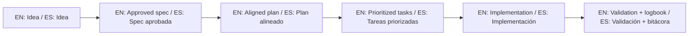

# 🤖 AI Start Here / Inicio IA aquí

> [!IMPORTANT]
> **EN:** Use this repository as the main SDD reference and keep GitHub Spec Kit as the default operating flow.
> **ES:** Usa este repositorio como referencia principal SDD y mantén GitHub Spec Kit como flujo operativo por defecto.

Repository URL / URL del repositorio:
- <kbd>https://github.com/juanklagos/spec-driven-development-template</kbd>

## 🧭 Mandatory context first / Contexto obligatorio primero

Read in this order before implementation:
1. `template-context/core-instructions/AGENT_OPERATING_SYSTEM.md`
2. `idea/IDEA_GENERAL.md`
3. `specs/INDEX.md`
4. latest `bitacora/handoffs/` file (if exists)

## 🛑 SDD Hard Stop / Parada obligatoria SDD

No code until both are true:
1. `spec.md` approved by user
2. `plan.md` consistent with `spec.md`

If missing: refine docs first (`spec`, `plan`, `tasks`, `history`, `bitacora`).

## ⚙️ Spec Kit-first startup

### New project / Proyecto nuevo
```bash
./scripts/init-project-with-spec-kit.sh /path/project codex
```

### Existing project / Proyecto existente
```bash
specify init . --ai codex
# or / o
uvx --from git+https://github.com/github/spec-kit.git specify init . --ai codex
```

### Standard command flow / Flujo estándar de comandos
1. `/speckit.constitution`
2. `/speckit.specify`
3. `/speckit.plan`
4. `/speckit.tasks`
5. `/speckit.implement`

## 🧪 Session close validation

```bash
./scripts/validate-sdd.sh . --strict
./scripts/check-sdd-gate.sh .
```

Mandatory updates:
- `specs/INDEX.md` (if status/priority changed)
- active spec `history.md`
- `bitacora/global/PROJECT_LOG.md`
- handoff in `bitacora/handoffs/` if pending work

## 🚀 Prompt pack by level / Pack de prompts por nivel

### Level 1 (Beginner) / Nivel 1 (Principiante)
```text
Act as an SDD beginner guide.
Read idea/IDEA_GENERAL.md and help me complete it with simple language.
Then create specs/001-... with spec.md, plan.md, tasks.md, history.md.
Ask short questions one by one before assuming missing info.
Do not implement code yet.
```

### Level 2 (Intermediate) / Nivel 2 (Intermedio)
```text
Read idea/IDEA_GENERAL.md, specs/INDEX.md and latest handoff.
Select one active specification and propose a 5-step session plan.
Execute only in-scope tasks.
Update history.md, INDEX.md (if needed), and PROJECT_LOG.md.
Run validations and report risks + next step.
```

### Level 3 (Advanced) / Nivel 3 (Avanzado)
```text
Operate in Spec Kit-first mode with strict SDD gates.
Use: constitution -> specify -> plan -> tasks -> implement.
Block implementation if spec approval or plan consistency is missing.
Return output contract: objective, active spec, changes, validation, risks, exact next step.
Ensure traceability and handoff completeness.
```

## 📚 Prompt references / Referencias de prompts

- Prompt matrix: [EN](./docs/en/19-prompt-matrix-by-goal.md) | [ES](./docs/es/19-matriz-prompts-por-objetivo.md)
- Validated prompt bank: [EN](./docs/en/26-validated-prompt-bank.md) | [ES](./docs/es/26-banco-prompts-validados.md)
- Prompts by template feature: [EN](./docs/en/30-prompts-by-template-feature.md) | [ES](./docs/es/30-guia-prompts-por-caracteristica.md)

## ✅ Expected outcome / Resultado esperado

- one clear idea
- one active numbered spec
- one session log entry
- one exact next step

## 🌐 Bilingual support / Soporte bilingüe

- EN: This repository is designed to be used in English and Spanish.
- ES: Este repositorio está diseñado para usarse en inglés y español.
- EN: Keep instructions simple, direct, and copy/paste-ready.
- ES: Mantén instrucciones simples, directas y listas para copiar/pegar.

## 🗣️ Prompt base / Base prompt

```text
EN: Using https://github.com/juanklagos/spec-driven-development-template, guide me step by step with SDD for my project.
My project is: [describe project in plain language].
Do not skip idea, spec, plan, tasks, logbook, and validation.

ES: Usando https://github.com/juanklagos/spec-driven-development-template, guíame paso a paso con SDD para mi proyecto.
Mi proyecto es: [explica el proyecto en lenguaje simple].
No omitas idea, spec, plan, tasks, bitácora y validación.
```

## 💡 Tips / Consejos

- EN: Ask the AI to confirm the active spec before coding.
- ES: Pide a la IA confirmar la spec activa antes de programar.
- EN: Keep one clear next step at the end of each session.
- ES: Deja un próximo paso claro al final de cada sesión.
- EN: Prefer simple language and concrete deliverables.
- ES: Prefiere lenguaje simple y entregables concretos.

## 📊 Visual flow / Flujo visual


