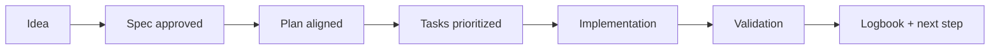

# 🤖 AI Start Here / Inicio IA aquí

> [!IMPORTANT]
> **EN:** This template exists to make SDD easy. The AI must guide the user step by step, not skip stages, and keep traceability.
> **ES:** Este template existe para volver SDD fácil. La IA debe guiar paso a paso, no saltar etapas y mantener trazabilidad.

Base repository / Repositorio base:
- <kbd>https://github.com/juanklagos/spec-driven-development-template</kbd>

---

## 1) What this is / Qué es esto

**EN (Problem):** Most teams jump to code and lose context, decisions, and quality.
**EN (Solution):** This template enforces a clear flow: `idea -> spec -> plan -> tasks -> implement -> validate -> logbook`.

**ES (Problema):** Muchos equipos saltan directo al código y pierden contexto, decisiones y calidad.
**ES (Solución):** Este template impone un flujo claro: `idea -> spec -> plan -> tasks -> implementar -> validar -> bitácora`.

---

## 2) Hard rule / Regla dura

**EN:** No implementation before:
1. `spec.md` is approved
2. `plan.md` is consistent with `spec.md`

**ES:** No hay implementación antes de:
1. `spec.md` aprobada
2. `plan.md` consistente con `spec.md`

- **EN:** Creating the SDD base (`idea/spec/plan/tasks/bitacora`) does not require execution consent.
- **EN:** Ask and record user consent only when implementation is going to start.
- **ES:** Crear la base SDD (`idea/spec/plan/tasks/bitacora`) no requiere consentimiento de ejecución.
- **ES:** Pide y registra consentimiento del usuario solo cuando vaya a iniciar implementación.

If not aligned, refine docs first:
- `spec.md`
- `plan.md`
- `tasks.md`
- `history.md`
- `bitacora/*`

## 2.1) Execution root / Raíz de ejecución

- EN: For runnable projects in this repository, execute inside `www/<project-name>/`.
- ES: Para proyectos ejecutables en este repositorio, ejecuta dentro de `www/<nombre-proyecto>/`.
- EN: Keep runnable projects inside the current chat workspace folder.
- ES: Mantén proyectos ejecutables dentro de la carpeta actual del chat/workspace.

Create workspace:

```bash
./scripts/create-www-project.sh my-project codex
```

Default behavior:
- EN: creates a recommended scaffold (SDD core + AI context + quality/playbooks essentials).
- ES: crea un scaffold recomendado (núcleo SDD + contexto IA + esenciales de calidad/playbooks).

Optional minimal scaffold:

```bash
./scripts/create-www-project.sh my-project codex --minimal-template
```

Optional full scaffold:

```bash
./scripts/create-www-project.sh my-project codex --full-template
```

---

## 3) First reading order / Orden inicial de lectura

1. `template-context/core-instructions/AGENT_OPERATING_SYSTEM.md`
2. `sdd.policy.yaml`
3. `INSTRUCTIONS.md`
4. `idea/IDEA_GENERAL.md`
5. `specs/INDEX.md`
6. latest file in `bitacora/handoffs/` (if exists)

---

## 4) Copy/paste prompts (easy mode) / Prompts copiar/pegar (modo fácil)

### A. New project / Proyecto nuevo

```text
EN:
Using https://github.com/juanklagos/spec-driven-development-template, create everything needed to execute my project end-to-end.
My project is: [describe your project in plain language].
If this repository is not available locally, tell me how to get it first.
Then initialize the template, define the idea, create the first spec, and guide me step by step.
Use www/<project-name>/ as execution root.
Before execution/implementation starts, ask for my approval and record it.
Do not skip idea, spec, plan, tasks, validation, and logbook.

ES:
Usando https://github.com/juanklagos/spec-driven-development-template, crea todo lo necesario para ejecutar mi proyecto de inicio a fin.
Mi proyecto es: [explica tu proyecto en lenguaje simple].
Si este repositorio no está disponible en local, indícame primero cómo obtenerlo.
Luego inicializa el template, define la idea, crea la primera spec y guíame paso a paso.
Antes de iniciar ejecución/implementación, pide mi aprobación y regístrala.
No omitas idea, spec, plan, tasks, validación y bitácora.
```

### B. Existing project / Proyecto existente

```text
EN:
Using https://github.com/juanklagos/spec-driven-development-template, adapt my existing project without breaking current behavior.
Project path: [PROJECT_PATH].
Integrate idea/specs/bitacora, create the first spec based on existing behavior, and leave full traceability.
Guide me in simple language.

ES:
Usando https://github.com/juanklagos/spec-driven-development-template, adapta mi proyecto existente sin romper el comportamiento actual.
Ruta del proyecto: [RUTA_PROYECTO].
Integra idea/specs/bitacora, crea la primera spec basada en el comportamiento existente y deja trazabilidad completa.
Usa www/<nombre-proyecto>/ como raíz de ejecución.
Guíame con lenguaje simple.
```

### C. Session close / Cierre de sesión

```text
EN:
Before closing, run validation and give me: what was done, what is pending, risks, and the next exact step.
Update INDEX, history, and PROJECT_LOG if needed.

ES:
Antes de cerrar, ejecuta validación y dame: qué se hizo, qué falta, riesgos y próximo paso exacto.
Actualiza INDEX, history y PROJECT_LOG si aplica.
```

---

## 5) Prompts by user level / Prompts por nivel de usuario

### Level 1 (Beginner) / Nivel 1 (Principiante)

```text
EN:
Act as an SDD guide for non-technical users.
Ask one short question at a time.
Use plain language, no jargon.
Do not write code yet.

ES:
Actúa como guía SDD para usuarios no técnicos.
Haz una pregunta corta por vez.
Usa lenguaje simple, sin jerga.
No escribas código todavía.
```

### Level 2 (Intermediate) / Nivel 2 (Intermedio)

```text
EN:
Read idea, INDEX, and latest handoff.
Choose one active spec and propose a 5-step session plan.
Implement only in-scope tasks.
End with validation + next step.

ES:
Lee idea, INDEX y último handoff.
Elige una spec activa y propone plan de sesión de 5 pasos.
Implementa solo tareas dentro de alcance.
Cierra con validación + próximo paso.
```

### Level 3 (Advanced) / Nivel 3 (Avanzado)

```text
EN:
Operate in Spec Kit-first mode with strict SDD gate.
Use: constitution -> specify -> plan -> tasks -> implement.
Block implementation if spec approval or plan consistency is missing.
Return objective, changes, validation, risks, and next step.

ES:
Opera en modo Spec Kit-first con compuerta SDD estricta.
Usa: constitution -> specify -> plan -> tasks -> implement.
Bloquea implementación si falta aprobación de spec o consistencia del plan.
Entrega objetivo, cambios, validación, riesgos y próximo paso.
```

---

## 6) Tips to write better prompts / Tips para escribir mejores prompts

### Use this structure / Usa esta estructura

```text
1) Context: what project and what goal
2) Current state: new project or existing project
3) Constraints: do not break behavior, simple language, no skipped phases
4) Deliverable: exact files/outputs expected
5) Closure: validation + next step
```

### Good vs bad prompt / Prompt bueno vs malo

**Bad / Malo**
```text
Help me with SDD.
```

**Good / Bueno**
```text
Using this template repo, adapt my existing project at [PATH].
Create idea/specs/bitacora, draft the first approved-ready spec,
and give me the next exact step. Use beginner-friendly language.
```

### Practical tips / Consejos prácticos

- **EN:** Keep prompts concrete: goal + path + expected output.
- **ES:** Mantén prompts concretos: objetivo + ruta + salida esperada.
- **EN:** Ask the AI to confirm the active spec before coding.
- **ES:** Pide a la IA confirmar la spec activa antes de programar.
- **EN:** End every session with one clear next step.
- **ES:** Cierra cada sesión con un próximo paso claro.

---

## 7) Optional command flow (for technical users) / Flujo de comandos opcional (usuarios técnicos)

```bash
/speckit.constitution
/speckit.specify
/speckit.plan
/speckit.tasks
/speckit.implement
```

Local validation:

```bash
./scripts/validate-sdd.sh . --strict
./scripts/check-sdd-policy.sh .
./scripts/check-sdd-gate.sh .
```

---

## 8) Visual map / Mapa visual



---

## 9) Related guides / Guías relacionadas

- Prompt matrix: [EN](./docs/en/19-prompt-matrix-by-goal.md) | [ES](./docs/es/19-matriz-prompts-por-objetivo.md)
- Validated prompt bank: [EN](./docs/en/26-validated-prompt-bank.md) | [ES](./docs/es/26-banco-prompts-validados.md)
- Prompts by template feature: [EN](./docs/en/30-prompts-by-template-feature.md) | [ES](./docs/es/30-guia-prompts-por-caracteristica.md)
- 3-level route: [EN](./docs/en/18-complete-3-level-path.md) | [ES](./docs/es/18-ruta-completa-3-niveles.md)

---

## 10) Minimum expected outcome / Resultado mínimo esperado

- **EN:** one clear idea, one active spec, one updated log entry, one exact next step.
- **ES:** una idea clara, una spec activa, una entrada de bitácora actualizada, un próximo paso exacto.
