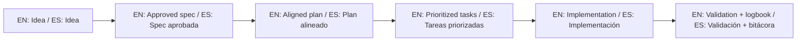

# Authors / Autores

## Main author / Autor principal

- **Juan Carlos Alvarez Lagos (Juan Klagos)**
  - **GitHub:** [@juanklagos](https://github.com/juanklagos)
  - **LinkedIn:** [Juan Carlos Alvarez Lagos](https://www.linkedin.com/in/juan-carlos-alvarez-lagos-672298103/)
  - **Portfolio:** [juanklagos.github.io](https://juanklagos.github.io/)

### Professional Profile / Perfil Profesional

CTO and software developer with over **10 years of experience** leading the full digital product development cycle. Expert in **SaaS multi-tenant architectures** and microservices. Specialist in **Laravel, Node.js, Vue 3, and Inertia.js**, with solid experience in **AWS, Docker, and CI/CD automation**.

### Experience / Experiencia

- **CTO @ Praxis Studio SAS** (2022 — Present)
- **Team Lead @ Cuemby Inc** (2020 — 2023)
- **Front-End Developer @ IPCOM AI** (2021)
- **Full-Stack Developer** (Various Roles since 2015)

### Skills / Habilidades

- **Stack:** Laravel, PHP, Vue 3, Inertia.js, Filament, TypeScript, JavaScript, Node.js.
- **Tools:** AWS, Docker, CI/CD, PostgreSQL, MySQL.

## Collaborators / Colaboradores

This section is open for future collaborators.

Esta sección queda abierta para colaboradores futuros.

- Name / Nombre:
- Contribution / Aporte:
- Contact / Contacto (optional):

## 🌐 Bilingual support / Soporte bilingüe

- EN: This repository is designed to be used in English and Spanish.
- ES: Este repositorio está diseñado para usarse en inglés y español.
- EN: Keep instructions simple, direct, and copy/paste-ready.
- ES: Mantén instrucciones simples, directas y listas para copiar/pegar.

## 🗣️ Prompt base / Base prompt

```text
EN: Using https://github.com/juanklagos/spec-driven-development-template, guide me step by step with SDD for my project.
My project is: [describe project in plain language].
Do not skip idea, spec, plan, tasks, logbook, and validation.

ES: Usando https://github.com/juanklagos/spec-driven-development-template, guíame paso a paso con SDD para mi proyecto.
Mi proyecto es: [explica el proyecto en lenguaje simple].
No omitas idea, spec, plan, tasks, bitácora y validación.
```

## 💡 Tips / Consejos

- EN: Ask the AI to confirm the active spec before coding.
- ES: Pide a la IA confirmar la spec activa antes de programar.
- EN: Keep one clear next step at the end of each session.
- ES: Deja un próximo paso claro al final de cada sesión.
- EN: Prefer simple language and concrete deliverables.
- ES: Prefiere lenguaje simple y entregables concretos.

## 📊 Visual flow / Flujo visual


