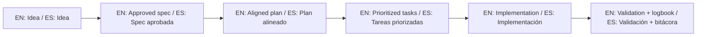

# Changelog

All notable changes to the SDD Template will be documented in this file.

The format is based on [Keep a Changelog](https://keepachangelog.com/en/1.1.0/).

---

## [v1.6.0] — 2026-07-20

### Added
- Packages published to npm under the author scope: [`@juanklagos/sdd-core`](https://www.npmjs.com/package/@juanklagos/sdd-core), [`@juanklagos/sdd-mcp`](https://www.npmjs.com/package/@juanklagos/sdd-mcp), and [`@juanklagos/create-sdd-project`](https://www.npmjs.com/package/@juanklagos/create-sdd-project) (the unscoped name `create-sdd-project` is taken by a third party).
- README (EN/ES): `npx @juanklagos/create-sdd-project` as the fastest no-clone start, and npx-based MCP client config.
- `sdd-mcp` 1.5.1: `mcpName` field for MCP Registry ownership validation.

- **SDD Builder (phase 1, spec 006)**: visual drag-and-drop spec builder at `http://127.0.0.1:3334/builder` — React Flow canvas with typed cards (Idea/Epic/Spec) showing status and task progress, connections with editable labels, palette, and a detail drawer with clickable task checkboxes. Markdown stays the source of truth; layout persists to `specs/board.canvas` (open JSON Canvas format). New `board` module in `sdd-core`, REST API on the HTTP transport, and `builder/` frontend (Vite + React Flow + dnd-kit, all MIT). Build once with `npm run builder:build`.

- **SDD Builder phase 2 — live sync**: `GET /api/events` (SSE) with a debounced recursive watcher on `specs/`; the builder updates cards, progress bars and the open drawer in real time when files change on disk, reconciling by stable id without touching local positions; echo-guard after own saves; live indicator with auto-reconnect and a 60s ping watchdog (detects proxy-masked disconnects); amber banner when the server workspace changed; error hints now include `SDD_PROJECT_ROOT`.

### Fixed
- `createSpec` no longer leaves a half-created bundle behind when `specs/_template/` is missing (atomic cleanup on failure).

### Changed
- Internal `@sdd/*` scope renamed to `@juanklagos/*` across packages, imports, workspace scripts, and docs.

### Verified
- `npm run build` (monorepo + builder) · 3 SDD scripts at 0 errors
- Builder phases 1-2 verified end-to-end against real sidecar workspaces (browser screenshots, live sync via SSE, atomicity fix exercised)

## [v1.5.0] — 2026-07-17

### Added
- New guide 50, "SDD in 2026: state of the art and how this template compares", based on fresh industry research (Spec Kit, Kiro, OpenSpec, BMAD, Tessl, Agent OS, community critiques, 2026 trends):
  - `docs/en/50-sdd-state-of-the-art-2026.md`
  - `docs/es/50-estado-del-arte-sdd-2026.md`
- EARS notation (industry-standard verifiable acceptance criteria) taught in guide 12 (EN/ES) with patterns table, example, and checklist; EARS blocks added to `specs/_template/spec.md` and `templates/spec/spec.template.md`.
- Spec `002-interactive-onboarding` (Level 1 of `idea/PROPUESTAS_2026-07-17.md`), user-approved and implemented:
  - Portable Agent Skill: `skills/sdd-workflow/SKILL.md` (open Agent Skills standard, readable by 32+ tools).
  - Claude Code slash commands: `.claude/commands/sdd/` — `/sdd:help` (stage router), `/sdd:new`, `/sdd:spec`, `/sdd:gate`, `/sdd:close`.
  - VS Code / Copilot mirror: `.github/prompts/sdd-{new,gate,close}.prompt.md` + `.github/instructions/sdd-specs.instructions.md` (`applyTo: specs/**`).
  - `llms.txt` at the root + generator `scripts/generate-llms-txt.sh`.
  - `.devcontainer/devcontainer.json` + "Open in Codespaces" badge in both READMEs.
  - `demo.tape` (VHS) + `.github/workflows/demo.yml` to regenerate `docs/assets/demo.gif` on release/dispatch.
  - New "Built-in commands for your AI agent" section in README (EN/ES).
- Ideas backlog from fresh ecosystem research: `idea/PROPUESTAS_2026-07-17.md` (16 proposals in 3 effort tiers).
- Spec `003-distribution-and-tutor` (Level 2 of the proposals), user-approved and implemented:
  - Claude Code plugin + own marketplace: `.claude-plugin/marketplace.json` + `.claude-plugin/plugin.json` — install with `/plugin marketplace add juanklagos/spec-driven-development-template` then `/plugin install sdd@sdd-template`.
  - Conversational tutor `/sdd:tutor` (levels 1-3, graded by the real validation scripts) + Copilot mirror.
  - GSD-style discovery interview reinforced in `/sdd:new`.
  - GitHub Action (composite) at `action.yml`: `uses: juanklagos/spec-driven-development-template@main` runs structure + policy + gate in any CI, with sidecar/standalone autodetection.
  - `packages/create-sdd-project`: zero-dependency npm scaffolder (`npx create-sdd-project`), prepared for publication.
  - README (EN/ES): tutor row, plugin install, CI snippet.

- Spec `004-site-dashboard-community` (Level 3 of the proposals), user-approved and implemented:
  - Documentation site (`site/`): Astro Starlight with EN/ES i18n, search, and auto-sync of all 51 guides from `docs/` (frontmatter injection + link rewriting); deployed to GitHub Pages at https://juanklagos.github.io/spec-driven-development-template/ via the `site` workflow.
  - Visual dashboard: `GET /dashboard` on the `sdd-mcp` HTTP transport — specs, statuses, gate state and approval count for the resolved workspace (`SDD_PROJECT_ROOT` override supported), with graceful degradation outside SDD workspaces.
  - Community: GitHub Discussions enabled, "Community" section in README (EN/ES), and completion badges in `/sdd:tutor`.
  - MCP Registry preparation: `packages/sdd-mcp/server.json` (io.github.juanklagos/sdd-mcp).

- Spec `005-learning-for-everyone`, user-approved and implemented:
  - Level badges (Beginner/Intermediate/Advanced/Reference, bilingual) on every guide in the docs site sidebar, driven by a curated map in `site/scripts/sync-docs.mjs`; landing cards link the three level paths.
  - Interactive course `aprende-sdd` (GitHub Skills format, template repo): 4 auto-graded steps ending with the real SDD gate as exam, verified end-to-end in CI including the "Use this template" path — https://github.com/juanklagos/aprende-sdd
  - Course linked from README (EN/ES) learning section and Community, and from the site landings.

### Fixed
- `demo-gif` workflow: replaced broken `charmbracelet/vhs-action@v2` (ffmpeg installer failure found in the first real run) with direct vhs/ttyd/ffmpeg installation from the Charm apt repo.

### Changed
- Guide 08 (EN/ES) updated to the current Spec Kit command set: `speckit.*` namespace note, full command table including `/speckit.clarify`, `/speckit.analyze`, `/speckit.checklist`, `/speckit.taskstoissues`, and how the optional commands fit this template's gate; optional commands also reflected in `AGENT_OPERATING_SYSTEM.md` and `AI_START_HERE.md`.
- README (EN/ES) fully reorganized for first-time visitors: "What is this?" and "Choose your door" sections first, golden rule simplified, MCP moved to an optional advanced section, three essential reads highlighted.
- `docs/README.md` now indexes all 51 guides (EN/ES) grouped by topic; removed duplicate MCP entry and the stale "Next release prep" label.
- Sidecar-first workspace guidance propagated to the canonical `AGENT_OPERATING_SYSTEM.md`, `template-context/06-AI-RULES-MATRIX.md`, and all per-agent rule files (`CLAUDE.md`, `GEMINI.md`, `WINDSURF.md`, `ROO.md`, `AIDER.md`, `.cursorrules`, `.clauderules`, `.github/copilot-instructions.md`).
- `QUICKSTART.md` external-path route now recommends `install-spec-sidecar.sh` (sidecar) and reserves `init-project.sh --profile=full` for explicit standalone mode.
- Spec `001-sdd-mcp-foundation` status updated to `Done / Completada` in `specs/INDEX.md`; `STATUS.md` regenerated.

### Fixed
- Stale `v1.4.0` version strings updated to `v1.4.1` in README badges (EN/ES), versioning strategy (doc 37), and public roadmap (doc 35); launch kit copy (doc 34) now uses generic `v1.4.x`.

### Verified
- `npm run build` · `npm run typecheck`
- `./scripts/validate-sdd.sh . --strict` · `./scripts/check-sdd-policy.sh .` · `./scripts/check-sdd-gate.sh .`
- Site build (155 pages) + GitHub Pages deploy · demo-gif workflow run · course flow end-to-end in CI

## [v1.4.1] — 2026-03-19

### Changed
- Core documentation now states explicitly that GitHub Spec Kit is the base workflow reference for this framework.
- README, docs index, and structure guides now align the real-project model with the `spec/` sidecar architecture.
- Roadmap, launch kit, and versioning docs are now aligned with the current `v1.4.x` state.

### Verified
- `npm run build`
- `./scripts/validate-sdd.sh . --strict`
- `./scripts/check-sdd-policy.sh .`
- `./scripts/check-sdd-gate.sh .`

## [v1.4.0] — 2026-03-19

### Added
- Exact sidecar-mode prompts to keep advanced projects clean and avoid copying the full framework repository:
  - `docs/en/49-spec-sidecar-prompts.md`
  - `docs/es/49-prompts-sidecar-spec.md`

### Changed
- The professional default architecture is now explicit:
  - project code stays in the project root
  - SDD artifacts stay in `./spec/`
  - full template copy is only for explicit standalone mode
- `sdd-core` now resolves SDD roots automatically for both:
  - classic root layout
  - compact `spec/` sidecar layout
- `sdd-mcp` resources and tools now work correctly with sidecar projects created under `./www/<project-name>/`.
- `scripts/create-www-project.sh` now invokes nested scripts through `bash` for reliable execution from MCP/Node-driven flows.
- GitMCP docs now use local relative links compatible with offline markdown link checks.

### Fixed
- MCP integration test updated for sidecar workspace outputs (`projectRoot` + `sddRoot` + `layout`).
- Local link-check failures caused by absolute filesystem links in:
  - `docs/en/47-free-external-mcp-options.md`
  - `docs/en/48-how-to-connect-this-repo-with-gitmcp.md`
  - `docs/es/47-opciones-gratis-mcp-externo.md`
  - `docs/es/48-como-conectar-este-repo-con-gitmcp.md`

### Verified
- `npm run typecheck`
- `npm run build`
- `npm run mcp:test`
- `./scripts/validate-sdd.sh . --strict`
- `./scripts/check-sdd-policy.sh .`
- `./scripts/check-sdd-gate.sh .`

## [v1.3.1] — 2026-03-18

### Added
- Dedicated GitMCP connection guides:
  - `docs/en/48-how-to-connect-this-repo-with-gitmcp.md`
  - `docs/es/48-como-conectar-este-repo-con-gitmcp.md`

### Changed
- README, docs index, easy MCP guide, and free external MCP guide now point explicitly to the GitMCP step-by-step path.
- GitMCP is now explained more clearly as:
  - free external repo-context MCP
  - not a replacement for `sdd-mcp`
  - useful for onboarding and repository understanding

### Verified
- `npm run build`
- `./scripts/validate-sdd.sh . --strict`
- `./scripts/check-sdd-policy.sh .`

## [v1.3.0] — 2026-03-18

### Added
- Easy MCP guides for non-technical users:
  - `docs/en/43-easy-mcp-guide.md`
  - `docs/es/43-guia-mcp-facil.md`
- Hosted onboarding MCP model docs:
  - `docs/en/44-hosted-mcp-onboarding-model.md`
  - `docs/es/44-modelo-onboarding-mcp-alojado.md`
- Client visual examples for easy MCP:
  - `docs/en/45-client-visual-examples-for-easy-mcp.md`
  - `docs/es/45-ejemplos-visuales-clientes-mcp-facil.md`
- Next release preparation docs:
  - `docs/en/46-v1.3.0-preparation.md`
  - `docs/es/46-preparacion-v1.3.0.md`
- Easy MCP resource:
  - `sdd-easy-mcp-guide`
- Easy MCP prompts:
  - `easy_start_project`
  - `easy_create_spec`
  - `easy_show_structure`
  - `easy_validate_project`
  - `easy_show_next_step`
  - `easy_close_session`

### Changed
- README, docs index, AI start guide, and MCP references now surface the easy path before the deep technical path.
- Media kit positioning now includes easy MCP onboarding.
- Internal package versions are now aligned with the framework release:
  - `@sdd/sdd-core` → `1.3.0`
  - `@sdd/sdd-mcp` → `1.3.0`

### Verified
- `npm run typecheck`
- `npm run build`
- `npm run mcp:smoke`
- `npm run mcp:http:smoke`
- `./scripts/validate-sdd.sh . --strict`
- `./scripts/check-sdd-policy.sh .`
- `./scripts/check-sdd-gate.sh .`

## [v1.2.0] — 2026-03-18

### Added
- Dedicated MCP CI workflow:
  - `.github/workflows/mcp.yml`
- MCP integration test covering:
  - workspace creation
  - spec creation
  - validation
  - gate checks
  - status and roadmap generation
  - project log and resource reads
- Public roadmap docs:
  - `docs/en/35-public-roadmap.md`
  - `docs/es/35-roadmap-publico.md`
- Tested client setup recipes:
  - `docs/en/36-client-setup-recipes.md`
  - `docs/es/36-recetas-setup-clientes.md`
- Versioning strategy docs:
  - `docs/en/37-versioning-strategy.md`
  - `docs/es/37-estrategia-versionado.md`
- Media/public launch assets:
  - `docs/assets/social-preview.svg`
  - `docs/en/38-media-kit.md`
  - `docs/es/38-kit-medios.md`
- Next release preparation docs:
  - `docs/en/39-v1.2.0-preparation.md`
  - `docs/es/39-preparacion-v1.2.0.md`
- Adoption-oriented GitHub issue templates:
  - `bug-report`
  - `use-case`
- End-to-end example:
  - `examples/002-mcp-end-to-end/`

### Changed
- Internal package versions are now aligned with the framework release:
  - `@sdd/sdd-core` → `1.2.0`
  - `@sdd/sdd-mcp` → `1.2.0`
- README and docs index now surface:
  - roadmap
  - client setup recipes
  - versioning strategy
  - media kit
  - next release prep
- Fixed `sdd_create_spec` to create the spec directory before creating `contracts/`.
- Repository positioning is now clearly framed as:
  - operational SDD framework
  - AI guidance
  - GitHub Spec Kit reference
  - MCP support

### Verified
- `npm run typecheck`
- `npm run build`
- `npm run mcp:smoke`
- `npm run mcp:http:smoke`
- `npm run mcp:test`
- `./scripts/validate-sdd.sh . --strict`
- `./scripts/check-sdd-policy.sh .`
- `./scripts/check-sdd-gate.sh .`

## [v1.1.0] — 2026-03-18

### Added
- `packages/sdd-core` as typed reusable SDD logic for workspace, spec, validation, gate, roadmap, status, and logbook operations.
- `packages/sdd-mcp` as a real MCP server with:
  - `stdio` transport
  - `Streamable HTTP` transport
  - 12 operational tools
  - static resources plus active project resource templates
  - beginner-friendly MCP prompts
- MCP smoke tests for both transports:
  - `npm run mcp:smoke`
  - `npm run mcp:http:smoke`
- Copy/paste client configuration examples for:
  - Cursor
  - Claude Code
  - Codex
- Root `.mcp.json` so the repository can be connected quickly in project-scoped MCP workflows.
- Bilingual MCP setup guides:
  - `docs/en/33-mcp-server-guide.md`
  - `docs/es/33-guia-servidor-mcp.md`
- Launch kit docs for diffusion and reuse:
  - `docs/en/34-launch-kit.md`
  - `docs/es/34-kit-lanzamiento.md`

### Changed
- README and README.es now surface MCP as a first-class entry point with links to setup guides and copy/paste configs.
- MCP tools now expose `outputSchema` and return `structuredContent` for stronger client compatibility.
- Project context is now available through MCP resource templates for:
  - `specs/INDEX.md`
  - project log
  - latest handoff
  - project idea
  - per-spec documents

### Verified
- `npm run typecheck`
- `npm run build`
- `npm run mcp:smoke`
- `npm run mcp:http:smoke`
- `./scripts/validate-sdd.sh . --strict`
- `./scripts/check-sdd-policy.sh .`
- `./scripts/check-sdd-gate.sh .`

## [v1.0.1] — 2026-03-14

### Added
- `scripts/check-sdd-gate.sh` to enforce SDD implementation gate checks before coding.
- `template-context/09-SPECKIT-STANDARDIZATION-PLAN.md` with phased roadmap to evolve into a Spec Kit-centered framework.

### Changed
- **Spec Kit-first workflow standardization** across scripts and docs.
- `scripts/init-project-with-spec-kit.sh` now prioritizes `specify`, then `uv tool install`, then `uvx`.
- `scripts/init-project.sh` now propagates AI rule files, template context, and `check-sdd-gate.sh` into initialized projects.
- CI workflow now validates canonical AI rule assets and runs both:
  - `./scripts/validate-sdd.sh . --strict`
  - `./scripts/check-sdd-gate.sh .`
- AI rules now use `template-context/core-instructions/AGENT_OPERATING_SYSTEM.md` as canonical source.
- Updated onboarding docs (`README.md`, `AGENTS.md`, `AI_START_HERE.md`, `QUICKSTART.md`, Spec Kit integration docs EN/ES) to include SDD gate and Spec Kit-first flow.
- Updated templates:
  - `specs/_template/spec.md` approval status fields clarified.
  - `specs/_template/plan.md` now includes dependencies, milestones, and risks sections.

### Removed
- References to deprecated root-level instruction files in active rule paths.

---

## [v1.0.0] — 2026-03-14

### 🎉 Initial Stable Release

#### Added
- **QUICKSTART.md** — 1-page, 5-step bilingual quick start guide for new users
- **CHANGELOG.md** — This file, tracking all version changes
- **scripts/reset-template.sh** — Clean reset script for starting fresh projects
- **Dogfooding:** `idea/IDEA_GENERAL.md` filled with the template's own vision and goals
- **Dogfooding:** `bitacora/global/PROJECT_LOG.md` populated with real session entries
- **Pre-commit hook** support via `.githooks/pre-commit`
- Version badge in README

#### Improved
- **10 documentation guides enriched** (docs 20-24, 26-29, 31 in EN + ES):
  - Anti-patterns guide with real scenarios and recovery protocol
  - Quality checklists with stage gates and daily routine
  - Team mode guide with roles, branch strategy, and communication protocol
  - 30-minute onboarding as minute-by-minute walkthrough
  - Architecture decisions with ADR-lite template and 3 examples
  - Validated prompt bank expanded to 6 tested prompts
  - Project type playbooks with detailed spec partitions
  - Legacy migration guide with 4-phase workflow and mermaid diagrams
  - Status dashboard guide with complete script documentation
  - Legal framework with clear allowed/restricted use tables
- **init-project.sh** — Now prints bilingual output (EN + ES)
- **validate-sdd.sh** — Improved IDEA_GENERAL.md content check (detects unfilled templates)
- **STATUS.md** — Cleaned to be a proper empty template instead of fake data
- **README.md** — Added Quickstart badge, version badge, and `degit` instructions

#### Changed
- **Legal files** moved to `legal/` directory (except LICENSE and NOTICE) to reduce root noise
- Updated legal document links throughout docs and README

#### Fixed
- STATUS.md no longer shows data from non-existent example spec

---

## [v0.9.0] — 2026-03-12

### Repository Polish & Audit (Pre-release)

#### Added
- `.gitkeep` files in `bitacora/diaria/`, `bitacora/handoffs/`, `bitacora/decisiones/`
- `.gitkeep` in `specs/_template/contracts/`, `playbooks/`, `examples/`
- GitHub Actions CI workflow (`validate.yml`)
- Golden Example: Weather App (`examples/001-weather-app-sdd/`)
- Examples: `new-project-example` and `adapt-existing-project-example`
- `template-context/` directory with 7 AI context files
- Guided prompts in `IDEA_GENERAL.md` template

#### Improved
- README restructured with thematic documentation discovery table
- docs/README.md reorganized into 4 categories
- Bilingual documentation (EN/ES) for all 32 guides

## 🌐 Bilingual support / Soporte bilingüe

- EN: This repository is designed to be used in English and Spanish.
- ES: Este repositorio está diseñado para usarse en inglés y español.
- EN: Keep instructions simple, direct, and copy/paste-ready.
- ES: Mantén instrucciones simples, directas y listas para copiar/pegar.

## 🗣️ Prompt base / Base prompt

```text
EN: Using https://github.com/juanklagos/spec-driven-development-template, guide me step by step with SDD for my project.
My project is: [describe project in plain language].
Do not skip idea, spec, plan, tasks, logbook, and validation.

ES: Usando https://github.com/juanklagos/spec-driven-development-template, guíame paso a paso con SDD para mi proyecto.
Mi proyecto es: [explica el proyecto en lenguaje simple].
No omitas idea, spec, plan, tasks, bitácora y validación.
```

## 💡 Tips / Consejos

- EN: Ask the AI to confirm the active spec before coding.
- ES: Pide a la IA confirmar la spec activa antes de programar.
- EN: Keep one clear next step at the end of each session.
- ES: Deja un próximo paso claro al final de cada sesión.
- EN: Prefer simple language and concrete deliverables.
- ES: Prefiere lenguaje simple y entregables concretos.

## 📊 Visual flow / Flujo visual


