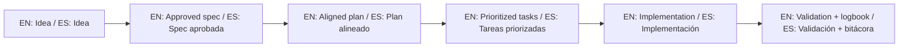

# Guía para contribuir

## Objetivo
Mantener esta plantilla clara, simple y útil para personas nuevas y profesionales.

## Reglas de contribución

0. Clonar es opcional; lo obligatorio es usar este repositorio y su documentación como referencia principal al trabajar con IA.
1. No introducir términos no explicados.
2. No romper la estructura base (`idea`, `specs`, `bitacora`).
3. Todo cambio relevante debe actualizar documentación en `docs/`.
4. Mantener ejemplos simples y aplicables.
5. Ejecutar `./scripts/validate-sdd.sh . --strict` antes de proponer cambios.
6. Módulos opcionales (`playbooks/`, `quality/`, scripts extra) no son obligatorios para contribuciones mínimas, pero deben mantenerse consistentes si se usan.
7. Toda contribución debe aceptar `CLA.md` y respetar la política de licencia no comercial.

## Proceso recomendado

1. Abrir una propuesta clara.
2. Describir el problema.
3. Proponer solución concreta.
4. Actualizar archivos afectados.

## Reconocimiento de autoría y colaboradores

- Autor principal: revisar `AUTHORS.md`.
- Nuevas personas colaboradoras: agregar entrada en `COLLABORATORS.md`.

## 🌐 Bilingual support / Soporte bilingüe

- EN: This repository is designed to be used in English and Spanish.
- ES: Este repositorio está diseñado para usarse en inglés y español.
- EN: Keep instructions simple, direct, and copy/paste-ready.
- ES: Mantén instrucciones simples, directas y listas para copiar/pegar.

## 🗣️ Prompt base / Base prompt

```text
EN: Using https://github.com/juanklagos/spec-driven-development-template, guide me step by step with SDD for my project.
My project is: [describe project in plain language].
Do not skip idea, spec, plan, tasks, logbook, and validation.

ES: Usando https://github.com/juanklagos/spec-driven-development-template, guíame paso a paso con SDD para mi proyecto.
Mi proyecto es: [explica el proyecto en lenguaje simple].
No omitas idea, spec, plan, tasks, bitácora y validación.
```

## 💡 Tips / Consejos

- EN: Ask the AI to confirm the active spec before coding.
- ES: Pide a la IA confirmar la spec activa antes de programar.
- EN: Keep one clear next step at the end of each session.
- ES: Deja un próximo paso claro al final de cada sesión.
- EN: Prefer simple language and concrete deliverables.
- ES: Prefiere lenguaje simple y entregables concretos.

## 📊 Visual flow / Flujo visual


