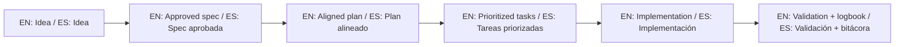

# Quickstart / Inicio rápido

Goal / Objetivo:
- EN: create your first valid SDD workflow quickly.
- ES: crear tu primer flujo SDD válido rápidamente.

## 1) Get the template / Obtén el template

```bash
npx degit juanklagos/spec-driven-development-template my-project
cd my-project
```

Alternative / Alternativa:

```bash
git clone https://github.com/juanklagos/spec-driven-development-template.git my-project
cd my-project
```

## 2) Initialize GitHub Spec Kit (recommended)

```bash
uv tool install specify-cli --from git+https://github.com/github/spec-kit.git
specify init . --ai codex
```

One-shot / Uso puntual:

```bash
uvx --from git+https://github.com/github/spec-kit.git specify init . --ai codex
```

## 3) Define the idea / Define la idea

Complete:
- `idea/IDEA_GENERAL.md`

Minimum fields / Campos mínimos:
- Project name / Nombre
- Problem / Problema
- Main goal / Objetivo principal
- MVP scope / Alcance inicial

## 4) Create first spec / Crea la primera spec

```bash
./scripts/new-spec.sh "my-feature" "Owner"
```

Then fill:
- `specs/001-.../spec.md`
- `specs/001-.../plan.md`
- `specs/001-.../tasks.md`
- `specs/001-.../history.md`

## 5) Follow Spec Kit flow / Sigue el flujo Spec Kit

1. `/speckit.constitution`
2. `/speckit.specify`
3. `/speckit.plan`
4. `/speckit.tasks`
5. `/speckit.implement`

## 6) Log session / Registra sesión

Update:
- `bitacora/global/PROJECT_LOG.md`
- `bitacora/diaria/AAAA-MM-DD.md`
- `bitacora/handoffs/` (if pending work / si hay pendientes)

## 7) Validate / Valida

```bash
./scripts/validate-sdd.sh . --strict
./scripts/check-sdd-policy.sh .
./scripts/check-sdd-gate.sh .
```

## Next / Siguiente

- Beginner path: [EN](./docs/en/13-quick-guide-non-programmers.md) | [ES](./docs/es/13-guia-rapida-no-programadores.md)
- Prompt bank: [EN](./docs/en/26-validated-prompt-bank.md) | [ES](./docs/es/26-banco-prompts-validados.md)

## 🌐 Bilingual support / Soporte bilingüe

- EN: This repository is designed to be used in English and Spanish.
- ES: Este repositorio está diseñado para usarse en inglés y español.
- EN: Keep instructions simple, direct, and copy/paste-ready.
- ES: Mantén instrucciones simples, directas y listas para copiar/pegar.

## 🗣️ Prompt base / Base prompt

```text
EN: Using https://github.com/juanklagos/spec-driven-development-template, guide me step by step with SDD for my project.
My project is: [describe project in plain language].
Do not skip idea, spec, plan, tasks, logbook, and validation.

ES: Usando https://github.com/juanklagos/spec-driven-development-template, guíame paso a paso con SDD para mi proyecto.
Mi proyecto es: [explica el proyecto en lenguaje simple].
No omitas idea, spec, plan, tasks, bitácora y validación.
```

## 💡 Tips / Consejos

- EN: Ask the AI to confirm the active spec before coding.
- ES: Pide a la IA confirmar la spec activa antes de programar.
- EN: Keep one clear next step at the end of each session.
- ES: Deja un próximo paso claro al final de cada sesión.
- EN: Prefer simple language and concrete deliverables.
- ES: Prefiere lenguaje simple y entregables concretos.

## 📊 Visual flow / Flujo visual


