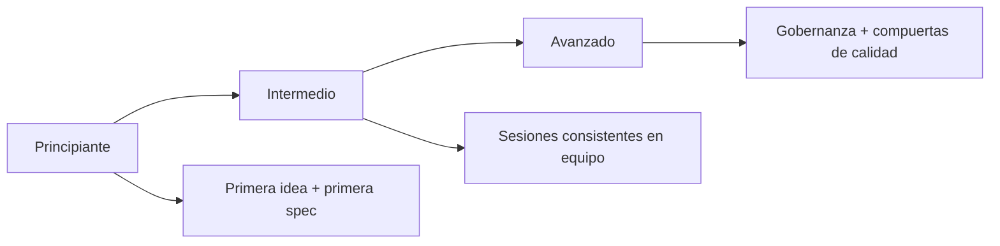

<div align="center">
  <h1>🌱 Spec-Driven Development Template</h1>
  <p><b>Inicia proyectos con disciplina basada en especificaciones y guía amigable para IA.</b></p>

  <p>
    <a href="./README.md"></a>
    <a href="./README.es.md"></a>
  </p>

  <p>
    
    <a href="./AI_START_HERE.md"></a>
    <a href="./QUICKSTART.md"></a>
  </p>
</div>

---

## ⚡ Empieza en 30 segundos

1. Abre [AI_START_HERE.md](./AI_START_HERE.md)
2. Copia y pega este prompt:

```text
Usando https://github.com/juanklagos/spec-driven-development-template, guíame paso a paso con SDD para mi proyecto.
Mi proyecto es: [explica tu proyecto en lenguaje simple].
Si mi proyecto es nuevo, inicializa desde este template.
Si ya existe, adáptalo sin romper el comportamiento actual.
No hay código sin spec aprobada y plan consistente.
```

3. Elige tu nivel y continúa:
- Principiante: [docs/es/13-guia-rapida-no-programadores.md](./docs/es/13-guia-rapida-no-programadores.md)
- Intermedio: [docs/es/14-guia-intermedia.md](./docs/es/14-guia-intermedia.md)
- Avanzado: [docs/es/15-guia-avanzada.md](./docs/es/15-guia-avanzada.md)

## 🚨 Regla obligatoria antes de codificar

Este template exige chequeos de política y compuerta:

```bash
./scripts/check-sdd-policy.sh .
./scripts/check-sdd-gate.sh .
```

Parada dura:
- No hay código sin `spec.md` aprobada y `plan.md` consistente.

Archivos de referencia:
- [sdd.policy.yaml](./sdd.policy.yaml)
- [INSTRUCTIONS.md](./INSTRUCTIONS.md)
- [template-context/core-instructions/AGENT_OPERATING_SYSTEM.md](./template-context/core-instructions/AGENT_OPERATING_SYSTEM.md)

---

## 🎯 Problema vs solución

| ❌ Problema | ✅ Solución SDD |
| :--- | :--- |
| Decisiones perdidas en chats | Fuente única de verdad en `specs/` |
| Código sin planeación | Compuerta obligatoria `spec.md` + `plan.md` |
| Onboarding difícil para equipo/IA | Estructura estándar y guías por nivel |
| Trazabilidad débil | Registro de sesiones en `bitacora/` |

## 🧭 Template vs proyecto real

- Este repositorio es un **marco/template**.
- El trabajo de producto debe ejecutarse en tu proyecto destino usando esta estructura.
- Si adaptas un proyecto existente, integra `idea/specs/bitacora` sin romper comportamiento actual.

## 🗺️ Ruta de aprendizaje (3 niveles)



---

## 🏗️ Anatomía de un proyecto SDD

Carpetas obligatorias:
- `idea/`: intención y alcance del proyecto
- `specs/`: especificaciones numeradas
- `bitacora/`: trazabilidad y handoffs
- `docs/`: guías y referencias

Paquete obligatorio por feature:
1. `spec.md`
2. `plan.md`
3. `tasks.md`
4. `history.md`

---

## 👤 Ruta no técnica

- Empieza aquí: [AI_START_HERE.md](./AI_START_HERE.md)
- Sigue la ruta por nivel: [docs/es/18-ruta-completa-3-niveles.md](./docs/es/18-ruta-completa-3-niveles.md)
- Usa prompts listos:
  - [docs/es/19-matriz-prompts-por-objetivo.md](./docs/es/19-matriz-prompts-por-objetivo.md)
  - [docs/es/26-banco-prompts-validados.md](./docs/es/26-banco-prompts-validados.md)

## 🛠️ Ruta técnica

| Herramienta | Comando | Descripción |
| :--- | :--- | :--- |
| Proyecto nuevo | `./scripts/init-project.sh` | Inicializa estructura SDD |
| Proyecto nuevo + Spec Kit | `./scripts/init-project-with-spec-kit.sh` | Inicializa estructura + Spec Kit |
| Nueva spec | `./scripts/new-spec.sh` | Crea carpeta numerada de spec |
| Validación | `./scripts/validate-sdd.sh . --strict` | Valida estructura y consistencia |
| Chequeo de política | `./scripts/check-sdd-policy.sh .` | Valida política multi-agente |
| Compuerta SDD | `./scripts/check-sdd-gate.sh .` | Exige aprobación y consistencia del plan |
| Dashboard de estado | `./scripts/generate-status.sh` | Genera reporte de estado |

> [!TIP]
> Para copia limpia: `npx degit juanklagos/spec-driven-development-template`

---

## 📚 Descubrimiento de documentación

- Esenciales: [Estructura](./docs/es/01-estructura.md) · [Flujo](./docs/es/02-flujo-de-trabajo.md)
- IA: [Agentes soportados](./docs/es/10-agentes-ia-soportados-y-prompts.md) · [Guía Lovable](./docs/es/17-trabajar-con-lovable.md)
- Calidad: [Checklists por etapa](./docs/es/21-checklists-calidad-por-etapa.md) · [ADR](./docs/es/24-decisiones-de-arquitectura.md)

---

## ⚖️ Legal y autoría

- Licencia: PolyForm Noncommercial 1.0.0
- Marco legal: [docs/es/31-marco-legal-y-uso-comercial.md](./docs/es/31-marco-legal-y-uso-comercial.md)
- Historial: [CHANGELOG.md](./CHANGELOG.md)
- Autor: Juan Klagos ([AUTHORS.md](./AUTHORS.md))
