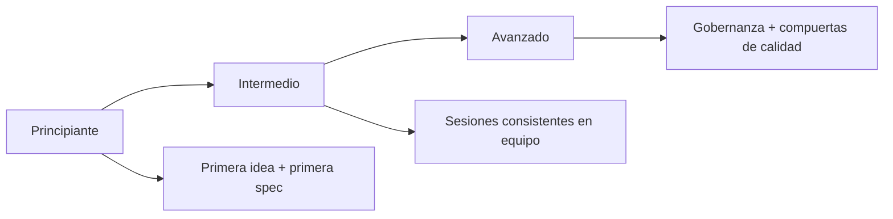
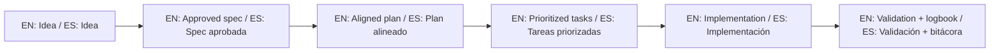

<div align="center">
  <h1>🌱 Spec-Driven Development Template</h1>
  <p><b>Ejecuta proyectos con disciplina guiada por especificaciones.<br>Execute projects with specification-first discipline.</b></p>

  <p>
    <a href="./README.md"></a>
    <a href="./README.es.md"></a>
  </p>

  <p>
    
    <a href="https://github.com/juanklagos/spec-driven-development-template"></a>
    <a href="https://github.com/juanklagos/spec-driven-development-template"></a>
    <a href="https://github.com/juanklagos/spec-driven-development-template"></a>
  </p>

  <br>

  <a href="./QUICKSTART.md">
    
  </a>
  &nbsp;&nbsp;
  <a href="./AI_START_HERE.md">
    
  </a>

  <br><br>
</div>

---

## ⚡ La misión: resolver el "code drift"
**Deja de perder contexto en chats. Deja de implementar código sin un plan.**

| ❌ El problema | ✅ La solución SDD |
| :--- | :--- |
| Decisiones perdidas en el historial de chat | **Fuente única de verdad** en `specs/` |
| Código implementado sin contexto | **Planificación obligatoria** en `plan.md` |
| Onboarding difícil de equipo/IA | **Anatomía estándar** para cualquier proyecto |
| Sin evidencia de validación | **Trazabilidad de ejecución** en `bitacora/` |

## 🗣️ Prompt amigable (copiar y pegar)

```text
Usando https://github.com/juanklagos/spec-driven-development-template, crea todo lo necesario para llevar a cabo mi proyecto de principio a fin.
Mi proyecto es: [explica tu proyecto en lenguaje simple].

Si mi proyecto es nuevo, inicialízalo con este template y GitHub Spec Kit.
Si mi proyecto ya existe, adáptalo a idea/specs/bitacora sin romper el comportamiento actual.
Guíame paso a paso según mi nivel (principiante/intermedio/avanzado), con lenguaje claro.
No omitas especificación, plan, tareas, traza de refinamiento, bitácora y validación.
```

## 🎯 Elige tu nivel



- Principiante: [docs/es/13-guia-rapida-no-programadores.md](./docs/es/13-guia-rapida-no-programadores.md)
- Intermedio: [docs/es/14-guia-intermedia.md](./docs/es/14-guia-intermedia.md)
- Avanzado: [docs/es/15-guia-avanzada.md](./docs/es/15-guia-avanzada.md)

---

## 🏗️ Anatomía del proyecto
El repositorio se divide en 3 capas obligatorias de ejecución:

### 1. Estructura de carpetas
- 📁 `idea/`: El "por qué". Visión general y alcance de alto nivel.
- 📁 `specs/`: El "qué". Especificaciones numeradas secuenciales (el contrato).
- 📁 `bitacora/`: El "cómo fue". Registro diario y handoffs técnicos.
- 📁 `docs/`: El "cómo trabajamos". Guías, playbooks y convenciones.

### 2. El paquete de especificación
Cada feature en `specs/` debe contener:
1. 📄 **`spec.md`**: Requerimientos de negocio y lógica UI/UX.
2. 📄 **`plan.md`**: Estrategia técnica y arquitectura.
3. 📄 **`tasks.md`**: Checklist secuencial de acciones.
4. 📄 **`history.md`**: Trazabilidad de todos los cambios.

---

## 🛠️ Toolkit y automatización
Gestiona tu flujo SDD con estas utilidades:

| Herramienta | Comando | Descripción |
| :--- | :--- | :--- |
| **Proyecto nuevo** | `./scripts/init-project.sh` | Inicializa la estructura en segundos. |
| **Proyecto nuevo + Spec Kit** | `./scripts/init-project-with-spec-kit.sh` | Inicializa estructura y GitHub Spec Kit. |
| **Reset** | `./scripts/reset-template.sh` | Limpia el template para empezar de cero. |
| **Nueva spec** | `./scripts/new-spec.sh` | Crea una carpeta numerada de spec. |
| **Validación** | `./scripts/validate-sdd.sh` | Verifica cumplimiento de reglas SDD. |
| **Chequeo de política** | `./scripts/check-sdd-policy.sh` | Exige consistencia de política multi-agente y archivos de reglas obligatorios. |
| **Compuerta SDD** | `./scripts/check-sdd-gate.sh` | Exige aprobación y consistencia spec-plan-tasks antes de codificar. |
| **Roadmap** | `./scripts/generate-status.sh` | Genera un tablero de estado automático. |

> [!TIP]
> **Tip:** Usa `npx degit juanklagos/spec-driven-development-template` para una copia limpia.

---

## 📚 Centro de conocimiento
Profundiza en los distintos aspectos de la metodología SDD:

### 🏗️ Esenciales
- [Detalle de estructura](./docs/es/01-estructura.md) | [Guía de flujo](./docs/es/02-flujo-de-trabajo.md) | [Ruta completa 3 niveles](./docs/es/18-ruta-completa-3-niveles.md)

### 🤖 IA y desarrollo
- [Agentes soportados y prompts](./docs/es/10-agentes-ia-soportados-y-prompts.md)
- [**Trabajar con Lovable (recomendado)**](./docs/es/17-trabajar-con-lovable.md)
- [Patrones TDD y BDD](./docs/es/12-tdd-y-bdd-como-escribir-specs.md)
- [Banco de prompts validados](./docs/es/26-banco-prompts-validados.md)

### 👥 Gobernanza y equipo
- [Modo equipo y colaboración](./docs/es/22-modo-equipo-y-colaboracion.md)
- [Checklists de calidad por etapa](./docs/es/21-checklists-calidad-por-etapa.md)
- [Decisiones de arquitectura (ADR)](./docs/es/24-decisiones-de-arquitectura.md)

---

## ⚖️ Legal y autoría
- **Licencia:** PolyForm Noncommercial 1.0.0. [Ver marco legal](./docs/es/31-marco-legal-y-uso-comercial.md).
- **Historial:** Revisa el [CHANGELOG.md](./CHANGELOG.md).
- **Autor:** Desarrollado con ☕ y disciplina por **Juan Klagos** ([AUTHORS.md](./AUTHORS.md)).

---
<p align="center">
  <em>Spec-Driven Development — La disciplina es el puente entre metas y resultados.</em>
</p>

## 🌐 Bilingual support / Soporte bilingüe

- EN: This repository is designed to be used in English and Spanish.
- ES: Este repositorio está diseñado para usarse en inglés y español.
- EN: Keep instructions simple, direct, and copy/paste-ready.
- ES: Mantén instrucciones simples, directas y listas para copiar/pegar.

## 🗣️ Prompt base / Base prompt

```text
EN: Using https://github.com/juanklagos/spec-driven-development-template, guide me step by step with SDD for my project.
My project is: [describe project in plain language].
Do not skip idea, spec, plan, tasks, logbook, and validation.

ES: Usando https://github.com/juanklagos/spec-driven-development-template, guíame paso a paso con SDD para mi proyecto.
Mi proyecto es: [explica el proyecto en lenguaje simple].
No omitas idea, spec, plan, tasks, bitácora y validación.
```

## 💡 Tips / Consejos

- EN: Ask the AI to confirm the active spec before coding.
- ES: Pide a la IA confirmar la spec activa antes de programar.
- EN: Keep one clear next step at the end of each session.
- ES: Deja un próximo paso claro al final de cada sesión.
- EN: Prefer simple language and concrete deliverables.
- ES: Prefiere lenguaje simple y entregables concretos.

## 📊 Visual flow / Flujo visual


