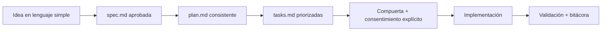
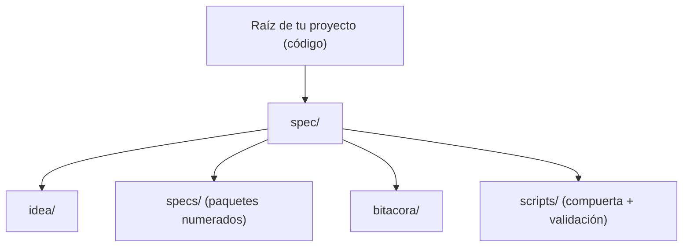

<div align="center">
  <h1>🌱 Spec-Driven Development Template</h1>
  <p><b>Aprende Spec-Driven Development (SDD) y aplícalo en proyectos reales — con la IA como copiloto y GitHub Spec Kit como flujo base.</b></p>

  <p>
    <a href="./README.md"></a>
    <a href="./README.es.md"></a>
  </p>

  <p>
    
    <a href="./START_HERE_NON_TECH.md"></a>
    <a href="./AI_START_HERE.md"></a>
    <a href="./QUICKSTART.md"></a>
    <a href="https://codespaces.new/juanklagos/spec-driven-development-template"></a>
  </p>
</div>


---

## 🌟 ¿Qué es esto?

**Spec-Driven Development (SDD)** significa escribir y aprobar una especificación clara *antes* de escribir código — para que las decisiones, el alcance y la calidad sobrevivan más allá de una ventana de chat. En 2026 es la práctica dominante para construir software con agentes de IA.

Este repositorio es **dos cosas a la vez**:

1. **Una escuela** — una ruta bilingüe (EN/ES) por niveles para aprender SDD desde cero, incluso si no programas.
2. **Una caja de herramientas** — una estructura lista para aplicar SDD en proyectos reales: scripts de cumplimiento, reglas para agentes de IA, un servidor MCP local y un sidecar compacto `spec/` para codebases existentes.

Usa [GitHub Spec Kit](https://github.com/github/spec-kit) como motor de flujo de referencia; este repo es la capa práctica a su alrededor (estructura inicial, guía, reglas y validación).

| ❌ Sin SDD | ✅ Con este template |
| :--- | :--- |
| Decisiones perdidas en chats | Fuente única de verdad en `specs/` |
| Código sin planeación | Compuerta obligatoria `spec.md` + `plan.md`, verificada por máquina |
| Onboarding difícil para equipo/IA | Estructura estándar y guías por nivel |
| Trazabilidad débil | Registro de sesiones en `bitacora/`, historia por spec |

> 🔭 ¿Quieres el mapa de la industria? Lee [SDD en 2026: estado del arte y cómo se compara este template](./docs/es/50-estado-del-arte-sdd-2026.md).

## 🚪 Elige tu puerta

Tres puntos de entrada, uno para cada tipo de visitante:

| Tú eres... | Empieza aquí | Qué obtienes |
| :--- | :--- | :--- |
| 🧑‍💼 **No técnico** (fundador, PM, curioso) | [START_HERE_NON_TECH.md](./START_HERE_NON_TECH.md) | Inicio guiado ultra simple, sin jerga |
| 👩‍💻 **Desarrollador** | [QUICKSTART.md](./QUICKSTART.md) | Comandos para crear y validar en 5 minutos |
| 🤖 **Agente de IA** (o tú, pegándolo en uno) | [AI_START_HERE.md](./AI_START_HERE.md) | Reglas operativas + prompts copy/paste por nivel |

Luego elige tu nivel de aprendizaje:

- Principiante: [docs/es/13-guia-rapida-no-programadores.md](./docs/es/13-guia-rapida-no-programadores.md)
- Intermedio: [docs/es/14-guia-intermedia.md](./docs/es/14-guia-intermedia.md)
- Avanzado: [docs/es/15-guia-avanzada.md](./docs/es/15-guia-avanzada.md)

¿Prefieres aprender haciendo? Toma el **[curso interactivo](https://github.com/juanklagos/aprende-sdd)** (formato GitHub Skills): 4 pasos, ~35 min, corregido automáticamente por Actions — terminas con la compuerta SDD real como examen.

## ⚡ Empieza en 30 segundos

Copia y pega este prompt en tu asistente de IA (Claude, Cursor, Copilot, Gemini...):

```text
Usando https://github.com/juanklagos/spec-driven-development-template, guíame paso a paso con SDD para mi proyecto.
Mi proyecto es: [explica tu proyecto en lenguaje simple].
Si mi proyecto es nuevo, inicializa desde este template y GitHub Spec Kit como flujo base.
Si ya existe, adáptalo sin romper el comportamiento actual.
No hay código sin spec aprobada y plan consistente.
```

## 🎛️ Comandos integrados para tu agente de IA

Si usas **Claude Code**, este repo trae slash commands listos — empieza con `/sdd:help`:

| Comando | Qué hace |
| :--- | :--- |
| `/sdd:help` | Diagnostica tu etapa actual y te da el único siguiente paso |
| `/sdd:new` | Inicio guiado: idea → primera spec lista para aprobar |
| `/sdd:spec` | Crea o refina un paquete de spec con criterios EARS |
| `/sdd:gate` | Ejecuta la compuerta verificada por máquina y registra tu consentimiento |
| `/sdd:close` | Valida y cierra la sesión con el contrato de salida |
| `/sdd:tutor` | Curso conversacional de SDD por niveles, corregido por los scripts de validación reales |

**Instálalo en cualquier proyecto como plugin** (sin clonar):

```text
/plugin marketplace add juanklagos/spec-driven-development-template
/plugin install sdd@sdd-template
```

- **VS Code / Copilot:** los mismos flujos como prompt files en [`.github/prompts/`](./.github/prompts/).
- **Cualquier agente (32+ herramientas):** Agent Skill portable en [skills/sdd-workflow/SKILL.md](./skills/sdd-workflow/SKILL.md).
- **Contexto para IA:** [llms.txt](./llms.txt) indexa toda la documentación para agentes de código (regenéralo con `./scripts/generate-llms-txt.sh`).

## 🚨 La regla de oro

> **No hay código sin `spec.md` aprobada y `plan.md` consistente.**

Y no es solo prosa — se verifica por máquina:

```bash
./scripts/check-sdd-policy.sh .   # los archivos de política multi-agente están alineados
./scripts/check-sdd-gate.sh .     # spec aprobada + plan consistente + consentimiento registrado
```

Antes de iniciar la implementación, se registra consentimiento explícito del usuario:

```bash
./scripts/confirm-user-consent.sh "Usuario aprobó alcance X"
```

(En proyectos sidecar los mismos scripts viven bajo `./spec/scripts/`.)

Exígela también en CI — este repo funciona además como GitHub Action:

```yaml
- uses: juanklagos/spec-driven-development-template@main
  with:
    path: "."      # raíz del proyecto (sidecar o standalone, autodetectado)
    strict: "true"
```

Archivos de referencia: [sdd.policy.yaml](./sdd.policy.yaml) · [INSTRUCTIONS.md](./INSTRUCTIONS.md) · [AGENT_OPERATING_SYSTEM.md](./template-context/core-instructions/AGENT_OPERATING_SYSTEM.md)

## 🎬 Cómo funciona



Cada feature recibe un paquete de spec numerado:

1. `spec.md` — qué y por qué (aprobada por ti)
2. `plan.md` — cómo (consistente con la spec)
3. `tasks.md` — pasos concretos
4. `history.md` — cómo evolucionó

Y cada sesión deja rastro en `bitacora/`: decisiones, handoffs, próximo paso.

Mira el flujo real (crear spec → validar → compuerta), regenerado automáticamente en cada release:


Ejemplo completo de inicio a fin: [examples/002-mcp-end-to-end](./examples/002-mcp-end-to-end/README.md)

## 🧭 Aplícalo en un proyecto real

Tres formas de usar el template, de la más ligera a la más pesada:

| Modo | Cuándo | Comando |
| :--- | :--- | :--- |
| **Sidecar compacto `spec/`** (recomendado) | Proyecto real o existente: artefactos SDD en `./spec/`, el código queda en la raíz de tu proyecto | `./scripts/install-spec-sidecar.sh /ruta/al/proyecto --profile=recommended` |
| **Workspace interno `www/`** | El proyecto ejecutable debe vivir dentro de este repositorio template | `./scripts/create-www-project.sh mi-proyecto codex` |
| **Copia standalone completa** | Quieres explícitamente todo el framework como workspace | `./scripts/init-project.sh /ruta/al/proyecto --profile=full` |

> [!TIP]
> Ruta profesional por defecto: instala solo el sidecar compacto `spec/`. Nunca copies el framework completo dentro de un codebase real salvo que quieras explícitamente el modo standalone.

Comandos del día a día (se muestra el modo sidecar; los mismos scripts existen en la raíz en modo standalone):

| Acción | Comando |
| :--- | :--- |
| Nueva spec | `./spec/scripts/new-spec.sh "mi-feature" "Responsable"` |
| Validar estructura | `./spec/scripts/validate-sdd.sh . --strict` |
| Chequeo de política | `./spec/scripts/check-sdd-policy.sh .` |
| Compuerta SDD | `./spec/scripts/check-sdd-gate.sh .` |
| Dashboard de estado | `./spec/scripts/generate-status.sh` |

Anatomía de carpetas, mapa del proyecto y detalles de layout: [docs/es/42-mapa-organizacion-proyecto.md](./docs/es/42-mapa-organizacion-proyecto.md)



## 🔌 Conéctalo por MCP (opcional, avanzado)

Si tu cliente de IA soporta MCP, este repo incluye un servidor local `sdd-mcp` que convierte el flujo SDD en comandos guiados (`/start-project`, `/create-spec ...`).

```bash
npm install
npm run build
npm run mcp:start
```

- La explicación más simple primero: [Guía fácil de MCP](./docs/es/43-guia-mcp-facil.md)
- Configuraciones por cliente: [`.mcp.json`](./.mcp.json) (Claude Code) · [Cursor](./packages/sdd-mcp/examples/.cursor/mcp.json) · [Codex](./packages/sdd-mcp/examples/codex.config.toml)
- Referencia completa: [docs/es/41-referencia-completa-mcp.md](./docs/es/41-referencia-completa-mcp.md)

Nota: `GitMCP` (gratis, remoto) ayuda a una IA a *leer* este repo público; el `sdd-mcp` local ejecuta el *flujo guiado real*. Se complementan: [guía GitMCP](./docs/es/48-como-conectar-este-repo-con-gitmcp.md).

## 📚 Documentación

**Tres lecturas esenciales:**

1. [Flujo de trabajo](./docs/es/02-flujo-de-trabajo.md) — el flujo SDD paso a paso
2. [Estructura](./docs/es/01-estructura.md) — para qué sirve cada carpeta
3. [SDD en 2026: estado del arte](./docs/es/50-estado-del-arte-sdd-2026.md) — el mapa de la industria y dónde está este template

**Todo lo demás:** el [índice completo de documentación](./docs/README.md) organiza las 51 guías (EN/ES) por tema: ruta de aprendizaje, prompts, MCP, calidad, modo equipo, migración legacy, legal.

## 💬 Comunidad

- 📖 Sitio de documentación navegable: [juanklagos.github.io/spec-driven-development-template](https://juanklagos.github.io/spec-driven-development-template/) — las 51 guías con búsqueda, EN/ES.
- 💬 Preguntas, ideas, muestra tu proyecto: [GitHub Discussions](https://github.com/juanklagos/spec-driven-development-template/discussions).
- 🐛 Bugs y propuestas concretas: [Issues](https://github.com/juanklagos/spec-driven-development-template/issues).
- 🎓 Curso interactivo: [aprende-sdd](https://github.com/juanklagos/aprende-sdd) — aprende haciendo, corregido por Actions.
- 🎓 ¿Terminaste un nivel del tutor? `/sdd:tutor` lo registra en tu bitácora y te da un badge de completación para tu README.

## ⚖️ Legal y autoría

- Licencia: PolyForm Noncommercial 1.0.0 — [marco legal](./docs/es/31-marco-legal-y-uso-comercial.md)
- Historial: [CHANGELOG.md](./CHANGELOG.md)
- Autor: Juan Klagos ([AUTHORS.md](./AUTHORS.md))
