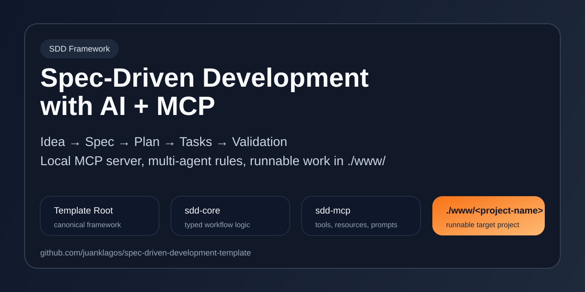
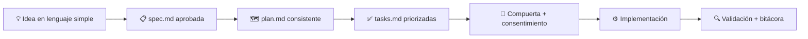
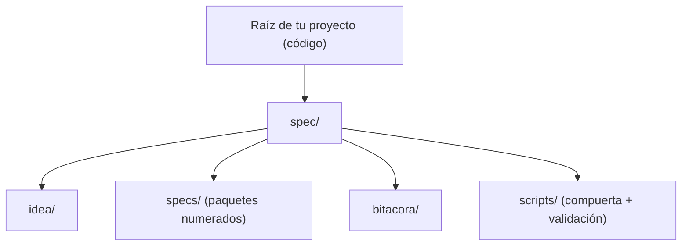

<div align="center">



# 🌱 Spec-Driven Development Template

**Aprende Spec-Driven Development y úsalo en proyectos reales.<br>Una sola regla: no se escribe código hasta que apruebas una especificación escrita. Un script comprueba esa regla cada vez que lo ejecutas, y te dice exactamente qué revisó.**

[🇺🇸 English](./README.md) · 🇪🇸 **Español**


<a href="https://github.com/juanklagos/spec-driven-development-template/releases/tag/v2.5.0"></a>

<a href="https://juanklagos.github.io/spec-driven-development-template/es/"></a>
<a href="https://github.com/juanklagos/aprende-sdd"></a>
<a href="https://github.com/marketplace/actions/sdd-validate"></a>
<a href="https://codespaces.new/juanklagos/spec-driven-development-template"></a>

[Inicio no técnico](./START_HERE_NON_TECH.md) · [Quickstart](./QUICKSTART.md) · [Inicio para agentes IA](./AI_START_HERE.md) · [Comandos](#comandos-integrados-para-tu-agente-de-ia) · [Comunidad](#comunidad)

</div>

---

## ¿Qué es esto?

**Spec-Driven Development (SDD)** consiste en escribir y aprobar una especificación clara *antes* de que exista código. Lo que decidiste queda en un archivo, y no enterrado en un chat que vas a cerrar y no vas a volver a encontrar. En 2026 es la forma en que casi todo el mundo construye software con agentes de IA.

Este repo sirve para dos cosas a la vez.

Es una escuela: una ruta bilingüe (EN/ES) que arranca desde cero, con guías, un curso interactivo y un tutor con el que puedes conversar. No necesitas saber programar para llegar al final.

Y es una caja de herramientas para trabajo real: scripts que comprueban la regla, instrucciones que tu asistente de IA lee, un conector para que tu herramienta de IA ejecute el flujo por sí misma (MCP, el Model Context Protocol), y una sola carpeta `spec/` que añades a un proyecto que ya tiene código, sin mover nada de lo que ya tienes.

Los comandos paso a paso vienen de [GitHub Spec Kit](https://github.com/github/spec-kit). Este repo añade encima las guías, las comprobaciones y las plantillas.

<div align="center">

**El flujo en acción** — crear una spec, validar, pasar la compuerta *(regenerado en cada release)*:


</div>

Qué cambia en la práctica: las decisiones dejan de vivir en el historial del chat y pasan a `specs/`. La compuerta no se abre hasta que `spec.md` y `plan.md` existen, coinciden y registras tu consentimiento — y eso lo revisa un script, no la memoria de alguien. Quien llegue nuevo, persona o agente, aterriza en una estructura de carpetas que ya reconoce. Y en `bitacora/` queda el registro de cada sesión, así que dentro de seis meses todavía puedes averiguar por qué algo se hizo como se hizo.

> ¿Quieres el mapa de la industria? Lee [SDD en 2026: estado del arte y cómo se compara este template](./docs/es/50-estado-del-arte-sdd-2026.md).

## Por dónde entrar

- **No técnico** (fundador, PM, curioso): [START_HERE_NON_TECH.md](./START_HERE_NON_TECH.md) — un inicio guiado, sin jerga.
- **Desarrollador**: [QUICKSTART.md](./QUICKSTART.md) — los comandos para crear y validar, unos cinco minutos.
- **Agente de IA**, o tú pegándolo en uno: [AI_START_HERE.md](./AI_START_HERE.md) — reglas operativas y prompts copy/paste para cada nivel.

Después elige tu nivel. Cada guía del [sitio de docs](https://juanklagos.github.io/spec-driven-development-template/es/) lleva su badge:

- 🟢 Básico: [guía rápida para no programadores](./docs/es/13-guia-rapida-no-programadores.md)
- 🟡 Intermedio: [guía de disciplina en equipo](./docs/es/14-guia-intermedia.md)
- 🔴 Avanzado: [gobernanza y estandarización](./docs/es/15-guia-avanzada.md)

> [!TIP]
> Si prefieres aprender haciendo, toma el **[curso interactivo](https://github.com/juanklagos/aprende-sdd)** (formato GitHub Skills): 4 pasos, ~35 min, corregido automáticamente por Actions. Tu examen es la compuerta SDD real.

## Empieza en 30 segundos

Copia y pega este prompt en tu asistente de IA (Claude, Cursor, Copilot, Gemini...):

```text
Usando https://github.com/juanklagos/spec-driven-development-template, guíame paso a paso con SDD para mi proyecto.
Mi proyecto es: [explica tu proyecto en lenguaje simple].
Si mi proyecto es nuevo, inicializa desde este template y GitHub Spec Kit como flujo base.
Si ya existe, adáptalo sin romper el comportamiento actual.
No hay código sin spec aprobada y plan consistente.
```

## Comandos integrados para tu agente de IA

Si usas **Claude Code**, este repo trae slash commands listos. Empieza con `/sdd:help`:

| Comando | Qué hace |
| :--- | :--- |
| `/sdd:help` | Te dice en qué etapa estás y cuál es el único siguiente paso |
| `/sdd:new` | Inicio guiado: idea → primera spec lista para aprobar |
| `/sdd:spec` | Crea o refina un paquete de spec con criterios EARS |
| `/sdd:gate` | Ejecuta la compuerta —aprobación, consistencia del plan, consentimiento— y registra el tuyo |
| `/sdd:decision` | Una decisión, escrita en `bitacora/decisiones/`: qué, por qué, qué se descartó, cuándo revisarla |
| `/sdd:close` | Valida y cierra la sesión con el contrato de salida |
| `/sdd:tutor` | Un curso conversacional de SDD por niveles, corregido por los scripts de validación reales |

**Instálalo en cualquier proyecto como plugin** (sin clonar):

```text
/plugin marketplace add juanklagos/spec-driven-development-template
/plugin install sdd@sdd-template
```

- **VS Code / Copilot:** los mismos flujos como prompt files en [`.github/prompts/`](./.github/prompts/).
- **Cualquier agente (39 herramientas):** Agent Skill portable en [skills/sdd-workflow/SKILL.md](./skills/sdd-workflow/SKILL.md).
- **Contexto para IA:** [llms.txt](./llms.txt) indexa toda la documentación para agentes de código (regenéralo con `./scripts/generate-llms-txt.sh`).

## La regla de oro

> [!IMPORTANT]
> **No hay código sin `spec.md` aprobada y `plan.md` consistente.**
> Lo verifica un script, y la implementación solo arranca cuando tu consentimiento queda registrado.

```bash
./scripts/check-sdd-policy.sh .   # los archivos de política multi-agente están alineados
./scripts/check-sdd-gate.sh .     # spec aprobada + plan consistente + consentimiento registrado
./scripts/confirm-user-consent.sh --spec 001-<slug> "Usuario aprobó alcance X"
```

(En proyectos sidecar los mismos scripts viven bajo `./spec/scripts/`.)

Exígela también en CI: este repo funciona además como GitHub Action, listada en el [GitHub Marketplace](https://github.com/marketplace/actions/sdd-validate):

```yaml
- uses: juanklagos/spec-driven-development-template@v2.5.0
  with:
    path: "."      # raíz del proyecto (sidecar o standalone, autodetectado)
    strict: "true"
```

Archivos de referencia: [sdd.policy.yaml](./sdd.policy.yaml) · [INSTRUCTIONS.md](./INSTRUCTIONS.md) · [AGENT_OPERATING_SYSTEM.md](./template-context/core-instructions/AGENT_OPERATING_SYSTEM.md)

## Cómo funciona


```mermaid
flowchart LR
  A["💡 Idea en lenguaje simple"] --> B["📋 spec.md aprobada"]
  B --> C["🗺️ plan.md consistente"]
  C --> D["✅ tasks.md priorizadas"]
  D --> E["🚦 Compuerta + consentimiento"]
  E --> F["⚙️ Implementación"]
  F --> G["🔍 Validación + bitácora"]
```

Cada feature recibe un paquete de spec numerado, y cada sesión deja rastro en `bitacora/`:

1. `spec.md` — qué y por qué *(aprobada por ti)*
2. `plan.md` — cómo *(consistente con la spec)*
3. `tasks.md` — pasos concretos
4. `history.md` — cómo evolucionó

Ejemplo completo de inicio a fin: [examples/002-mcp-end-to-end](./examples/002-mcp-end-to-end/README.md)

## Aplícalo en un proyecto real

**El inicio más rápido (sin clonar nada):**

```bash
npx @juanklagos/create-sdd-project@latest mi-app
```

Te hace unas preguntas y crea el sidecar `spec/` recomendado, o un workspace completo, desde la última versión del template.

Tres formas de usar el template, de la más ligera a la más pesada:

| Modo | Cuándo | Comando |
| :--- | :--- | :--- |
| **Sidecar compacto `spec/`** ⭐ | Proyecto real o existente: artefactos SDD en `./spec/`, el código queda en la raíz | `./scripts/install-spec-sidecar.sh /ruta/al/proyecto --profile=recommended` |
| **Workspace interno `www/`** | El proyecto ejecutable debe vivir dentro de este repositorio template | `./scripts/create-www-project.sh mi-proyecto codex` |
| **Copia standalone completa** | Quieres explícitamente todo el framework como workspace | `./scripts/init-project.sh /ruta/al/proyecto --profile=full` |

> [!TIP]
> La ruta profesional por defecto es el sidecar compacto `spec/` y nada más. No copies el framework completo dentro de un codebase real salvo que de verdad quieras el modo standalone.

<details>
<summary><b>Comandos del día a día</b> (modo sidecar; los mismos scripts existen en la raíz en modo standalone)</summary>

<br>

| Acción | Comando |
| :--- | :--- |
| Nueva spec | `./spec/scripts/new-spec.sh "mi-feature" "Responsable"` |
| Validar estructura | `./spec/scripts/validate-sdd.sh . --strict` |
| Chequeo de política | `./spec/scripts/check-sdd-policy.sh .` |
| Compuerta SDD | `./spec/scripts/check-sdd-gate.sh .` |
| Dashboard de estado | `./spec/scripts/generate-status.sh` |

Anatomía de carpetas y detalles de layout: [mapa de organización del proyecto](./docs/es/42-mapa-organizacion-proyecto.md)


```mermaid
flowchart TD
  A["Raíz de tu proyecto (código)"] --> B["spec/"]
  B --> C["idea/"]
  B --> D["specs/ (paquetes numerados)"]
  B --> E["bitacora/"]
  B --> F["scripts/ (compuerta + validación)"]
```

</details>

<details>
<summary><b>Conéctalo por MCP</b> (opcional, avanzado)</summary>

<br>

Si tu herramienta de IA soporta MCP (el Model Context Protocol), puede ejecutar este flujo por sí misma: crear specs, comprobar la compuerta, escribir la bitácora. Un solo comando lo configura, desde la carpeta de tu proyecto:

```bash
npx @juanklagos/sdd-mcp@latest connect
```

Detecta los clientes que tengas —Claude Code, Codex, Cursor, VS Code, Windsurf, Gemini CLI, opencode— y escribe la configuración en el archivo propio de cada uno. Fusiona con lo que ya tienes y no lo sobrescribe. Añade `--dry-run` primero para ver qué tocaría. Después reinicia tu cliente.

- **¿Prefieres hacerlo a mano?** Apunta tu cliente a npm: `{"command": "npx", "args": ["-y", "@juanklagos/sdd-mcp@latest"]}`. El `@latest` importa: sin él, `npx` puede servir una versión vieja de su caché, con menos herramientas.
- **¿Trabajas en esta plantilla?** `npm install && npm run build && npm run mcp:start` levanta el servidor desde el código fuente.
- **SDD Builder (visual, arrastrar y soltar):** compila una vez con `npm run builder:build`, luego `SDD_PROJECT_ROOT=/ruta/a/tu/proyecto npm run mcp:http:start` y abre `http://127.0.0.1:3334/builder`. Construyes tus specs como tarjetas conectadas, y cada tarjeta es un bundle real `specs/NNN/` en disco. Dentro de este repositorio template el builder está bloqueado por diseño (no se ejecuta trabajo de proyecto destino en la raíz del template), así que apunta siempre `SDD_PROJECT_ROOT` a un workspace real. Ver la [guía visual](./docs/es/51-guia-visual-sdd-builder.md).
- **¿Ya usas SDD y quieres lo último?** `npx @juanklagos/sdd-mcp@latest upgrade --project-root . --dry-run` te muestra qué cambiaría antes de cambiar nada: lo del framework se repara, lo tuyo no se escribe sin `--apply`. Ver la [guía de actualización](./docs/es/52-guia-de-actualizacion.md).
- **SDD Desk (el mismo builder, como app de escritorio):** [descárgala](https://juanklagos.github.io/spec-driven-development-template/es/download/) para macOS, Windows o Linux. No hay que instalar nada más: la app trae todo lo que necesita. Mientras está abierta, tu asistente de IA puede conectarse a ella — copia la dirección que te muestra la app y pégala en la configuración de tu asistente. Un aviso: la app no está firmada digitalmente, así que la primera vez macOS o Windows muestra una advertencia que asusta y te pide autorizarla. Si prefieres no lidiar con eso, ejecuta `npx @juanklagos/sdd-mcp@latest --http`. La misma herramienta, en tu navegador, sin ninguna advertencia.
- **Dashboard visual:** apunta el servidor a un proyecto — `SDD_PROJECT_ROOT=./www/mi-proyecto npm run mcp:http:start` — y abre `http://127.0.0.1:3334/dashboard` para una página que puedes mirar pero no editar: si la compuerta está abierta, unos pocos números de cabecera, cuánto ha avanzado cada spec y cuáles esperan a otra. En tu idioma y sin compilar nada. Esta carpeta —la plantilla— no es un proyecto, así que si lo ejecutas aquí te lo dirá.
- La explicación más simple primero: [Guía fácil de MCP](./docs/es/43-guia-mcp-facil.md)
- Configuraciones por cliente: [`.mcp.json`](./.mcp.json) (Claude Code) · [Cursor](./packages/sdd-mcp/examples/.cursor/mcp.json) · [Codex](./packages/sdd-mcp/examples/codex.config.toml)
- Referencia completa: [docs/es/41-referencia-completa-mcp.md](./docs/es/41-referencia-completa-mcp.md)

Nota: `GitMCP` (gratis, remoto) ayuda a una IA a *leer* este repo público; el `sdd-mcp` local ejecuta el *flujo guiado real*. Se complementan: [guía GitMCP](./docs/es/48-como-conectar-este-repo-con-gitmcp.md).

</details>

## Documentación

**Navega online:** el [sitio de documentación](https://juanklagos.github.io/spec-driven-development-template/es/) tiene todas las guías con búsqueda, selector de idioma EN/ES y badges de nivel.

**Si solo lees tres:**

1. [Flujo de trabajo](./docs/es/02-flujo-de-trabajo.md) — el flujo SDD paso a paso
2. [Estructura](./docs/es/01-estructura.md) — para qué sirve cada carpeta
3. [SDD en 2026: estado del arte](./docs/es/50-estado-del-arte-sdd-2026.md) — el mapa de la industria y dónde está este template

**Todo lo demás:** el [índice completo de documentación](./docs/README.md) organiza las 53 guías (EN/ES) por tema.

## Comunidad

- Sitio de docs: [juanklagos.github.io/spec-driven-development-template](https://juanklagos.github.io/spec-driven-development-template/es/)
- Preguntas, ideas, muestra tu proyecto: [GitHub Discussions](https://github.com/juanklagos/spec-driven-development-template/discussions)
- Bugs y propuestas concretas: [Issues](https://github.com/juanklagos/spec-driven-development-template/issues)
- Curso interactivo: [aprende-sdd](https://github.com/juanklagos/aprende-sdd) — aprende haciendo, corregido por Actions
- ¿Terminaste un nivel del tutor? `/sdd:tutor` lo registra en tu bitácora y te da un badge de completación para tu README

## Legal y autoría

- Licencia: **MIT** — úsalo donde quieras, incluido uso comercial y dentro de una empresa, gratis y sin
  pedir permiso. Conserva el aviso de copyright. [Marco legal](./docs/es/31-marco-legal-y-uso-comercial.md)
- Lo que escribes con las plantillas es tuyo: [TEMPLATE-OUTPUT.md](./TEMPLATE-OUTPUT.md)
- Publicar una versión / Publishing a release: [RELEASING.md](./RELEASING.md)
- Historial: [CHANGELOG.md](./CHANGELOG.md) · Último release: [v2.5.0](https://github.com/juanklagos/spec-driven-development-template/releases/tag/v2.5.0)
- Copyright (c) 2026 Juan Carlos Alvarez Lagos ([AUTHORS.md](./AUTHORS.md))

---

<div align="center">

**Si esto te ahorra un sprint malo, una ⭐ ayuda a que otros lo encuentren.**

🌱 *No hay código sin spec aprobada y plan consistente.*

[⬆️ Volver arriba](#-spec-driven-development-template)

</div>
