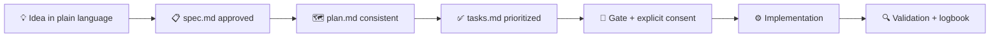
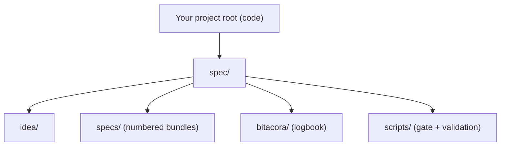

<div align="center">


# 🌱 Spec-Driven Development Template

**Learn Spec-Driven Development and apply it to real projects —<br>with AI as your co-pilot and one golden rule, checked by machine.**

🇺🇸 **English** · [🇪🇸 Español](./README.es.md)


<a href="https://github.com/juanklagos/spec-driven-development-template/releases/tag/v1.7.0"></a>

<a href="https://juanklagos.github.io/spec-driven-development-template/"></a>
<a href="https://github.com/juanklagos/aprende-sdd"></a>
<a href="https://github.com/marketplace/actions/sdd-validate"></a>
<a href="https://codespaces.new/juanklagos/spec-driven-development-template"></a>

[Non-technical start](./START_HERE_NON_TECH.md) · [Quickstart](./QUICKSTART.md) · [AI agent start](./AI_START_HERE.md) · [Commands](#️-built-in-commands-for-your-ai-agent) · [Community](#-community)

</div>

---

## 🌟 What is this?

**Spec-Driven Development (SDD)** means writing and approving a clear specification *before* any code is written — so decisions, scope, and quality survive beyond a chat window. In 2026 it is the dominant practice for building software with AI agents.

This repository is **two things at once**:

|  | 🎓 A school | 🧰 A toolkit |
| :--- | :--- | :--- |
| **What** | Bilingual (EN/ES), level-based path to learn SDD from zero | Ready-to-use structure to apply SDD in real projects |
| **How** | Guides, interactive course, conversational tutor | Enforcement scripts, agent rules, MCP server, compact `spec/` sidecar |
| **For whom** | Even if you don't program | Solo devs, teams, and AI agents |

It uses [GitHub Spec Kit](https://github.com/github/spec-kit) as the reference workflow engine; this repo is the practical layer around it.

<div align="center">

**The flow in action** — create a spec, validate, pass the gate *(regenerated on every release)*:


</div>

| ❌ Without SDD | ✅ With this template |
| :--- | :--- |
| Decisions lost in chat history | Single source of truth in `specs/` |
| Code created without planning | Mandatory `spec.md` + `plan.md` gate, machine-checked |
| Hard onboarding for teams/AI | Standard structure and level-based guides |
| Weak traceability | Session logs in `bitacora/`, history per spec |

> 🔭 Want the industry map? Read [SDD in 2026: state of the art and how this template compares](./docs/en/50-sdd-state-of-the-art-2026.md).

## 🚪 Choose your door

| You are... | Start here | What you get |
| :--- | :--- | :--- |
| 🧑‍💼 **Non-technical** (founder, PM, curious) | [START_HERE_NON_TECH.md](./START_HERE_NON_TECH.md) | Ultra-simple guided start, no jargon |
| 👩‍💻 **Developer** | [QUICKSTART.md](./QUICKSTART.md) | Commands to scaffold and validate in 5 minutes |
| 🤖 **AI agent** (or you, pasting into one) | [AI_START_HERE.md](./AI_START_HERE.md) | Operating rules + copy/paste prompts by level |

Then pick your learning level — every guide on the [docs site](https://juanklagos.github.io/spec-driven-development-template/) carries its level badge:

- 🟢 Beginner: [quick guide for non-programmers](./docs/en/13-quick-guide-non-programmers.md)
- 🟡 Intermediate: [team discipline guide](./docs/en/14-intermediate-guide.md)
- 🔴 Advanced: [governance and standardization](./docs/en/15-advanced-guide.md)

> [!TIP]
> Prefer learning by doing? Take the **[interactive course](https://github.com/juanklagos/aprende-sdd)** (GitHub Skills format): 4 steps, ~35 min, auto-graded by Actions — finish with the real SDD gate as your exam.

## ⚡ Start in 30 seconds

Copy/paste this prompt into your AI assistant (Claude, Cursor, Copilot, Gemini...):

```text
Using https://github.com/juanklagos/spec-driven-development-template, guide me step by step with SDD for my project.
My project is: [describe your project in plain language].
If my project is new, initialize from this template and GitHub Spec Kit as the base workflow.
If it already exists, adapt it without breaking current behavior.
No code before approved spec and consistent plan.
```

## 🎛️ Built-in commands for your AI agent

If you use **Claude Code**, this repo ships slash commands out of the box — start with `/sdd:help`:

| Command | What it does |
| :--- | :--- |
| `/sdd:help` | Diagnoses your current stage and gives the single next step |
| `/sdd:new` | Guided start: idea → first spec ready for approval |
| `/sdd:spec` | Create or refine a spec bundle with EARS criteria |
| `/sdd:gate` | Runs the machine-checked gate and records your consent |
| `/sdd:decision` | Records one decision (what, why, what was rejected, when to revisit) in `bitacora/decisiones/` |
| `/sdd:close` | Validates and closes the session with the output contract |
| `/sdd:tutor` | Conversational SDD course by levels, graded by the real validation scripts |

**Install in any project as a plugin** (no cloning):

```text
/plugin marketplace add juanklagos/spec-driven-development-template
/plugin install sdd@sdd-template
```

- **VS Code / Copilot:** the same flows as prompt files in [`.github/prompts/`](./.github/prompts/).
- **Any agent (32+ tools):** portable Agent Skill at [skills/sdd-workflow/SKILL.md](./skills/sdd-workflow/SKILL.md).
- **AI context:** [llms.txt](./llms.txt) indexes all docs for coding agents (regenerate with `./scripts/generate-llms-txt.sh`).

## 🚨 The golden rule

> [!IMPORTANT]
> **No code before an approved `spec.md` and a consistent `plan.md`.**
> Not just prose — it is machine-checked, and implementation only starts after your recorded consent.

```bash
./scripts/check-sdd-policy.sh .   # multi-agent policy files are aligned
./scripts/check-sdd-gate.sh .     # spec approved + plan consistent + consent recorded
./scripts/confirm-user-consent.sh "User approved scope X"
```

(In sidecar projects the same scripts live under `./spec/scripts/`.)

Enforce it in CI too — this repo doubles as a GitHub Action, listed on the [GitHub Marketplace](https://github.com/marketplace/actions/sdd-validate):

```yaml
- uses: juanklagos/spec-driven-development-template@v1.7.0
  with:
    path: "."      # project root (sidecar or standalone auto-detected)
    strict: "true"
```

Reference files: [sdd.policy.yaml](./sdd.policy.yaml) · [INSTRUCTIONS.md](./INSTRUCTIONS.md) · [AGENT_OPERATING_SYSTEM.md](./template-context/core-instructions/AGENT_OPERATING_SYSTEM.md)

## 🎬 How it works



Every feature gets a numbered spec bundle, and every session leaves a trace in `bitacora/` (logbook):

1. `spec.md` — what and why *(approved by you)*
2. `plan.md` — how *(consistent with the spec)*
3. `tasks.md` — concrete steps
4. `history.md` — how it evolved

Full walkthrough example: [examples/002-mcp-end-to-end](./examples/002-mcp-end-to-end/README.md)

## 🧭 Apply it to a real project

**Fastest start (no clone needed):**

```bash
npx @juanklagos/create-sdd-project my-app
```

It scaffolds the recommended `spec/` sidecar (or a full workspace) interactively from the latest template.

Three ways to use the template, from lightest to heaviest:

| Mode | When | Command |
| :--- | :--- | :--- |
| **Compact `spec/` sidecar** ⭐ | Real or existing project: SDD artifacts in `./spec/`, code stays in your project root | `./scripts/install-spec-sidecar.sh /path/to/project --profile=recommended` |
| **Internal workspace `www/`** | The runnable project should live inside this template repo | `./scripts/create-www-project.sh my-project codex` |
| **Full standalone copy** | You explicitly want the whole framework as your workspace | `./scripts/init-project.sh /path/to/project --profile=full` |

> [!TIP]
> Default professional path: install only the compact `spec/` sidecar. Never copy the full framework into a real codebase unless you explicitly want standalone mode.

<details>
<summary><b>📟 Everyday commands</b> (sidecar mode shown; same scripts exist at root in standalone mode)</summary>

<br>

| Action | Command |
| :--- | :--- |
| New spec | `./spec/scripts/new-spec.sh "my-feature" "Owner"` |
| Validate structure | `./spec/scripts/validate-sdd.sh . --strict` |
| Policy check | `./spec/scripts/check-sdd-policy.sh .` |
| SDD gate | `./spec/scripts/check-sdd-gate.sh .` |
| Status dashboard | `./spec/scripts/generate-status.sh` |

Folder anatomy and layout details: [project organization map](./docs/en/42-project-organization-map.md)



</details>

<details>
<summary><b>🔌 Connect via MCP</b> (optional, advanced)</summary>

<br>

If your AI client supports MCP, this repo ships a local `sdd-mcp` server so the SDD workflow becomes guided commands (`/start-project`, `/create-spec ...`).

```bash
npm install
npm run build
npm run mcp:start
```

- **No clone?** Point your MCP client straight at npm: `{"command": "npx", "args": ["-y", "@juanklagos/sdd-mcp"]}`.
- **🎨 SDD Builder (visual, drag-and-drop):** build once with `npm run builder:build`, then `SDD_PROJECT_ROOT=/path/to/your/project npm run mcp:http:start` and open `http://127.0.0.1:3334/builder` — compose your specs as connected cards; every card is a real `specs/NNN/` bundle on disk. Inside this template repository the builder is blocked by design (no target-project work in the template root), so always point `SDD_PROJECT_ROOT` at a real workspace — see the [visual guide](./docs/en/51-sdd-builder-visual-guide.md).
- **Visual dashboard:** run `npm run mcp:http:start` and open `http://127.0.0.1:3334/dashboard` — a read-only executive view of the workspace (gate status, KPI tiles, per-spec progress and dependency warnings) in your language, no build step required.
- Easiest explanation first: [Easy MCP Guide](./docs/en/43-easy-mcp-guide.md)
- Client configs: [`.mcp.json`](./.mcp.json) (Claude Code) · [Cursor](./packages/sdd-mcp/examples/.cursor/mcp.json) · [Codex](./packages/sdd-mcp/examples/codex.config.toml)
- Complete reference: [docs/en/41-complete-mcp-reference.md](./docs/en/41-complete-mcp-reference.md)

Note: `GitMCP` (free, remote) helps an AI *read* this public repo; the local `sdd-mcp` runs the *real guided workflow*. They complement each other: [GitMCP guide](./docs/en/48-how-to-connect-this-repo-with-gitmcp.md).

</details>

## 📚 Documentation

**Browse online:** the [documentation site](https://juanklagos.github.io/spec-driven-development-template/) has every guide with search, EN/ES language picker, and level badges.

**Three essential reads:**

1. [Workflow](./docs/en/02-workflow.md) — the SDD flow step by step
2. [Structure](./docs/en/01-structure.md) — what each folder is for
3. [SDD in 2026: state of the art](./docs/en/50-sdd-state-of-the-art-2026.md) — the industry map and where this template stands

**Everything else:** the [full documentation index](./docs/README.md) organizes all 52 guides (EN/ES) by topic.

## 💬 Community

- 📖 Docs site: [juanklagos.github.io/spec-driven-development-template](https://juanklagos.github.io/spec-driven-development-template/)
- 💬 Questions, ideas, show-and-tell: [GitHub Discussions](https://github.com/juanklagos/spec-driven-development-template/discussions)
- 🐛 Bugs and concrete proposals: [Issues](https://github.com/juanklagos/spec-driven-development-template/issues)
- 🎓 Interactive course: [aprende-sdd](https://github.com/juanklagos/aprende-sdd) — learn by doing, auto-graded by Actions
- 🏅 Finished a tutor level? `/sdd:tutor` records it in your logbook and gives you a completion badge for your README

## ⚖️ Legal & authorship

- License: PolyForm Noncommercial 1.0.0 — [legal guide](./docs/en/31-legal-framework-and-commercial-use.md)
- Changelog: [CHANGELOG.md](./CHANGELOG.md) · Latest release: [v1.7.0](https://github.com/juanklagos/spec-driven-development-template/releases/tag/v1.7.0)
- Author: Juan Klagos ([AUTHORS.md](./AUTHORS.md))

---

<div align="center">

**If this template helps you build with discipline, ⭐ star the repo — it helps others find it.**

🌱 *No code before approved spec and consistent plan.*

[⬆️ Back to top](#-spec-driven-development-template)

</div>
