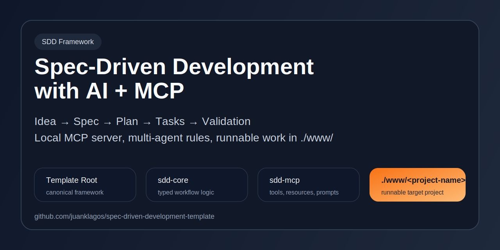
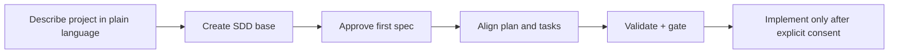
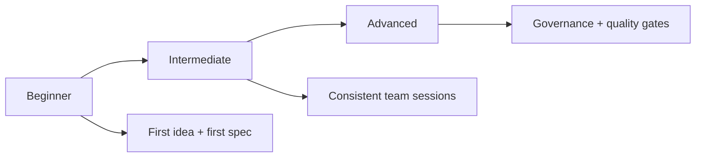
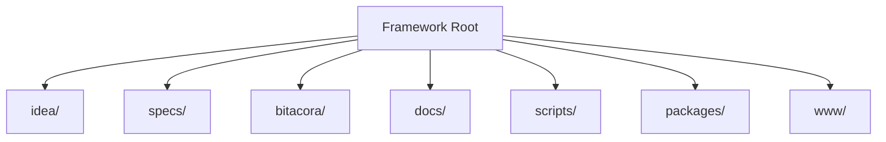

<div align="center">
  <h1>🌱 Spec-Driven Development Template</h1>
  <p><b>Start projects with specification-first discipline and AI-friendly guidance.</b></p>

  <p>
    <a href="./README.md"></a>
    <a href="./README.es.md"></a>
  </p>

  <p>
    
    <a href="./START_HERE_NON_TECH.md"></a>
    <a href="./AI_START_HERE.md"></a>
    <a href="./QUICKSTART.md"></a>
  </p>
</div>



---

## ⚡ Start in 30 Seconds

1. Open [AI_START_HERE.md](./AI_START_HERE.md)
   or [START_HERE_NON_TECH.md](./START_HERE_NON_TECH.md) if you are non-technical.
2. Copy/paste this prompt:

```text
Using https://github.com/juanklagos/spec-driven-development-template, guide me step by step with SDD for my project.
My project is: [describe your project in plain language].
If my project is new, initialize from this template.
If it already exists, adapt it without breaking current behavior.
No code before approved spec and consistent plan.
```

3. Choose your level and continue:
- Beginner: [docs/en/13-quick-guide-non-programmers.md](./docs/en/13-quick-guide-non-programmers.md)
- Intermediate: [docs/en/14-intermediate-guide.md](./docs/en/14-intermediate-guide.md)
- Advanced: [docs/en/15-advanced-guide.md](./docs/en/15-advanced-guide.md)

## 🔌 Connect via MCP

If your AI client supports MCP, this repository now includes a local `sdd-mcp` server and shared project config.

If you want the simplest explanation first:
- [Easy MCP Guide](./docs/en/43-easy-mcp-guide.md)

Important distinction:
- `GitMCP` or similar can help an AI read and understand this public repository for free.
- It does not replace this framework's own `sdd-mcp` behavior.
- Use `GitMCP` for remote repo context and `sdd-mcp` for the real guided SDD workflow.

Quick path:
1. Build the server:

```bash
npm install
npm run build
```

2. Use one of these configs:
- Claude Code project config: [`.mcp.json`](./.mcp.json)
- Cursor example: [`packages/sdd-mcp/examples/.cursor/mcp.json`](./packages/sdd-mcp/examples/.cursor/mcp.json)
- Codex example: [`packages/sdd-mcp/examples/codex.config.toml`](./packages/sdd-mcp/examples/codex.config.toml)

3. Read in this order:
- [docs/en/43-easy-mcp-guide.md](./docs/en/43-easy-mcp-guide.md)
- [docs/en/41-complete-mcp-reference.md](./docs/en/41-complete-mcp-reference.md)
- [docs/en/33-mcp-server-guide.md](./docs/en/33-mcp-server-guide.md)
- [docs/en/40-command-results-reference.md](./docs/en/40-command-results-reference.md)

## 🎬 Fast Adoption Flow



Use a complete example:
- [examples/002-mcp-end-to-end/README.md](./examples/002-mcp-end-to-end/README.md)

## 🚨 Mandatory Rule Before Coding

This template enforces policy + gate checks:

```bash
# standalone framework workspace
./scripts/check-sdd-policy.sh .
./scripts/check-sdd-gate.sh .

# compact sidecar inside a real project
./spec/scripts/check-sdd-policy.sh .
./spec/scripts/check-sdd-gate.sh .
```

Hard stop:
- No code before approved `spec.md` and consistent `plan.md`.
- Record explicit user consent before execution/implementation starts:
  - sidecar: `./spec/scripts/confirm-user-consent.sh "User approved scope X"`
  - standalone: `./scripts/confirm-user-consent.sh "User approved scope X"`

Reference files:
- [sdd.policy.yaml](./sdd.policy.yaml)
- [INSTRUCTIONS.md](./INSTRUCTIONS.md)
- [template-context/core-instructions/AGENT_OPERATING_SYSTEM.md](./template-context/core-instructions/AGENT_OPERATING_SYSTEM.md)

---

## 🎯 Problem vs Solution

| ❌ Problem | ✅ SDD Solution |
| :--- | :--- |
| Decisions lost in chat history | Single source of truth in `specs/` |
| Code created without planning | Mandatory `spec.md` + `plan.md` gate |
| Hard onboarding for teams/AI | Standard structure and level-based guides |
| Weak traceability | Session logs in `bitacora/` |

## 🧭 Template vs Real Project

- This repository is a **framework/template**.
- The professional productization path is: framework root + `packages/sdd-core` + `packages/sdd-mcp`.
- Your product work should run in your target project using this structure.
- For real projects, prefer a compact `spec/` sidecar inside the project and keep code in the project root.
- Do not clone or copy the full framework repository into the target project unless you explicitly want a full standalone workspace.
- Inside this repository, use `www/<project-name>/` as the clean container when the target project should live here.
- The user may choose another target path; if the runnable project lives inside this repository, keep it under `www/` to avoid mixing framework and product work.
- If you adapt an existing project, integrate `idea/specs/bitacora` without breaking current behavior.

## 🗺️ 3-Level Learning Path



---

## 🏗️ Anatomy of an SDD Project

Full folder-by-folder map:
- [docs/en/42-project-organization-map.md](./docs/en/42-project-organization-map.md)



Mandatory folders:
- `idea/`: project intent and scope
- `specs/`: numbered specifications
- `bitacora/`: execution trace and handoffs
- `docs/`: usage guides and references

Mandatory spec bundle (for each feature):
1. `spec.md`
2. `plan.md`
3. `tasks.md`
4. `history.md`

---

## 👤 Non-Technical Path

- Start here: [AI_START_HERE.md](./AI_START_HERE.md)
- Ultra-simple starter: [START_HERE_NON_TECH.md](./START_HERE_NON_TECH.md)
- Follow level path: [docs/en/18-complete-3-level-path.md](./docs/en/18-complete-3-level-path.md)
- Use ready prompts:
  - [docs/en/19-prompt-matrix-by-goal.md](./docs/en/19-prompt-matrix-by-goal.md)
  - [docs/en/26-validated-prompt-bank.md](./docs/en/26-validated-prompt-bank.md)

## 🛠️ Technical Path

| Tool | Command | Description |
| :--- | :--- | :--- |
| Create execution workspace | `./scripts/create-www-project.sh my-project codex` | Create clean project root under `www/` and install compact `spec/` sidecar |
| Install compact sidecar | `./scripts/install-spec-sidecar.sh /absolute/path/to/project --profile=recommended` | Install only the SDD sidecar inside an existing or external project |
| Full standalone workspace | `./scripts/init-project.sh /absolute/path/to/project --profile=full` | Copy the larger standalone template only when explicitly needed |
| New Spec | `./spec/scripts/new-spec.sh` | Create numbered spec folder in compact sidecar mode |
| Validation | `./spec/scripts/validate-sdd.sh . --strict` | Validate structure and consistency in compact sidecar mode |
| Policy Check | `./spec/scripts/check-sdd-policy.sh .` | Validate multi-agent policy files in compact sidecar mode |
| SDD Gate | `./spec/scripts/check-sdd-gate.sh .` | Enforce approval and plan consistency in compact sidecar mode |
| Status Dashboard | `./spec/scripts/generate-status.sh` | Generate project status report when that script is present in the project layout |
| MCP Server MVP | `npm run mcp:start` | Start the local `sdd-mcp` stdio server |

> [!TIP]
> Default professional path: install only the compact `spec/` sidecar in real projects. Use a full copy only when you explicitly need a standalone workspace.

---

## 📚 Documentation Discovery

- Essentials: [Structure](./docs/en/01-structure.md) · [Workflow](./docs/en/02-workflow.md)
- AI: [Supported Agents](./docs/en/10-supported-ai-agents-and-prompts.md) · [Lovable Guide](./docs/en/17-working-with-lovable.md)
- MCP: [Complete Reference](./docs/en/41-complete-mcp-reference.md)
- MCP Easy Mode: [Easy Guide](./docs/en/43-easy-mcp-guide.md)
- MCP Hosted Onboarding: [Model](./docs/en/44-hosted-mcp-onboarding-model.md)
- MCP Client Examples: [Visual Guide](./docs/en/45-client-visual-examples-for-easy-mcp.md)
- MCP Free External Options: [Guide](./docs/en/47-free-external-mcp-options.md)
- MCP GitMCP Connection: [Step-by-step](./docs/en/48-how-to-connect-this-repo-with-gitmcp.md)
- Sidecar Prompts: [Exact prompts for `spec/` mode](./docs/en/49-spec-sidecar-prompts.md)
- MCP Setup: [Server Guide](./docs/en/33-mcp-server-guide.md)
- MCP Results: [Command Reference](./docs/en/40-command-results-reference.md)
- Client Setup: [Recipes](./docs/en/36-client-setup-recipes.md)
- Versioning: [Strategy](./docs/en/37-versioning-strategy.md)
- Roadmap: [Public Roadmap](./docs/en/35-public-roadmap.md)
- Organization: [Project Map](./docs/en/42-project-organization-map.md)
- Media Kit: [Assets and Positioning](./docs/en/38-media-kit.md)
- Next Release Prep: [v1.3.0](./docs/en/46-v1.3.0-preparation.md)
- Quality: [Stage Checklists](./docs/en/21-quality-checklists-by-stage.md) · [ADR](./docs/en/24-architecture-decisions.md)

---

## ⚖️ Legal & Authorship

- License: PolyForm Noncommercial 1.0.0
- Legal guide: [docs/en/31-legal-framework-and-commercial-use.md](./docs/en/31-legal-framework-and-commercial-use.md)
- Changelog: [CHANGELOG.md](./CHANGELOG.md)
- Author: Juan Klagos ([AUTHORS.md](./AUTHORS.md))
