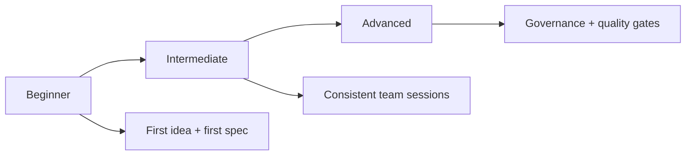

<div align="center">
  <h1>🌱 Spec-Driven Development Template</h1>
  <p><b>Start projects with specification-first discipline and AI-friendly guidance.</b></p>

  <p>
    <a href="./README.md"></a>
    <a href="./README.es.md"></a>
  </p>

  <p>
    
    <a href="./START_HERE_NON_TECH.md"></a>
    <a href="./AI_START_HERE.md"></a>
    <a href="./QUICKSTART.md"></a>
  </p>
</div>

---

## ⚡ Start in 30 Seconds

1. Open [AI_START_HERE.md](./AI_START_HERE.md)
   or [START_HERE_NON_TECH.md](./START_HERE_NON_TECH.md) if you are non-technical.
2. Copy/paste this prompt:

```text
Using https://github.com/juanklagos/spec-driven-development-template, guide me step by step with SDD for my project.
My project is: [describe your project in plain language].
If my project is new, initialize from this template.
If it already exists, adapt it without breaking current behavior.
No code before approved spec and consistent plan.
```

3. Choose your level and continue:
- Beginner: [docs/en/13-quick-guide-non-programmers.md](./docs/en/13-quick-guide-non-programmers.md)
- Intermediate: [docs/en/14-intermediate-guide.md](./docs/en/14-intermediate-guide.md)
- Advanced: [docs/en/15-advanced-guide.md](./docs/en/15-advanced-guide.md)

## 🚨 Mandatory Rule Before Coding

This template enforces policy + gate checks:

```bash
./scripts/check-sdd-policy.sh .
./scripts/check-sdd-gate.sh .
```

Hard stop:
- No code before approved `spec.md` and consistent `plan.md`.
- Record explicit user consent before execution/implementation starts:
  `./scripts/confirm-user-consent.sh "User approved scope X"`

Reference files:
- [sdd.policy.yaml](./sdd.policy.yaml)
- [INSTRUCTIONS.md](./INSTRUCTIONS.md)
- [template-context/core-instructions/AGENT_OPERATING_SYSTEM.md](./template-context/core-instructions/AGENT_OPERATING_SYSTEM.md)

---

## 🎯 Problem vs Solution

| ❌ Problem | ✅ SDD Solution |
| :--- | :--- |
| Decisions lost in chat history | Single source of truth in `specs/` |
| Code created without planning | Mandatory `spec.md` + `plan.md` gate |
| Hard onboarding for teams/AI | Standard structure and level-based guides |
| Weak traceability | Session logs in `bitacora/` |

## 🧭 Template vs Real Project

- This repository is a **framework/template**.
- Your product work should run in your target project using this structure.
- Inside this repository, use `www/<project-name>/` as execution root for runnable projects.
- Keep runnable projects inside the current chat/workspace folder (do not create them outside).
- If you adapt an existing project, integrate `idea/specs/bitacora` without breaking current behavior.

## 🗺️ 3-Level Learning Path



---

## 🏗️ Anatomy of an SDD Project

Mandatory folders:
- `idea/`: project intent and scope
- `specs/`: numbered specifications
- `bitacora/`: execution trace and handoffs
- `docs/`: usage guides and references

Mandatory spec bundle (for each feature):
1. `spec.md`
2. `plan.md`
3. `tasks.md`
4. `history.md`

---

## 👤 Non-Technical Path

- Start here: [AI_START_HERE.md](./AI_START_HERE.md)
- Ultra-simple starter: [START_HERE_NON_TECH.md](./START_HERE_NON_TECH.md)
- Follow level path: [docs/en/18-complete-3-level-path.md](./docs/en/18-complete-3-level-path.md)
- Use ready prompts:
  - [docs/en/19-prompt-matrix-by-goal.md](./docs/en/19-prompt-matrix-by-goal.md)
  - [docs/en/26-validated-prompt-bank.md](./docs/en/26-validated-prompt-bank.md)

## 🛠️ Technical Path

| Tool | Command | Description |
| :--- | :--- | :--- |
| Create execution workspace | `./scripts/create-www-project.sh my-project codex` | Create runnable project under `www/` (recommended scaffold by default) |
| New Project | `./scripts/init-project.sh` | Bootstrap SDD structure |
| New Project + Spec Kit | `./scripts/init-project-with-spec-kit.sh` | Bootstrap + Spec Kit init |
| New Spec | `./scripts/new-spec.sh` | Create numbered spec folder |
| Validation | `./scripts/validate-sdd.sh . --strict` | Validate structure and consistency |
| Policy Check | `./scripts/check-sdd-policy.sh .` | Validate multi-agent policy files |
| SDD Gate | `./scripts/check-sdd-gate.sh .` | Enforce approval and plan consistency |
| Status Dashboard | `./scripts/generate-status.sh` | Generate project status report |

> [!TIP]
> For a clean copy: `npx degit juanklagos/spec-driven-development-template`

---

## 📚 Documentation Discovery

- Essentials: [Structure](./docs/en/01-structure.md) · [Workflow](./docs/en/02-workflow.md)
- AI: [Supported Agents](./docs/en/10-supported-ai-agents-and-prompts.md) · [Lovable Guide](./docs/en/17-working-with-lovable.md)
- Quality: [Stage Checklists](./docs/en/21-quality-checklists-by-stage.md) · [ADR](./docs/en/24-architecture-decisions.md)

---

## ⚖️ Legal & Authorship

- License: PolyForm Noncommercial 1.0.0
- Legal guide: [docs/en/31-legal-framework-and-commercial-use.md](./docs/en/31-legal-framework-and-commercial-use.md)
- Changelog: [CHANGELOG.md](./CHANGELOG.md)
- Author: Juan Klagos ([AUTHORS.md](./AUTHORS.md))
