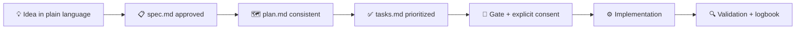
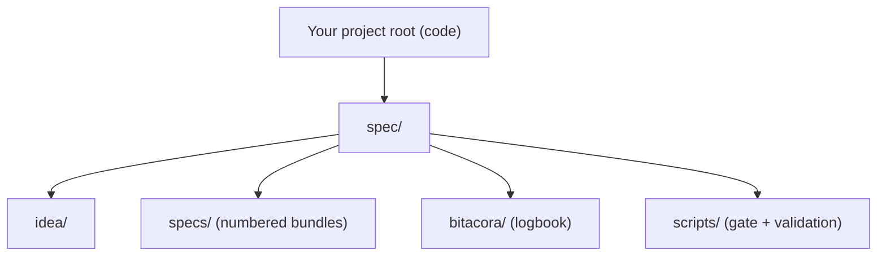

<div align="center">


# 🌱 Spec-Driven Development Template

**Learn Spec-Driven Development, then use it on real projects.<br>One rule, and a gate that stays shut until you approve a spec — and tells you on every run exactly what it checked.**

🇺🇸 **English** · [🇪🇸 Español](./README.es.md)


<a href="https://github.com/juanklagos/spec-driven-development-template/releases/tag/v2.2.1"></a>

<a href="https://juanklagos.github.io/spec-driven-development-template/"></a>
<a href="https://github.com/juanklagos/aprende-sdd"></a>
<a href="https://github.com/marketplace/actions/sdd-validate"></a>
<a href="https://codespaces.new/juanklagos/spec-driven-development-template"></a>

[Non-technical start](./START_HERE_NON_TECH.md) · [Quickstart](./QUICKSTART.md) · [AI agent start](./AI_START_HERE.md) · [Commands](#built-in-commands-for-your-ai-agent) · [Community](#community)

</div>

---

## What is this?

**Spec-Driven Development (SDD)** means writing and approving a clear specification *before* any code exists, so that scope and decisions outlive the chat window they were born in. By 2026 it is how most people build software with AI agents.

This repo does double duty.

It is a school: a bilingual (EN/ES) path that starts from zero, with guides, an interactive course and a tutor you can talk to. You do not need to know how to program to get through it.

It is also a toolkit for real work: enforcement scripts, rules your agent reads, an MCP server, and a compact `spec/` sidecar you drop into a codebase that already exists.

The workflow engine underneath is [GitHub Spec Kit](https://github.com/github/spec-kit). This repo is the practical layer around it.

<div align="center">

**The flow in action** — create a spec, validate, pass the gate *(regenerated on every release)*:


</div>

What changes in practice: decisions stop living in chat history and move into `specs/`. The gate stays closed until `spec.md` and `plan.md` exist, agree, and you record your consent — a script checks that, not somebody's memory. A new teammate or a new agent lands in a folder layout they already recognize. And `bitacora/` keeps the session log, so six months later you can still find out why something was done the way it was.

> Want the industry map? Read [SDD in 2026: state of the art and how this template compares](./docs/en/50-sdd-state-of-the-art-2026.md).

## Choose your door

- **Non-technical** (founder, PM, curious): [START_HERE_NON_TECH.md](./START_HERE_NON_TECH.md) — a guided start with no jargon in it.
- **Developer**: [QUICKSTART.md](./QUICKSTART.md) — the commands to scaffold and validate, about five minutes.
- **AI agent**, or you pasting into one: [AI_START_HERE.md](./AI_START_HERE.md) — operating rules plus copy/paste prompts for each level.

Then pick your learning level. Every guide on the [docs site](https://juanklagos.github.io/spec-driven-development-template/) carries its level badge:

- 🟢 Beginner: [quick guide for non-programmers](./docs/en/13-quick-guide-non-programmers.md)
- 🟡 Intermediate: [team discipline guide](./docs/en/14-intermediate-guide.md)
- 🔴 Advanced: [governance and standardization](./docs/en/15-advanced-guide.md)

> [!TIP]
> If you would rather learn by doing, take the **[interactive course](https://github.com/juanklagos/aprende-sdd)** (GitHub Skills format): 4 steps, ~35 min, auto-graded by Actions. Your exam is the real SDD gate.

## Start in 30 seconds

Copy/paste this prompt into your AI assistant (Claude, Cursor, Copilot, Gemini...):

```text
Using https://github.com/juanklagos/spec-driven-development-template, guide me step by step with SDD for my project.
My project is: [describe your project in plain language].
If my project is new, initialize from this template and GitHub Spec Kit as the base workflow.
If it already exists, adapt it without breaking current behavior.
No code before approved spec and consistent plan.
```

## Built-in commands for your AI agent

If you use **Claude Code**, this repo ships slash commands out of the box. Start with `/sdd:help`:

| Command | What it does |
| :--- | :--- |
| `/sdd:help` | Tells you what stage you are in and the single next step |
| `/sdd:new` | Guided start: idea → first spec ready for approval |
| `/sdd:spec` | Create or refine a spec bundle with EARS criteria |
| `/sdd:gate` | Runs the gate — approval, plan consistency, consent — and records yours |
| `/sdd:decision` | One decision, written down in `bitacora/decisiones/`: what, why, what was rejected, when to revisit |
| `/sdd:close` | Validates and closes the session with the output contract |
| `/sdd:tutor` | A conversational SDD course by levels, graded by the real validation scripts |

**Install in any project as a plugin** (no cloning):

```text
/plugin marketplace add juanklagos/spec-driven-development-template
/plugin install sdd@sdd-template
```

- **VS Code / Copilot:** the same flows as prompt files in [`.github/prompts/`](./.github/prompts/).
- **Any agent (32+ tools):** portable Agent Skill at [skills/sdd-workflow/SKILL.md](./skills/sdd-workflow/SKILL.md).
- **AI context:** [llms.txt](./llms.txt) indexes all docs for coding agents (regenerate with `./scripts/generate-llms-txt.sh`).

## The golden rule

> [!IMPORTANT]
> **No code before an approved `spec.md` and a consistent `plan.md`.**
> A script enforces this, and implementation starts only once your consent is on record.

```bash
./scripts/check-sdd-policy.sh .   # multi-agent policy files are aligned
./scripts/check-sdd-gate.sh .     # spec approved + plan consistent + consent recorded
./scripts/confirm-user-consent.sh --spec 001-<slug> "User approved scope X"
```

(In sidecar projects the same scripts live under `./spec/scripts/`.)

Enforce it in CI too. This repo doubles as a GitHub Action, listed on the [GitHub Marketplace](https://github.com/marketplace/actions/sdd-validate):

```yaml
- uses: juanklagos/spec-driven-development-template@v2.2.1
  with:
    path: "."      # project root (sidecar or standalone auto-detected)
    strict: "true"
```

Reference files: [sdd.policy.yaml](./sdd.policy.yaml) · [INSTRUCTIONS.md](./INSTRUCTIONS.md) · [AGENT_OPERATING_SYSTEM.md](./template-context/core-instructions/AGENT_OPERATING_SYSTEM.md)

## How it works



Every feature gets a numbered spec bundle, and every session leaves a trace in `bitacora/` (the logbook):

1. `spec.md` — what and why *(approved by you)*
2. `plan.md` — how *(consistent with the spec)*
3. `tasks.md` — concrete steps
4. `history.md` — how it evolved

Full walkthrough example: [examples/002-mcp-end-to-end](./examples/002-mcp-end-to-end/README.md)

## Apply it to a real project

**Fastest start (no clone needed):**

```bash
npx @juanklagos/create-sdd-project@latest my-app
```

It asks a few questions and scaffolds the recommended `spec/` sidecar, or a full workspace, from the latest template.

Three ways to use the template, from lightest to heaviest:

| Mode | When | Command |
| :--- | :--- | :--- |
| **Compact `spec/` sidecar** ⭐ | Real or existing project: SDD artifacts in `./spec/`, code stays in your project root | `./scripts/install-spec-sidecar.sh /path/to/project --profile=recommended` |
| **Internal workspace `www/`** | The runnable project should live inside this template repo | `./scripts/create-www-project.sh my-project codex` |
| **Full standalone copy** | You explicitly want the whole framework as your workspace | `./scripts/init-project.sh /path/to/project --profile=full` |

> [!TIP]
> The professional default is the compact `spec/` sidecar and nothing else. Never copy the full framework into a real codebase unless you actually want standalone mode.

<details>
<summary><b>Everyday commands</b> (sidecar mode shown; the same scripts exist at root in standalone mode)</summary>

<br>

| Action | Command |
| :--- | :--- |
| New spec | `./spec/scripts/new-spec.sh "my-feature" "Owner"` |
| Validate structure | `./spec/scripts/validate-sdd.sh . --strict` |
| Policy check | `./spec/scripts/check-sdd-policy.sh .` |
| SDD gate | `./spec/scripts/check-sdd-gate.sh .` |
| Status dashboard | `./spec/scripts/generate-status.sh` |

Folder anatomy and layout details: [project organization map](./docs/en/42-project-organization-map.md)



</details>

<details>
<summary><b>Connect via MCP</b> (optional, advanced)</summary>

<br>

If your AI client supports MCP, this repo ships a local `sdd-mcp` server that turns the SDD workflow into guided commands (`/start-project`, `/create-spec ...`).

```bash
npm install
npm run build
npm run mcp:start
```

- **No clone?** Point your MCP client straight at npm: `{"command": "npx", "args": ["-y", "@juanklagos/sdd-mcp"]}`.
- **SDD Builder (visual, drag-and-drop):** build once with `npm run builder:build`, then `SDD_PROJECT_ROOT=/path/to/your/project npm run mcp:http:start` and open `http://127.0.0.1:3334/builder` — compose your specs as connected cards, where every card is a real `specs/NNN/` bundle on disk. Inside this template repository the builder is blocked by design (no target-project work in the template root), so always point `SDD_PROJECT_ROOT` at a real workspace. See the [visual guide](./docs/en/51-sdd-builder-visual-guide.md).
- **SDD Desk (the same builder, as a desktop app):** [download it](https://juanklagos.github.io/spec-driven-development-template/en/download/) for macOS, Windows or Linux. It carries its own Node runtime, so nothing has to be installed first, and while it is open the app *is* your project's MCP server — point your agent at the URL it shows you. The builds are **not code-signed**: macOS and Windows ask you to authorise the app once, with a warning that sounds alarming, so it suits people who do not mind doing that. If you would rather not, `npx @juanklagos/sdd-mcp@latest --http` gives you the same builder in your browser with no warning at all.
- **Visual dashboard:** point the server at a project — `SDD_PROJECT_ROOT=./www/my-project npm run mcp:http:start` — then open `http://127.0.0.1:3334/dashboard` for a read-only executive view (gate verdict, KPI tiles, per-spec progress, dependency warnings) in your language, with no build step. The template root is not a workspace, so running it from here reports exactly that.
- Easiest explanation first: [Easy MCP Guide](./docs/en/43-easy-mcp-guide.md)
- Client configs: [`.mcp.json`](./.mcp.json) (Claude Code) · [Cursor](./packages/sdd-mcp/examples/.cursor/mcp.json) · [Codex](./packages/sdd-mcp/examples/codex.config.toml)
- Complete reference: [docs/en/41-complete-mcp-reference.md](./docs/en/41-complete-mcp-reference.md)

Note: `GitMCP` (free, remote) helps an AI *read* this public repo; the local `sdd-mcp` runs the *real guided workflow*. They complement each other: [GitMCP guide](./docs/en/48-how-to-connect-this-repo-with-gitmcp.md).

</details>

## Documentation

**Browse online:** the [documentation site](https://juanklagos.github.io/spec-driven-development-template/) has every guide with search, an EN/ES language picker and level badges.

**If you only read three:**

1. [Workflow](./docs/en/02-workflow.md) — the SDD flow step by step
2. [Structure](./docs/en/01-structure.md) — what each folder is for
3. [SDD in 2026: state of the art](./docs/en/50-sdd-state-of-the-art-2026.md) — the industry map and where this template stands

**Everything else:** the [full documentation index](./docs/README.md) organizes all 52 guides (EN/ES) by topic.

## Community

- Docs site: [juanklagos.github.io/spec-driven-development-template](https://juanklagos.github.io/spec-driven-development-template/)
- Questions, ideas, show-and-tell: [GitHub Discussions](https://github.com/juanklagos/spec-driven-development-template/discussions)
- Bugs and concrete proposals: [Issues](https://github.com/juanklagos/spec-driven-development-template/issues)
- Interactive course: [aprende-sdd](https://github.com/juanklagos/aprende-sdd) — learn by doing, auto-graded by Actions
- Finished a tutor level? `/sdd:tutor` records it in your logbook and hands you a completion badge for your README

## Legal & authorship

- License: **MIT** — use it anywhere, including commercially and inside a company, free and without
  asking. Keep the copyright notice. [Legal guide](./docs/en/31-legal-framework-and-commercial-use.md)
- What you write with the templates is yours: [TEMPLATE-OUTPUT.md](./TEMPLATE-OUTPUT.md)
- Publishing a release / Publicar una versión: [RELEASING.md](./RELEASING.md)
- Changelog: [CHANGELOG.md](./CHANGELOG.md) · Latest release: [v2.2.1](https://github.com/juanklagos/spec-driven-development-template/releases/tag/v2.2.1)
- Copyright (c) 2026 Juan Carlos Alvarez Lagos ([AUTHORS.md](./AUTHORS.md))

---

<div align="center">

**If this saves you one bad sprint, a ⭐ helps other people find it.**

🌱 *No code before approved spec and consistent plan.*

[⬆️ Back to top](#-spec-driven-development-template)

</div>
