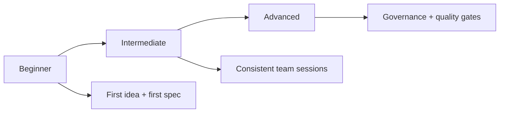
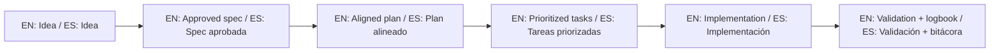

<div align="center">
  <h1>🌱 Spec-Driven Development Template</h1>
  <p><b>Execute projects with specification-first discipline.<br>Ejecuta proyectos con disciplina guiada por especificaciones.</b></p>

  <p>
    <a href="./README.md"></a>
    <a href="./README.es.md"></a>
  </p>

  <p>
    
    <a href="https://github.com/juanklagos/spec-driven-development-template"></a>
    <a href="https://github.com/juanklagos/spec-driven-development-template"></a>
    <a href="https://github.com/juanklagos/spec-driven-development-template"></a>
  </p>

  <br>

  <a href="./QUICKSTART.md">
    
  </a>
  &nbsp;&nbsp;
  <a href="./AI_START_HERE.md">
    
  </a>

  <br><br>
</div>

---

## ⚡ The Mission: Solve "Code Drift"
**Stop losing context in chats. Stop implementing code without a plan.**

| ❌ The Problem | ✅ The SDD Solution |
| :--- | :--- |
| Decisions lost in chat history | **Single Source of Truth** in `specs/` |
| Code implemented without context | **Mandatory Planning** in `plan.md` |
| Difficult team/AI onboarding | **Standard Anatomy** for any project |
| No proof of validation | **Execution Logs** in `bitacora/` |

## 🗣️ Friendly prompt (copy/paste)

```text
Using https://github.com/juanklagos/spec-driven-development-template, create everything needed to carry out my project end-to-end.
My project is: [describe your project in plain language].

If my project is new, initialize it with this template and GitHub Spec Kit.
If my project already exists, adapt it to idea/specs/bitacora without breaking current behavior.
Guide me step by step for my level (beginner/intermediate/advanced), using simple language.
Do not skip specification, plan, tasks, refinement trace, logbook, and validation.
```

## 🎯 Choose your level



- Beginner: [docs/en/13-quick-guide-non-programmers.md](./docs/en/13-quick-guide-non-programmers.md)
- Intermediate: [docs/en/14-intermediate-guide.md](./docs/en/14-intermediate-guide.md)
- Advanced: [docs/en/15-advanced-guide.md](./docs/en/15-advanced-guide.md)

---

## 🏗️ Project Anatomy
The repository is divided into 3 mandatory execution layers:

### 1. Folder Structure
- 📁 `idea/`: The "Why". General vision and high-level scope.
- 📁 `specs/`: The "What". Numbered sequential specifications (The Contract).
- 📁 `bitacora/`: The "How it went". Daily logs and technical handoffs.
- 📁 `docs/`: The "How we work". Guides, playbooks, and conventions.

### 2. The Spec Bundle
Every feature in `specs/` must contain:
1. 📄 **`spec.md`**: Business requirements & UI/UX logic.
2. 📄 **`plan.md`**: Technical strategy & architecture.
3. 📄 **`tasks.md`**: Sequential Actionable Checklist.
4. 📄 **`history.md`**: Traceability of all changes.

---

## 🛠️ Toolkit & Automation
Manage your SDD life with these pre-built helpers:

| Tool | Command | Description |
| :--- | :--- | :--- |
| **New Project** | `./scripts/init-project.sh` | Bootstrap the structure in seconds. |
| **New Project + Spec Kit** | `./scripts/init-project-with-spec-kit.sh` | Bootstrap structure and initialize GitHub Spec Kit. |
| **Reset** | `./scripts/reset-template.sh` | Clean the template for a fresh start. |
| **New Spec** | `./scripts/new-spec.sh` | Generate a new numbered spec folder. |
| **Validation** | `./scripts/validate-sdd.sh` | Ensure your repo follows the SDD rules. |
| **Policy Check** | `./scripts/check-sdd-policy.sh` | Enforce multi-agent policy consistency and mandatory rule files. |
| **SDD Gate** | `./scripts/check-sdd-gate.sh` | Enforce approval and spec-plan-task consistency before coding. |
| **Roadmap** | `./scripts/generate-status.sh` | Generate an auto-updating dashboard. |

> [!TIP]
> **Pro Tip:** Use `npx degit juanklagos/spec-driven-development-template` for a clean copy.

---

## 📚 Knowledge Hub
Deep dive into different aspects of the SDD methodology:

### 🏗️ Essentials
- [Structure Detail](./docs/en/01-structure.md) | [Workflow Guide](./docs/en/02-workflow.md) | [3-Level Learning Path](./docs/en/18-complete-3-level-path.md)

### 🤖 AI & Development
- [Supported Agents & Prompts](./docs/en/10-supported-ai-agents-and-prompts.md)
- [**Working with Lovable (Recommended)**](./docs/en/17-working-with-lovable.md)
- [TDD & BDD patterns](./docs/en/12-tdd-and-bdd-how-to-write-specs.md)
- [Validated Prompt Bank](./docs/en/26-validated-prompt-bank.md)

### 👥 Governance & Team
- [Team Mode & Collaboration](./docs/en/22-team-mode-and-collaboration.md)
- [Quality Stage Gates](./docs/en/21-quality-checklists-by-stage.md)
- [Architecture Decision Records (ADR)](./docs/en/24-architecture-decisions.md)

---

## ⚖️ Legal & Authorship
- **License:** PolyForm Noncommercial 1.0.0. [See Legal Framework](./docs/en/31-legal-framework-and-commercial-use.md).
- **History:** Check the [CHANGELOG.md](./CHANGELOG.md).
- **Author:** Developed with ☕ and discipline by **Juan Klagos** ([AUTHORS.md](./AUTHORS.md)).

---
<p align="center">
  <em>Spec-Driven Development — Discipline is the bridge between goals and accomplishment.</em>
</p>

## 🌐 Bilingual support / Soporte bilingüe

- EN: This repository is designed to be used in English and Spanish.
- ES: Este repositorio está diseñado para usarse en inglés y español.
- EN: Keep instructions simple, direct, and copy/paste-ready.
- ES: Mantén instrucciones simples, directas y listas para copiar/pegar.

## 🗣️ Prompt base / Base prompt

```text
EN: Using https://github.com/juanklagos/spec-driven-development-template, guide me step by step with SDD for my project.
My project is: [describe project in plain language].
Do not skip idea, spec, plan, tasks, logbook, and validation.

ES: Usando https://github.com/juanklagos/spec-driven-development-template, guíame paso a paso con SDD para mi proyecto.
Mi proyecto es: [explica el proyecto en lenguaje simple].
No omitas idea, spec, plan, tasks, bitácora y validación.
```

## 💡 Tips / Consejos

- EN: Ask the AI to confirm the active spec before coding.
- ES: Pide a la IA confirmar la spec activa antes de programar.
- EN: Keep one clear next step at the end of each session.
- ES: Deja un próximo paso claro al final de cada sesión.
- EN: Prefer simple language and concrete deliverables.
- ES: Prefiere lenguaje simple y entregables concretos.

## 📊 Visual flow / Flujo visual


