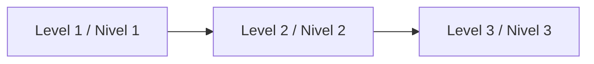

# Documentation / Documentación

Start here / Empieza aquí:
- [AI_START_HERE.md](../AI_START_HERE.md)
- [QUICKSTART.md](../QUICKSTART.md)
- [AGENT_OPERATING_SYSTEM.md](../template-context/core-instructions/AGENT_OPERATING_SYSTEM.md)

## Friendly prompt / Prompt amigable

```text
Using https://github.com/juanklagos/spec-driven-development-template, create everything needed to carry out my project end-to-end.
My project is: [describe your project in plain language].
If my project is new, initialize it with this template, using GitHub Spec Kit as the base workflow.
If it already exists, adapt it to idea/specs/bitacora without breaking behavior.
Guide me by level (beginner/intermediate/advanced) using simple language.
```

## Choose language / Elige idioma
- English: [docs/en](./en)
- Español: [docs/es](./es)

## Learning path / Ruta de aprendizaje



### 1) Beginner / Principiante (first 30-60 min)
- EN: [13-quick-guide-non-programmers](./en/13-quick-guide-non-programmers.md) · ES: [13-guia-rapida-no-programadores](./es/13-guia-rapida-no-programadores.md)
- Outcome: first idea, first spec, first logbook entry.

### 2) Intermediate / Intermedio (team execution)
- EN: [14-intermediate-guide](./en/14-intermediate-guide.md) · ES: [14-guia-intermedia](./es/14-guia-intermedia.md)
- Outcome: consistent execution across sessions and contributors.

### 3) Advanced / Avanzado (standardization)
- EN: [15-advanced-guide](./en/15-advanced-guide.md) · ES: [15-guia-avanzada](./es/15-guia-avanzada.md)
- Outcome: cross-agent consistency, governance, and quality gates.

---

## Full index by topic / Índice completo por tema

### 🌱 Fundamentals / Fundamentos

| # | Guide / Guía | EN | ES |
|---|---|---|---|
| 00 | Introduction / Introducción | [EN](./en/00-introduction.md) | [ES](./es/00-introduccion.md) |
| 01 | Structure / Estructura | [EN](./en/01-structure.md) | [ES](./es/01-estructura.md) |
| 02 | Workflow / Flujo de trabajo | [EN](./en/02-workflow.md) | [ES](./es/02-flujo-de-trabajo.md) |
| 04 | Glossary / Glosario | [EN](./en/04-glossary.md) | [ES](./es/04-glosario.md) |
| 05 | FAQ / Preguntas frecuentes | [EN](./en/05-faq.md) | [ES](./es/05-preguntas-frecuentes.md) |
| 06 | What this template uses / Qué usa esta plantilla | [EN](./en/06-what-this-template-uses.md) | [ES](./es/06-que-usa-esta-plantilla.md) |
| 50 | SDD in 2026: state of the art / Estado del arte SDD 2026 | [EN](./en/50-sdd-state-of-the-art-2026.md) | [ES](./es/50-estado-del-arte-sdd-2026.md) |

### 🎓 Learning path / Ruta de aprendizaje

| # | Guide / Guía | EN | ES |
|---|---|---|---|
| 13 | Quick guide for non-programmers / Guía rápida no programadores | [EN](./en/13-quick-guide-non-programmers.md) | [ES](./es/13-guia-rapida-no-programadores.md) |
| 14 | Intermediate guide / Guía intermedia | [EN](./en/14-intermediate-guide.md) | [ES](./es/14-guia-intermedia.md) |
| 15 | Advanced guide / Guía avanzada | [EN](./en/15-advanced-guide.md) | [ES](./es/15-guia-avanzada.md) |
| 18 | Complete 3-level path / Ruta completa 3 niveles | [EN](./en/18-complete-3-level-path.md) | [ES](./es/18-ruta-completa-3-niveles.md) |
| 23 | 30-minute onboarding / Onboarding 30 minutos | [EN](./en/23-30-minute-onboarding.md) | [ES](./es/23-onboarding-30-minutos.md) |
| 25 | Idea to spec, 3 levels / De idea a spec, 3 niveles | [EN](./en/25-idea-to-spec-with-sdd-3-levels.md) | [ES](./es/25-de-idea-a-spec-con-sdd-3-niveles.md) |

### 🤖 Working with AI / Trabajar con IA

| # | Guide / Guía | EN | ES |
|---|---|---|---|
| 03 | Use with any AI / Usar con cualquier IA | [EN](./en/03-how-to-use-with-any-ai.md) | [ES](./es/03-como-usar-con-cualquier-inteligencia-artificial.md) |
| 10 | Supported agents and prompts / Agentes soportados y prompts | [EN](./en/10-supported-ai-agents-and-prompts.md) | [ES](./es/10-agentes-ia-soportados-y-prompts.md) |
| 16 | Local desktop tools / Herramientas desktop local | [EN](./en/16-local-desktop-tools-guide.md) | [ES](./es/16-guia-herramientas-desktop-local.md) |
| 17 | Working with Lovable / Trabajar con Lovable | [EN](./en/17-working-with-lovable.md) | [ES](./es/17-trabajar-con-lovable.md) |
| 19 | Prompt matrix by goal / Matriz de prompts por objetivo | [EN](./en/19-prompt-matrix-by-goal.md) | [ES](./es/19-matriz-prompts-por-objetivo.md) |
| 26 | Validated prompt bank / Banco de prompts validados | [EN](./en/26-validated-prompt-bank.md) | [ES](./es/26-banco-prompts-validados.md) |
| 30 | Prompts by template feature / Prompts por característica | [EN](./en/30-prompts-by-template-feature.md) | [ES](./es/30-guia-prompts-por-caracteristica.md) |
| 49 | Spec sidecar prompts / Prompts sidecar `spec/` | [EN](./en/49-spec-sidecar-prompts.md) | [ES](./es/49-prompts-sidecar-spec.md) |

### ✅ Specs & quality / Specs y calidad

| # | Guide / Guía | EN | ES |
|---|---|---|---|
| 11 | Continuous refinement / Refinamiento continuo | [EN](./en/11-continuous-refinement.md) | [ES](./es/11-refinamiento-continuo.md) |
| 12 | TDD/BDD: how to write specs / TDD/BDD: cómo escribir specs | [EN](./en/12-tdd-and-bdd-how-to-write-specs.md) | [ES](./es/12-tdd-y-bdd-como-escribir-specs.md) |
| 20 | Anti-patterns and common errors / Anti-patrones y errores | [EN](./en/20-anti-patterns-and-common-errors.md) | [ES](./es/20-anti-patrones-y-errores-comunes.md) |
| 21 | Quality checklists by stage / Checklists de calidad por etapa | [EN](./en/21-quality-checklists-by-stage.md) | [ES](./es/21-checklists-calidad-por-etapa.md) |
| 24 | Architecture decisions (ADR) / Decisiones de arquitectura | [EN](./en/24-architecture-decisions.md) | [ES](./es/24-decisiones-de-arquitectura.md) |
| 29 | Status dashboard and auto-roadmap / Dashboard y roadmap | [EN](./en/29-status-dashboard-and-auto-roadmap.md) | [ES](./es/29-dashboard-status-y-roadmap.md) |

### 👥 Teams & real projects / Equipos y proyectos reales

| # | Guide / Guía | EN | ES |
|---|---|---|---|
| 22 | Team mode and collaboration / Modo equipo y colaboración | [EN](./en/22-team-mode-and-collaboration.md) | [ES](./es/22-modo-equipo-y-colaboracion.md) |
| 27 | Project-type playbooks / Playbooks por tipo de proyecto | [EN](./en/27-project-type-playbooks.md) | [ES](./es/27-playbooks-por-tipo-de-proyecto.md) |
| 28 | Advanced legacy migration / Migración legacy avanzada | [EN](./en/28-advanced-legacy-migration-mode.md) | [ES](./es/28-modo-migracion-legado-avanzado.md) |
| 42 | Project organization map / Mapa de organización | [EN](./en/42-project-organization-map.md) | [ES](./es/42-mapa-organizacion-proyecto.md) |

### 🔌 MCP

| # | Guide / Guía | EN | ES |
|---|---|---|---|
| 43 | Easy MCP guide (start here) / Guía fácil MCP (empieza aquí) | [EN](./en/43-easy-mcp-guide.md) | [ES](./es/43-guia-mcp-facil.md) |
| 33 | MCP server guide / Guía del servidor MCP | [EN](./en/33-mcp-server-guide.md) | [ES](./es/33-guia-servidor-mcp.md) |
| 36 | Client setup recipes / Recetas de setup por cliente | [EN](./en/36-client-setup-recipes.md) | [ES](./es/36-recetas-setup-clientes.md) |
| 40 | Command results reference / Resultados por comando | [EN](./en/40-command-results-reference.md) | [ES](./es/40-referencia-resultados-comandos.md) |
| 41 | Complete MCP reference / Referencia completa MCP | [EN](./en/41-complete-mcp-reference.md) | [ES](./es/41-referencia-completa-mcp.md) |
| 44 | Hosted MCP onboarding model / Modelo onboarding alojado | [EN](./en/44-hosted-mcp-onboarding-model.md) | [ES](./es/44-modelo-onboarding-mcp-alojado.md) |
| 45 | Client visual examples / Ejemplos visuales por cliente | [EN](./en/45-client-visual-examples-for-easy-mcp.md) | [ES](./es/45-ejemplos-visuales-clientes-mcp-facil.md) |
| 47 | Free external MCP options / Opciones MCP externas gratis | [EN](./en/47-free-external-mcp-options.md) | [ES](./es/47-opciones-gratis-mcp-externo.md) |
| 48 | Connect with GitMCP / Conectar con GitMCP | [EN](./en/48-how-to-connect-this-repo-with-gitmcp.md) | [ES](./es/48-como-conectar-este-repo-con-gitmcp.md) |

### 🚀 Releases & project meta / Releases y meta del proyecto

| # | Guide / Guía | EN | ES |
|---|---|---|---|
| 07 | Publish on GitHub step by step / Publicar en GitHub | [EN](./en/07-how-to-publish-on-github-step-by-step.md) | [ES](./es/07-como-publicar-en-github-paso-a-paso.md) |
| 08 | GitHub Spec Kit integration / Integración Spec Kit | [EN](./en/08-github-spec-kit-integration.md) | [ES](./es/08-integracion-github-spec-kit.md) |
| 09 | Release checklist | [EN](./en/09-release-checklist.md) | [ES](./es/09-release-checklist.md) |
| 34 | Launch kit / Kit de lanzamiento | [EN](./en/34-launch-kit.md) | [ES](./es/34-kit-lanzamiento.md) |
| 35 | Public roadmap / Roadmap público | [EN](./en/35-public-roadmap.md) | [ES](./es/35-roadmap-publico.md) |
| 37 | Versioning strategy / Estrategia de versionado | [EN](./en/37-versioning-strategy.md) | [ES](./es/37-estrategia-versionado.md) |
| 38 | Media kit / Kit de medios | [EN](./en/38-media-kit.md) | [ES](./es/38-kit-medios.md) |

### ⚖️ Legal

| # | Guide / Guía | EN | ES |
|---|---|---|---|
| 31 | Legal framework and commercial use / Marco legal y uso comercial | [EN](./en/31-legal-framework-and-commercial-use.md) | [ES](./es/31-marco-legal-y-uso-comercial.md) |

### 🗄️ Historical records / Registros históricos

| # | Guide / Guía | EN | ES |
|---|---|---|---|
| 32 | Documentation audit (2026-03-14) / Auditoría de documentación | [EN](./en/32-documentation-audit-2026-03-14.md) | [ES](./es/32-auditoria-documentacion-2026-03-14.md) |
| 39 | v1.2.0 preparation notes (historical) / Preparación v1.2.0 (histórico) | [EN](./en/39-v1.2.0-preparation.md) | [ES](./es/39-preparacion-v1.2.0.md) |
| 46 | v1.3.0 preparation notes (historical) / Preparación v1.3.0 (histórico) | [EN](./en/46-v1.3.0-preparation.md) | [ES](./es/46-preparacion-v1.3.0.md) |
