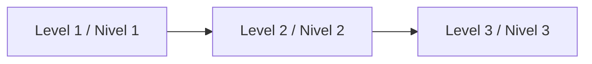

# Documentation / Documentación

Start here / Empieza aquí:
- [AI_START_HERE.md](../AI_START_HERE.md)
- [QUICKSTART.md](../QUICKSTART.md)
- [AGENT_OPERATING_SYSTEM.md](../template-context/core-instructions/AGENT_OPERATING_SYSTEM.md)

## Friendly prompt / Prompt amigable

```text
Using https://github.com/juanklagos/spec-driven-development-template, create everything needed to carry out my project end-to-end.
My project is: [describe your project in plain language].
If my project is new, initialize it with this template + GitHub Spec Kit.
If it already exists, adapt it to idea/specs/bitacora without breaking behavior.
Guide me by level (beginner/intermediate/advanced) using simple language.
```

## Choose language / Elige idioma
- English: [docs/en](./en)
- Español: [docs/es](./es)

## Fast routes / Rutas rápidas



### 1) Beginner / Principiante (first 30-60 min)
- EN: [13-quick-guide-non-programmers](./en/13-quick-guide-non-programmers.md)
- ES: [13-guia-rapida-no-programadores](./es/13-guia-rapida-no-programadores.md)
- Outcome: first idea, first spec, first logbook entry.

### 2) Intermediate / Intermedio (team execution)
- EN: [14-intermediate-guide](./en/14-intermediate-guide.md)
- ES: [14-guia-intermedia](./es/14-guia-intermedia.md)
- Outcome: consistent execution across sessions and contributors.

### 3) Advanced / Avanzado (standardization)
- EN: [15-advanced-guide](./en/15-advanced-guide.md)
- ES: [15-guia-avanzada](./es/15-guia-avanzada.md)
- Outcome: cross-agent consistency, governance, and quality gates.

## Core SDD references / Referencias SDD base
- Workflow: [EN](./en/02-workflow.md) | [ES](./es/02-flujo-de-trabajo.md)
- Spec Kit integration: [EN](./en/08-github-spec-kit-integration.md) | [ES](./es/08-integracion-github-spec-kit.md)
- MCP server guide: [EN](./en/33-mcp-server-guide.md) | [ES](./es/33-guia-servidor-mcp.md)
- Launch kit: [EN](./en/34-launch-kit.md) | [ES](./es/34-kit-lanzamiento.md)
- Public roadmap: [EN](./en/35-public-roadmap.md) | [ES](./es/35-roadmap-publico.md)
- Continuous refinement: [EN](./en/11-continuous-refinement.md) | [ES](./es/11-refinamiento-continuo.md)
- Quality checklists: [EN](./en/21-quality-checklists-by-stage.md) | [ES](./es/21-checklists-calidad-por-etapa.md)

## AI & prompts / IA y prompts
- Supported agents: [EN](./en/10-supported-ai-agents-and-prompts.md) | [ES](./es/10-agentes-ia-soportados-y-prompts.md)
- Prompt matrix: [EN](./en/19-prompt-matrix-by-goal.md) | [ES](./es/19-matriz-prompts-por-objetivo.md)
- Validated prompt bank: [EN](./en/26-validated-prompt-bank.md) | [ES](./es/26-banco-prompts-validados.md)

## Full index / Índice completo
- EN docs list: `docs/en/00` to `docs/en/35`
- ES docs list: `docs/es/00` to `docs/es/35`

## Documentation audits / Auditorías de documentación
- EN: [32-documentation-audit-2026-03-14](./en/32-documentation-audit-2026-03-14.md)
- ES: [32-auditoria-documentacion-2026-03-14](./es/32-auditoria-documentacion-2026-03-14.md)
