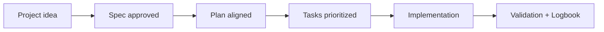

# Introduction

<a href="../README.md"></a>

---

## 🌍 Language pair / Par de idioma

- English: **00-introduction.md**
- Español: [../es/00-introduccion.md](../es/00-introduccion.md)


## 🗣️ Friendly prompt (copy/paste)

Use this when you are not technical and want the AI to do setup + guidance end-to-end:

```text
Using https://github.com/juanklagos/spec-driven-development-template, create everything needed to carry out my project end-to-end.
My project is: [describe your project in plain language].

If my project is new, initialize it with this template and GitHub Spec Kit.
If my project already exists, adapt it to idea/specs/bitacora without breaking current behavior.
Guide me step by step for my level (beginner/intermediate/advanced), using simple language.
Do not skip specification, plan, tasks, refinement trace, logbook, and validation.
```


> [!TIP]
> For startup instructions and prompts, use:
> - [`AI_START_HERE.md`](../../AI_START_HERE.md)
> - [Prompt matrix](./19-prompt-matrix-by-goal.md)
> - [Validated prompt bank](./26-validated-prompt-bank.md)


## Who this template is for

Anyone who wants the same way of working on Monday that they had on Friday. You do not need to be a programmer to use it, and you do not need to abandon it once you are one.

## Problem it solves

Three things go wrong in most projects, whether or not an AI is involved. Decisions get made in a chat window and then evaporate. Code changes land with no record of what they were for. And after a two-week break, nobody — including you — can pick the work back up without re-reading everything.

A fixed structure fixes all three, because there is exactly one place each of those things belongs.

## What you get

Mostly it means fewer "wait, why did we do it that way?" moments, and work you can walk back into cold after two weeks away. The other half of it is the AI assistant, which reads the same context you do instead of guessing.

## The flow


