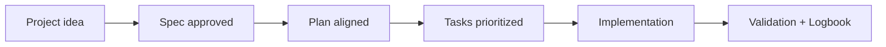

# Introduction

<a href="../README.md"></a>

---

## 🌍 Language pair / Par de idioma

- English: **00-introduction.md**
- Español: [../es/00-introduccion.md](../es/00-introduccion.md)


## 🗣️ Friendly prompt (copy/paste)

Use this when you are not technical and want the AI to do setup + guidance end-to-end:

```text
Using https://github.com/juanklagos/spec-driven-development-template, create everything needed to carry out my project end-to-end.
My project is: [describe your project in plain language].

If my project is new, initialize it with this template and GitHub Spec Kit.
If my project already exists, adapt it to idea/specs/bitacora without breaking current behavior.
Guide me step by step for my level (beginner/intermediate/advanced), using simple language.
Do not skip specification, plan, tasks, refinement trace, logbook, and validation.
```


> [!TIP]
> For startup instructions and prompts, use:
> - [`AI_START_HERE.md`](../../AI_START_HERE.md)
> - [Prompt matrix](./19-prompt-matrix-by-goal.md)
> - [Validated prompt bank](./26-validated-prompt-bank.md)


## Who this template is for

This template is designed for beginners and professionals who want a clear, repeatable, and auditable way of working.

## Problem it solves

In many projects:

- Decisions are lost in chats.
- Code changes happen without context.
- Work is hard to resume after breaks.

This template solves that with a fixed structure.

## Expected outcome

- Less confusion
- Better continuity
- Better collaboration between people and Artificial Intelligence tools

## 💡 Quick tips

- Start from a simple one-paragraph project description.
- Ask the AI to confirm the active spec before coding.
- Close every session with validation and a clear next step.

## 📊 Visual flow


