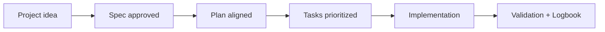

# Detailed structure

## 🌍 Language pair / Par de idioma

- English: **01-structure.md**
- Español: [../es/01-estructura.md](../es/01-estructura.md)


> [!TIP]
> For startup instructions and prompts, use:
> - [`AI_START_HERE.md`](../../AI_START_HERE.md)
> - [Prompt matrix](./19-prompt-matrix-by-goal.md)
> - [Validated prompt bank](./26-validated-prompt-bank.md)

## 🗣️ Friendly prompt (copy/paste)

```text
Using https://github.com/juanklagos/spec-driven-development-template, set up my project structure with a compact spec/ sidecar and guide me in simple language.
My project is: [describe project].
Do not clone the full template into my project unless I explicitly ask for a standalone workspace.
If it is new, create a clean project root and install spec/.
If it already exists, adapt it without breaking current behavior.
```

Recommended target-project shape:
- project root = app code
- `spec/` = SDD operating system

That means:
- `spec/idea/`
- `spec/specs/`
- `spec/bitacora/`

GitHub Spec Kit remains the base workflow reference for the project.
This repository adds the structure, sidecar mode, AI rules, and guidance around that base.


## idea

Path:
- framework root mode: `idea/`
- real project sidecar mode: `spec/idea/`

Main file:

- `IDEA_GENERAL.md`: defines project problem, goal, scope, users, risks, and completion criteria.

## specs

Path:
- framework root mode: `specs/`
- real project sidecar mode: `spec/specs/`

Main files:

- `INDEX.md`: list of all specifications.
- `README.md`: specification rules.
- `_template/`: template for new specifications.

Each specification lives in a numbered folder:

- `001-name`
- `002-name`
- `003-name`

## bitacora

Path:
- framework root mode: `bitacora/`
- real project sidecar mode: `spec/bitacora/`

Subfolders:

- `global/`: overall project history.
- `diaria/`: daily session logs.
- `handoffs/`: handoff notes to resume work.
- `decisiones/`: key decisions.
- `templates/`: log templates.

## docs

Path: `docs/`

Contains educational documentation for this system.

## scripts

Path:
- framework root mode: `scripts/`
- real project sidecar mode: `spec/scripts/`

Contains scripts to initialize this structure in other repositories.

## Optional folders (accelerators)

- `playbooks/`: project-type guides (SaaS, e-commerce, mobile app, backend API).
- `quality/`: evidence templates for testing and quality control.

These folders are optional. If they are not used, the base `idea/specs/bitacora` workflow remains valid.

## 💡 Quick tips

- Start from a simple one-paragraph project description.
- Ask the AI to confirm the active spec before coding.
- Close every session with validation and a clear next step.

## 📊 Visual flow


