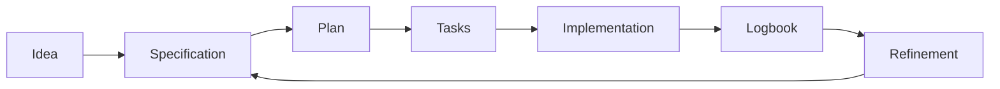

# 🧭 Workflow

## Quick view

| Step | Action | Outcome |
|---|---|---|
| 1 | Define idea | Clear project direction |
| 2 | Create specification | Defined scope |
| 3 | Plan and split tasks | Structured execution |
| 4 | Implement | Real deliverable |
| 5 | Update logbook | Full traceability |
| 6 | Refine | Continuous improvement |

## Visual flow

## Step 1: Define project idea ✨

Complete `idea/IDEA_GENERAL.md`.

## Step 2: Create a specification 📄

Create a numbered folder in `specs/`.

Example:

- `specs/001-authentication/`

## Step 3: Complete required files ✅

- `spec.md`
- `plan.md`
- `tasks.md`
- `research.md`
- `history.md`
- `contracts/` when needed

## Step 4: Execute real work ⚙️

Implement tasks from `tasks.md`.

## Step 5: Record what happened 📝

Update:

- `bitacora/global/PROJECT_LOG.md`
- `bitacora/diaria/YYYY-MM-DD.md`
- `bitacora/handoffs/` when pending work remains

## Step 6: Refine 🔁

If ideas or requirements change, follow:

- `docs/en/11-continuous-refinement.md`
