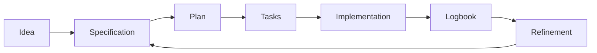

# 🧭 Workflow

<a href="../README.md"></a>

---

## 🗣️ Friendly prompt (copy/paste)

Use this when you are not technical and want the AI to do setup + guidance end-to-end:

```text
Using https://github.com/juanklagos/spec-driven-development-template, create everything needed to carry out my project end-to-end.
My project is: [describe your project in plain language].

If my project is new, initialize it with this template and GitHub Spec Kit.
If my project already exists, adapt it to idea/specs/bitacora without breaking current behavior.
Guide me step by step for my level (beginner/intermediate/advanced), using simple language.
Do not skip specification, plan, tasks, refinement trace, logbook, and validation.
```


> [!TIP]
> For startup instructions and prompts, use:
> - [`AI_START_HERE.md`](../../AI_START_HERE.md)
> - [Prompt matrix](./19-prompt-matrix-by-goal.md)
> - [Validated prompt bank](./26-validated-prompt-bank.md)


## Quick view

| Step | Action | Outcome |
|---|---|---|
| 1 | Define idea | Clear project direction |
| 2 | Create specification | Defined scope |
| 3 | Plan and split tasks | Structured execution |
| 4 | Implement | Real deliverable |
| 5 | Update logbook | Full traceability |
| 6 | Refine | Continuous improvement |

## Visual flow



## Step 1: Define project idea ✨

Complete `idea/IDEA_GENERAL.md`.

## Step 2: Create a specification 📄

Create a numbered folder in `specs/`.

Example:

- `specs/001-authentication/`

## Step 3: Complete required files ✅

- `spec.md`
- `plan.md`
- `tasks.md`
- `research.md`
- `history.md`
- `contracts/` when needed

## Step 4: Execute real work ⚙️

Implement tasks from `tasks.md`.

## Step 5: Record what happened 📝

Update:

- `bitacora/global/PROJECT_LOG.md`
- `bitacora/diaria/YYYY-MM-DD.md`
- `bitacora/handoffs/` when pending work remains

## Step 6: Refine 🔁

If ideas or requirements change, follow:

- `docs/en/11-continuous-refinement.md`
