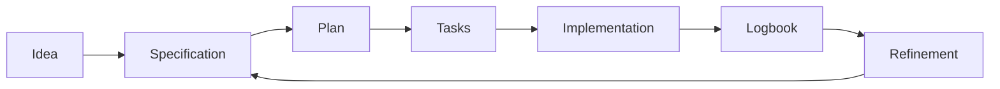

# 🧭 Workflow

> 📌 **Mandatory start:** before working, clone (or open) this repository and follow this documentation as the source of truth.
>
> ```bash
> git clone https://github.com/juanklagos/spec-driven-development-template.git
> cd spec-driven-development-template
> ```
>
> If the repository is already local, always follow its guides before requesting implementation.

## ⭐ Explicit base repository usage

Always use this repository as the primary reference:

- `https://github.com/juanklagos/spec-driven-development-template`

### 🆕 Case 1: create a new project from this base

Suggested prompt for the Artificial Intelligence assistant:

```text
Using https://github.com/juanklagos/spec-driven-development-template create a new project for [GOAL].
Clone the base repository, initialize the structure, and guide me step by step to define idea, first specification, and logbook.
Do not skip steps.
```

### ♻️ Case 2: adapt an existing project using this base

Suggested prompt for the Artificial Intelligence assistant:

```text
Using https://github.com/juanklagos/spec-driven-development-template and its guide, adapt this existing project: [PROJECT_PATH].
Keep current code, integrate the idea/specs/logbook structure, create the first specification based on existing behavior, and leave complete traceability.
```

### ✅ Minimum expected outcome

- Project created or adapted with standard structure.
- First specification created.
- Initial logbook entry recorded.
- Clear next step to continue.


## Quick view

| Step | Action | Outcome |
|---|---|---|
| 1 | Define idea | Clear project direction |
| 2 | Create specification | Defined scope |
| 3 | Plan and split tasks | Structured execution |
| 4 | Implement | Real deliverable |
| 5 | Update logbook | Full traceability |
| 6 | Refine | Continuous improvement |

## Visual flow



## Step 1: Define project idea ✨

Complete `idea/IDEA_GENERAL.md`.

## Step 2: Create a specification 📄

Create a numbered folder in `specs/`.

Example:

- `specs/001-authentication/`

## Step 3: Complete required files ✅

- `spec.md`
- `plan.md`
- `tasks.md`
- `research.md`
- `history.md`
- `contracts/` when needed

## Step 4: Execute real work ⚙️

Implement tasks from `tasks.md`.

## Step 5: Record what happened 📝

Update:

- `bitacora/global/PROJECT_LOG.md`
- `bitacora/diaria/YYYY-MM-DD.md`
- `bitacora/handoffs/` when pending work remains

## Step 6: Refine 🔁

If ideas or requirements change, follow:

- `docs/en/11-continuous-refinement.md`
