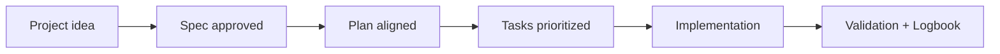

# How to publish on GitHub step by step

## 🌍 Language pair / Par de idioma

- English: **07-how-to-publish-on-github-step-by-step.md**
- Español: [../es/07-como-publicar-en-github-paso-a-paso.md](../es/07-como-publicar-en-github-paso-a-paso.md)


> [!TIP]
> For startup instructions and prompts, use:
> - [`AI_START_HERE.md`](../../AI_START_HERE.md)
> - [Prompt matrix](./19-prompt-matrix-by-goal.md)
> - [Validated prompt bank](./26-validated-prompt-bank.md)

## 🗣️ Friendly prompt (copy/paste)

```text
Using https://github.com/juanklagos/spec-driven-development-template, prepare my project to publish on GitHub step by step.
My project is: [describe project].
Do the setup and explain each step in simple language.
```


## Prerequisites

- A GitHub account
- Git installed locally

## Step 1: Create repository on GitHub

1. Open GitHub
2. Create a new repository
3. Copy repository URL

## Step 2: Initialize local repository

From the template folder:

```bash
git init
git add .
git commit -m "Initial template release"
```

## Step 3: Connect to GitHub

```bash
git branch -M main
git remote add origin <REPOSITORY_URL>
git push -u origin main
```

## Step 4: Verify visible files

Confirm these files appear on GitHub:

- `README.md`
- `LICENSE`
- `CONTRIBUTING.md`
- `CODE_OF_CONDUCT.md`
- `docs/`

## Step 5: Create first release tag

```bash
git tag v1.0.0
git push origin v1.0.0
```

## 💡 Quick tips

- Start from a simple one-paragraph project description.
- Ask the AI to confirm the active spec before coding.
- Close every session with validation and a clear next step.

## 📊 Visual flow


