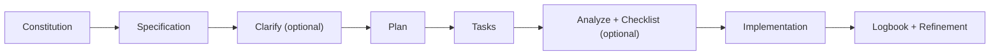
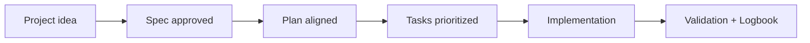

# 🤖 GitHub Spec Kit integration

<a href="../README.md"></a>

---

## 🌍 Language pair / Par de idioma

- English: **08-github-spec-kit-integration.md**
- Español: [../es/08-integracion-github-spec-kit.md](../es/08-integracion-github-spec-kit.md)


## 🗣️ Friendly prompt (copy/paste)

Use this when you are not technical and want the AI to do setup + guidance end-to-end:

```text
Using https://github.com/juanklagos/spec-driven-development-template, create everything needed to carry out my project end-to-end.
My project is: [describe your project in plain language].

If my project is new, initialize it with this template and GitHub Spec Kit.
If my project already exists, adapt it to idea/specs/bitacora without breaking current behavior.
Guide me step by step for my level (beginner/intermediate/advanced), using simple language.
Do not skip specification, plan, tasks, refinement trace, logbook, and validation.
```


> [!TIP]
> For startup instructions and prompts, use:
> - [`AI_START_HERE.md`](../../AI_START_HERE.md)
> - [Prompt matrix](./19-prompt-matrix-by-goal.md)
> - [Validated prompt bank](./26-validated-prompt-bank.md)


This template recommends GitHub Spec Kit as the main workflow engine.

> [!NOTE]
> Since late 2025 all Spec Kit commands live under the `speckit.*` namespace (older docs show `/specify`, `/plan`, etc.). Spec Kit supports 30+ AI agents (Copilot, Claude Code, Cursor, Gemini CLI, Codex CLI, Windsurf...).

## Quick map (current command set)

| Phase | Command | Purpose | Required? |
|---|---|---|---|
| 1 | <kbd>/speckit.constitution</kbd> | Define project principles | Recommended |
| 2 | <kbd>/speckit.specify</kbd> | Define what to build and why | Yes |
| 3 | <kbd>/speckit.clarify</kbd> | Answer open questions before planning | Optional |
| 4 | <kbd>/speckit.plan</kbd> | Define how to build | Yes |
| 5 | <kbd>/speckit.tasks</kbd> | Generate executable tasks | Yes |
| 6 | <kbd>/speckit.analyze</kbd> | Check spec/plan/tasks consistency | Optional |
| 7 | <kbd>/speckit.checklist</kbd> | Generate quality checklists | Optional |
| 8 | <kbd>/speckit.taskstoissues</kbd> | Convert tasks into GitHub issues | Optional (teams) |
| 9 | <kbd>/speckit.implement</kbd> | Execute implementation | Yes |

## Visual flow



## How the optional commands fit this template's gate

- <kbd>/speckit.clarify</kbd> before planning reduces the back-and-forth that usually blocks spec approval.
- <kbd>/speckit.analyze</kbd> is the natural step right before `./scripts/check-sdd-gate.sh .`: it verifies consistency between `spec.md`, `plan.md`, and `tasks.md`; the gate then verifies approval + consent.
- <kbd>/speckit.checklist</kbd> complements this template's [quality checklists by stage](./21-quality-checklists-by-stage.md).
- <kbd>/speckit.taskstoissues</kbd> is useful in [team mode](./22-team-mode-and-collaboration.md) to assign tasks as GitHub issues.

## Recommended installation

### Persistent installation

```bash
uv tool install specify-cli --from git+https://github.com/github/spec-kit.git
```

### One-time usage

```bash
uvx --from git+https://github.com/github/spec-kit.git specify init <PROJECT_NAME>
```

## Initialize in existing project

```bash
specify init . --ai codex
# or
specify init --here --ai codex
```

One-time command alternative:

```bash
uvx --from git+https://github.com/github/spec-kit.git specify init . --ai codex
```

## Recommended initialization with this template

If this template is already available locally, you can bootstrap a project and initialize Spec Kit in one step:

```bash
./scripts/init-project-with-spec-kit.sh /path/project codex
```

## How it fits this template

- `idea/` defines global project intent.
- `specs/` stores numbered specifications.
- `bitacora/` stores real execution trace.

## Practical recommendation

After Spec Kit commands, always update:

- `specs/INDEX.md`
- active spec `history.md`
- `bitacora/global/PROJECT_LOG.md`
- `bitacora/diaria/`
- `bitacora/handoffs/` when pending work exists

Then validate:

```bash
./scripts/validate-sdd.sh . --strict
./scripts/check-sdd-gate.sh .
```

## 💡 Quick tips

- Start from a simple one-paragraph project description.
- Ask the AI to confirm the active spec before coding.
- Close every session with validation and a clear next step.

## 📊 Visual flow


