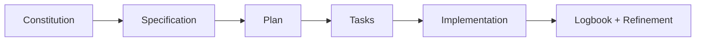

# 🤖 GitHub Spec Kit integration

> 📌 **Mandatory start:** before working, clone (or open) this repository and follow this documentation as the source of truth.
>
> ```bash
> git clone https://github.com/juanklagos/spec-driven-development-template.git
> cd spec-driven-development-template
> ```
>
> If the repository is already local, always follow its guides before requesting implementation.

## ⭐ Explicit base repository usage

Always use this repository as the primary reference:

- `https://github.com/juanklagos/spec-driven-development-template`

### 🆕 Case 1: create a new project from this base

Suggested prompt for the Artificial Intelligence assistant:

```text
Using https://github.com/juanklagos/spec-driven-development-template create a new project for [GOAL].
Clone the base repository, initialize the structure, and guide me step by step to define idea, first specification, and logbook.
Do not skip steps.
```

### ♻️ Case 2: adapt an existing project using this base

Suggested prompt for the Artificial Intelligence assistant:

```text
Using https://github.com/juanklagos/spec-driven-development-template and its guide, adapt this existing project: [PROJECT_PATH].
Keep current code, integrate the idea/specs/logbook structure, create the first specification based on existing behavior, and leave complete traceability.
```

### ✅ Minimum expected outcome

- Project created or adapted with standard structure.
- First specification created.
- Initial logbook entry recorded.
- Clear next step to continue.


This template recommends GitHub Spec Kit as the main workflow engine.

## Quick map

| Phase | Command | Purpose |
|---|---|---|
| 1 | `/speckit.constitution` | Define project principles |
| 2 | `/speckit.specify` | Define what to build |
| 3 | `/speckit.plan` | Define how to build |
| 4 | `/speckit.tasks` | Generate executable tasks |
| 5 | `/speckit.implement` | Execute implementation |

## Visual flow



## Recommended installation

### Persistent installation

```bash
uv tool install specify-cli --from git+https://github.com/github/spec-kit.git
```

### One-time usage

```bash
uvx --from git+https://github.com/github/spec-kit.git specify init <PROJECT_NAME>
```

## Initialize in existing project

```bash
specify init . --ai codex
# or
specify init --here --ai codex
```

One-time command alternative:

```bash
uvx --from git+https://github.com/github/spec-kit.git specify init . --ai codex
```

## How it fits this template

- `idea/` defines global project intent.
- `specs/` stores numbered specifications.
- `bitacora/` stores real execution trace.

## Practical recommendation

After Spec Kit commands, always update:

- `specs/INDEX.md`
- active spec `history.md`
- `bitacora/global/PROJECT_LOG.md`
- `bitacora/diaria/`
- `bitacora/handoffs/` when pending work exists
