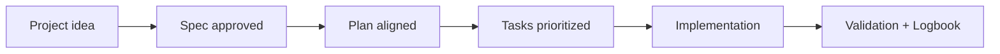

# Release checklist

## 🌍 Language pair / Par de idioma

- English: **09-release-checklist.md**
- Español: [../es/09-release-checklist.md](../es/09-release-checklist.md)


> [!TIP]
> For startup instructions and prompts, use:
> - [`AI_START_HERE.md`](../../AI_START_HERE.md)
> - [Prompt matrix](./19-prompt-matrix-by-goal.md)
> - [Validated prompt bank](./26-validated-prompt-bank.md)

## 🗣️ Friendly prompt (copy/paste)

```text
Using https://github.com/juanklagos/spec-driven-development-template, run a release-readiness review on my project.
My project is: [describe project].
Check this list, tell me what is missing, and propose exact next actions in simple language.
```


Use this list before publishing on GitHub.

## Content validation

- [ ] `README.md` is clear and complete.
- [ ] `idea/` includes a usable project idea template.
- [ ] `specs/` includes rules, index, and templates.
- [ ] `bitacora/` includes structure and templates.
- [ ] At least one complete sample specification exists.

## GitHub Spec Kit integration

- [ ] Integration guide exists.
- [ ] Installation and initialization commands are documented.
- [ ] Recommended command flow is documented.
- [ ] Bootstrap script with Spec Kit exists.

## Community files

- [ ] `LICENSE`
- [ ] `CONTRIBUTING.md`
- [ ] `CODE_OF_CONDUCT.md`
- [ ] Issue and Pull Request templates

## Final checks

- [ ] New users can follow the guide without extra context.
- [ ] Scripts run correctly.
- [ ] Repository metadata is complete.

## 💡 Quick tips

- Start from a simple one-paragraph project description.
- Ask the AI to confirm the active spec before coding.
- Close every session with validation and a clear next step.

## 📊 Visual flow


