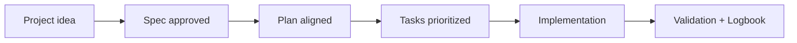

# Supported Artificial Intelligence agents and recommended prompts

<a href="../README.md"></a>

---

## 🌍 Language pair / Par de idioma

- English: **10-supported-ai-agents-and-prompts.md**
- Español: [../es/10-agentes-ia-soportados-y-prompts.md](../es/10-agentes-ia-soportados-y-prompts.md)


## 🗣️ Friendly prompt (copy/paste)

Use this when you are not technical and want the AI to do setup + guidance end-to-end:

```text
Using https://github.com/juanklagos/spec-driven-development-template, create everything needed to carry out my project end-to-end.
My project is: [describe your project in plain language].

If my project is new, initialize it with this template and GitHub Spec Kit.
If my project already exists, adapt it to idea/specs/bitacora without breaking current behavior.
Guide me step by step for my level (beginner/intermediate/advanced), using simple language.
Do not skip specification, plan, tasks, refinement trace, logbook, and validation.
```


> [!TIP]
> For startup instructions and prompts, use:
> - [`AI_START_HERE.md`](../../AI_START_HERE.md)
> - [Prompt matrix](./19-prompt-matrix-by-goal.md)
> - [Validated prompt bank](./26-validated-prompt-bank.md)


This guide is based on official GitHub Spec Kit documentation.

Official source:

- https://github.com/github/spec-kit

## 1) Agent table supported by GitHub Spec Kit

In <kbd>specify init --ai</kbd>, Spec Kit supports the following agents:

| Agent | `--ai` identifier | Status |
|---|---|---|
| Antigravity | `agy` | Supported |
| Amp | `amp` | Supported |
| Auggie | `auggie` | Supported |
| Bob (IBM) | `bob` | Supported |
| Claude Code | `claude` | Supported |
| CodeBuddy | `codebuddy` | Supported |
| Codex | `codex` | Supported |
| GitHub Copilot | `copilot` | Supported |
| Cursor | `cursor-agent` | Supported |
| Gemini | `gemini` | Supported |
| Kilo Code | `kilocode` | Supported |
| Kimi Code | `kimi` | Supported |
| Kiro CLI | `kiro-cli` (alias `kiro`) | Supported |
| OpenCode | `opencode` | Supported |
| Qoder CLI | `qodercli` | Supported |
| Qwen Code | `qwen` | Supported |
| Roo Code | `roo` | Supported |
| SHAI (OVHcloud) | `shai` | Supported |
| Tabnine CLI | `tabnine` | Supported |
| Mistral Vibe | `vibe` | Supported |
| Windsurf | `windsurf` | Supported |
| Generic (unlisted agent) | `generic` | Supported with `--ai-commands-dir` |

## 2) Recommended flow for any agent

1. <kbd>/speckit.constitution</kbd>
2. <kbd>/speckit.specify</kbd>
3. <kbd>/speckit.plan</kbd>
4. <kbd>/speckit.tasks</kbd>
5. <kbd>/speckit.implement</kbd>

## 3) Master kickoff prompt (copy and paste)

"""
Work under this repository structure: `idea/`, `specs/`, `bitacora/`.

Before making changes, read in this order:
1) `idea/IDEA_GENERAL.md`
2) `specs/INDEX.md`
3) latest file in `bitacora/handoffs/` (if any)

Mandatory rules:
- Do not implement without an active specification.
- Use GitHub Spec Kit in this order: constitution, specify, plan, tasks, implement.
- Keep traceability in `bitacora/` when closing the session.

Mandatory response format:
1) Session goal
2) Active specification
3) Immediate plan (short steps)
4) Changes made
5) Validation
6) Exact next step
"""

## 4) Prompt for consistent specification authoring

"""
Create or update a numbered specification in `specs/NNN-name/` with these files:
- `spec.md`
- `plan.md`
- `tasks.md`
- `research.md`
- `contracts/` when needed

Conditions:
- Clear language for beginners and professionals.
- No unexplained abbreviations.
- Every acceptance criterion must be verifiable.
- Tasks must be concrete and executable.
"""

## 5) Prompt for consistent implementation

"""
Implement only what is defined in the active specification.

Before implementing:
- Summarize acceptance criteria.
- Mention risks.

During implementation:
- Keep changes minimal and traceable.
- Avoid out-of-scope changes.

At the end:
- Record results in `bitacora/global/PROJECT_LOG.md`.
- Update `bitacora/diaria/YYYY-MM-DD.md`.
- Create a handoff if pending work remains.
"""

## 6) Unified output contract (for any agent)

Always request this output structure:

1. Summary
2. Updated specification
3. Files changed
4. Validations executed
5. Open risks
6. Next step

This contract reduces tool differences and keeps outcomes consistent.


## 7) Playbooks by level

### 

```text
Explain step by step as if I am new to programming.
Ask short questions.
Help me complete the idea and then create spec 001.
Do not move to the next step until I confirm understanding.
```

### 

```text
Work on one active specification.
Prioritize scope clarity, executable tasks, and complete logbook updates.
Separate changes into: idea, spec, plan, tasks, and validation.
```

### 

```text
Apply unified output contract and refinement protocol.
If scope changes, block implementation until history.md and INDEX are updated.
Return risk analysis and exact next step.
```

## 💡 Quick tips

- Start from a simple one-paragraph project description.
- Ask the AI to confirm the active spec before coding.
- Close every session with validation and a clear next step.

## 📊 Visual flow


