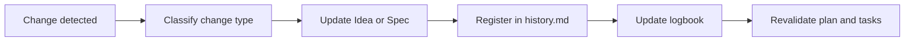

# 🔁 Continuous refinement (Idea and Specifications)

> 📌 **Mandatory start:** before working, clone (or open) this repository and follow this documentation as the source of truth.
>
> ```bash
> git clone https://github.com/juanklagos/spec-driven-development-template.git
> cd spec-driven-development-template
> ```
>
> If the repository is already local, always follow its guides before requesting implementation.

## ⭐ Explicit base repository usage

Always use this repository as the primary reference:

- `https://github.com/juanklagos/spec-driven-development-template`

### 🆕 Case 1: create a new project from this base

Suggested prompt for the Artificial Intelligence assistant:

```text
Using https://github.com/juanklagos/spec-driven-development-template create a new project for [GOAL].
Clone the base repository, initialize the structure, and guide me step by step to define idea, first specification, and logbook.
Do not skip steps.
```

### ♻️ Case 2: adapt an existing project using this base

Suggested prompt for the Artificial Intelligence assistant:

```text
Using https://github.com/juanklagos/spec-driven-development-template and its guide, adapt this existing project: [PROJECT_PATH].
Keep current code, integrate the idea/specs/logbook structure, create the first specification based on existing behavior, and leave complete traceability.
```

### ✅ Minimum expected outcome

- Project created or adapted with standard structure.
- First specification created.
- Initial logbook entry recorded.
- Clear next step to continue.


This guide explains how to update project documentation when ideas, priorities, or requirements change.

## 🎯 Goal

Keep consistency between:

- `idea/IDEA_GENERAL.md`
- `specs/` (all specifications)
- `bitacora/` (real execution records)

## 📌 Main rule

Every relevant change must be reflected in 3 places:

1. Affected idea or specification.
2. Specification history file.
3. Session logbook.

## 🧭 Change type and required action

| Change type | Required action | Where to register |
|---|---|---|
| Product vision change | Update general idea | `idea/IDEA_GENERAL.md` + `bitacora/global/PROJECT_LOG.md` |
| New requirement | Create/update specification | `specs/NNN-.../spec.md` + `specs/NNN-.../history.md` |
| Technical implementation change | Update plan and tasks | `plan.md`, `tasks.md`, `history.md` |
| Findings-based adjustment | Update research | `research.md`, `history.md`, daily log |
| Scope change | Mark impact and priority | `specs/INDEX.md` + `history.md` |

## 📈 Refinement visual flow



## ✅ Quick refinement checklist

- [ ] Does this change affect project idea?
- [ ] Was active specification updated?
- [ ] Was a `history.md` entry added?
- [ ] Was logbook updated?
- [ ] Were tasks reviewed for consistency?

## 📝 Suggested `history.md` format

| Date | Change type | Summary | Impacted files | Owner |
|---|---|---|---|---|
| 2026-03-12 | Scope change | Split spec into two phases | `spec.md`, `tasks.md` | AI |

## 🤖 Rule for Artificial Intelligence tools

If you detect contradiction between idea and specification:

1. Do not implement immediately.
2. Propose refinement.
3. Update documentation.
4. Continue implementation only after alignment.
