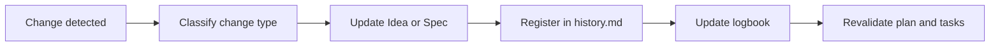

# 🔁 Continuous refinement (Idea and Specifications)

<a href="../README.md"></a>

---

## 🗣️ Friendly prompt (copy/paste)

Use this when you are not technical and want the AI to do setup + guidance end-to-end:

```text
Using https://github.com/juanklagos/spec-driven-development-template, create everything needed to carry out my project end-to-end.
My project is: [describe your project in plain language].

If my project is new, initialize it with this template and GitHub Spec Kit.
If my project already exists, adapt it to idea/specs/bitacora without breaking current behavior.
Guide me step by step for my level (beginner/intermediate/advanced), using simple language.
Do not skip specification, plan, tasks, refinement trace, logbook, and validation.
```


> [!TIP]
> For startup instructions and prompts, use:
> - [`AI_START_HERE.md`](../../AI_START_HERE.md)
> - [Prompt matrix](./19-prompt-matrix-by-goal.md)
> - [Validated prompt bank](./26-validated-prompt-bank.md)


This guide explains how to update project documentation when ideas, priorities, or requirements change.

## 🎯 Goal

Keep consistency between:

- `idea/IDEA_GENERAL.md`
- `specs/` (all specifications)
- `bitacora/` (real execution records)

## 📌 Main rule

Every relevant change must be reflected in 3 places:

1. Affected idea or specification.
2. Specification history file.
3. Session logbook.

## 🧭 Change type and required action

| Change type | Required action | Where to register |
|---|---|---|
| Product vision change | Update general idea | `idea/IDEA_GENERAL.md` + `bitacora/global/PROJECT_LOG.md` |
| New requirement | Create/update specification | `specs/NNN-.../spec.md` + `specs/NNN-.../history.md` |
| Technical implementation change | Update plan and tasks | `plan.md`, `tasks.md`, `history.md` |
| Findings-based adjustment | Update research | `research.md`, `history.md`, daily log |
| Scope change | Mark impact and priority | `specs/INDEX.md` + `history.md` |

## 📈 Refinement visual flow



## ✅ Quick refinement checklist

- [ ] Does this change affect project idea?
- [ ] Was active specification updated?
- [ ] Was a `history.md` entry added?
- [ ] Was logbook updated?
- [ ] Were tasks reviewed for consistency?

## 📝 Suggested `history.md` format

| Date | Change type | Summary | Impacted files | Owner |
|---|---|---|---|---|
| 2026-03-12 | Scope change | Split spec into two phases | `spec.md`, `tasks.md` | AI |

## 🤖 Rule for Artificial Intelligence tools

If you detect contradiction between idea and specification:

1. Do not implement immediately.
2. Propose refinement.
3. Update documentation.
4. Continue implementation only after alignment.
