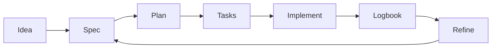

# 🛠️ Intermediate guide (teams and real projects)

<a href="../README.md"></a>

---

> [!TIP]
> **Recommended start (low friction):** you do not need to clone this repository if you are already working inside a project.
>
> **Mandatory rule:** tell the Artificial Intelligence assistant to use this template and its guides as the primary reference.
>
> Options:
> - If this repository is already local, use it directly.
> - If you are in another project, ask the assistant to adapt that project using this guide.
> - If you do not have this repository, cloning is optional:
>
> ```bash
> git clone https://github.com/juanklagos/spec-driven-development-template.git
> cd spec-driven-development-template
> ```

## ⭐ Explicit base repository usage

Always use this repository as the primary reference:

- `https://github.com/juanklagos/spec-driven-development-template`

### 🆕 Case 1: create a new project from this base

Suggested prompt for the Artificial Intelligence assistant:

```text
Using https://github.com/juanklagos/spec-driven-development-template create a new project for [GOAL].
If this repository is not available locally, tell me how to get access to it; then initialize the structure and guide me step by step to define idea, first specification, and logbook.
Do not skip steps.
```

### ♻️ Case 2: adapt an existing project using this base

Suggested prompt for the Artificial Intelligence assistant:

```text
Using https://github.com/juanklagos/spec-driven-development-template and its guide, adapt this existing project: [PROJECT_PATH].
Keep current code, integrate the idea/specs/logbook structure, create the first specification based on existing behavior, and leave complete traceability.
```

### ✅ Minimum expected outcome

- Project created or adapted with standard structure.
- First specification created.
- Initial logbook entry recorded.
- Clear next step to continue.


> Goal: keep consistency across sessions and contributors.

## 🎯 Approach

- Clear active specification
- Executable tasks
- Updated logbook
- Continuous refinement

## 🔁 Recommended flow



## 🗣️ Ready-to-use prompt (intermediate)

```text
Read idea/IDEA_GENERAL.md, specs/INDEX.md, and the latest handoff.
Select one active specification.
Propose a session plan in at most 5 steps.
Execute only in-scope tasks.
At the end, update global log, daily log, and handoff.
```

## 📊 Control table

| Control | File | Frequency |
|---|---|---|
| Spec status | `specs/INDEX.md` | Every session |
| Change history | `specs/NNN-.../history.md` | Every relevant change |
| Global log | `bitacora/global/PROJECT_LOG.md` | Every session |
| Handoff | `bitacora/handoffs/` | When work is pending |

## ⚠️ Common mistake

Implementing while idea and specification are misaligned.

## ✅ Good habit

Align first, implement second.
