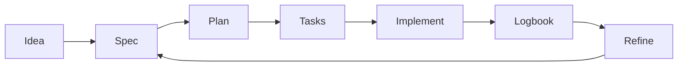

# 🛠️ Intermediate guide (teams and real projects)

> 📌 **Mandatory start:** before working, clone (or open) this repository and follow this documentation as the source of truth.
>
> ```bash
> git clone https://github.com/juanklagos/spec-driven-development-template.git
> cd spec-driven-development-template
> ```
>
> If the repository is already local, always follow its guides before requesting implementation.

> Goal: keep consistency across sessions and contributors.

## 🎯 Approach

- Clear active specification
- Executable tasks
- Updated logbook
- Continuous refinement

## 🔁 Recommended flow



## 🗣️ Ready-to-use prompt (intermediate)

```text
Read idea/IDEA_GENERAL.md, specs/INDEX.md, and the latest handoff.
Select one active specification.
Propose a session plan in at most 5 steps.
Execute only in-scope tasks.
At the end, update global log, daily log, and handoff.
```

## 📊 Control table

| Control | File | Frequency |
|---|---|---|
| Spec status | `specs/INDEX.md` | Every session |
| Change history | `specs/NNN-.../history.md` | Every relevant change |
| Global log | `bitacora/global/PROJECT_LOG.md` | Every session |
| Handoff | `bitacora/handoffs/` | When work is pending |

## ⚠️ Common mistake

Implementing while idea and specification are misaligned.

## ✅ Good habit

Align first, implement second.
