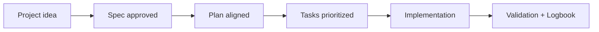

# 🛠️ Intermediate guide (teams and real projects)

## 🌍 Language pair / Par de idioma

- English: **14-intermediate-guide.md**
- Español: [../es/14-guia-intermedia.md](../es/14-guia-intermedia.md)


## 🗣️ Friendly prompt (copy/paste)

```text
Using https://github.com/juanklagos/spec-driven-development-template, create everything needed to carry out my project end-to-end.
My project is: [describe your project in plain language].
Guide me step by step for my level and do not skip specification, plan, tasks, logbook, and validation.
```


Who is this for:
- You already use SDD basics and need consistent team execution.

## Goal
Run repeatable sessions with traceability and low rework.

## Standard session flow

1. Read context (`idea`, `INDEX`, latest handoff).
2. Select one active spec.
3. Execute only in-scope tasks.
4. Update `history.md`, `INDEX.md` (if needed), `PROJECT_LOG.md`.
5. Validate and close with next exact step.

## Prompt pack (Intermediate)

### Prompt A: Start session cleanly
```text
Read idea/IDEA_GENERAL.md, specs/INDEX.md, and latest handoff.
Select one active spec and propose a 5-step session plan.
Block any out-of-scope work.
```

### Prompt B: Controlled implementation
```text
Implement only tasks from the active spec.
Before coding, confirm approved spec and consistent plan.
After changes, update history.md and bitacora.
```

### Prompt C: Session close + handoff
```text
Generate PROJECT_LOG entry and handoff with:
current state, pending items, blockers, exact next step.
Also verify if specs/INDEX.md status needs update.
```

## Team controls
- One active spec per session.
- No undocumented scope changes.
- Mandatory handoff when work is pending.

## Validation
```bash
./scripts/validate-sdd.sh . --strict
./scripts/check-sdd-gate.sh .
```

## More prompts
- [Prompt matrix](./19-prompt-matrix-by-goal.md)
- [Validated prompt bank](./26-validated-prompt-bank.md)

## Next step
- [docs/en/15-advanced-guide.md](./15-advanced-guide.md)

## 💡 Quick tips

- Start from a simple one-paragraph project description.
- Ask the AI to confirm the active spec before coding.
- Close every session with validation and a clear next step.

## 📊 Visual flow


