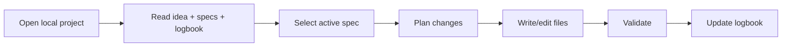

# 🖥️ Guide: desktop tools with local project access

> ✅ **Recommended start (low friction):** you do not need to clone this repository if you are already working inside a project.
>
> **Mandatory rule:** tell the Artificial Intelligence assistant to use this template and its guides as the primary reference.
>
> Options:
> - If this repository is already local, use it directly.
> - If you are in another project, ask the assistant to adapt that project using this guide.
> - If you do not have this repository, cloning is optional:
>
> ```bash
> git clone https://github.com/juanklagos/spec-driven-development-template.git
> cd spec-driven-development-template
> ```

## ⭐ Explicit base repository usage

Always use this repository as the primary reference:

- `https://github.com/juanklagos/spec-driven-development-template`

### 🆕 Case 1: create a new project from this base

Suggested prompt for the Artificial Intelligence assistant:

```text
Using https://github.com/juanklagos/spec-driven-development-template create a new project for [GOAL].
If this repository is not available locally, tell me how to get access to it; then initialize the structure and guide me step by step to define idea, first specification, and logbook.
Do not skip steps.
```

### ♻️ Case 2: adapt an existing project using this base

Suggested prompt for the Artificial Intelligence assistant:

```text
Using https://github.com/juanklagos/spec-driven-development-template and its guide, adapt this existing project: [PROJECT_PATH].
Keep current code, integrate the idea/specs/logbook structure, create the first specification based on existing behavior, and leave complete traceability.
```

### ✅ Minimum expected outcome

- Project created or adapted with standard structure.
- First specification created.
- Initial logbook entry recorded.
- Clear next step to continue.


> This guide explains how to use this template with Artificial Intelligence desktop assistants that can read and write local files.

## 🎯 Goal

Enable anyone to work with tools such as:

- Codex desktop
- Claude desktop
- Other desktop tools with local folder access

while preserving structure, traceability, and consistency.

## 📦 What “local access” means

The tool can:

- Read project files.
- Create and edit documents.
- Run terminal commands (if enabled).

## 🧭 Recommended workflow (always)



## ✅ Session startup checklist

- [ ] Opened the correct project root.
- [ ] Confirmed `idea/`, `specs/`, `bitacora/` exist.
- [ ] Read `idea/IDEA_GENERAL.md`.
- [ ] Read `specs/INDEX.md`.
- [ ] Read latest file in `bitacora/handoffs/`.

## 🗣️ Base prompt for desktop assistants

```text
Work in local mode on this folder.
Do not create files outside this standard.
Follow this order:
1) idea/IDEA_GENERAL.md
2) specs/INDEX.md
3) latest handoff in bitacora/handoffs/

Then:
- select one active specification,
- propose a short plan,
- execute only in-scope changes,
- update logbook at session close.

Output format:
1) Goal
2) Modified files
3) Validation
4) Risks
5) Next step
```

## 🛠️ Suggested setup by tool type

## 1) Codex desktop

Recommendation:

- Open project folder as workspace.
- Start with context reading (idea/specs/logbook).
- Request small, controlled execution blocks.

Suggested prompt:

```text
Act as a local implementation assistant.
First summarize project context from idea/specs/logbook.
Then execute one task from the active spec and report exact changed file paths.
```

## 2) Claude desktop

Recommendation:

- Use short iterations.
- Ask for plan summary before execution.
- Require logbook update at the end.

Suggested prompt:

```text
Before writing files, explain your plan in 3 steps.
Then apply minimal changes.
At the end, prepare one global log entry and one daily log entry.
```

## 3) Other desktop tools

Universal rule:

- If the tool can edit locally, it must follow this template structure strictly.
- If it cannot edit, it must return copy-ready content with exact file paths.

Suggested prompt:

```text
Use this repository as source of truth.
Do not change base structure.
If context is missing, ask before editing.
If scope changes, update history.md and logbook.
```

## 🔒 Safety and control best practices

- Review file paths before confirming changes.
- Avoid destructive commands in unrelated folders.
- Commit often with clear messages.
- Never push secrets or credentials.

## 🧪 Minimum validation per session

| Validation | Expected result |
|---|---|
| Structure intact | `idea/`, `specs/`, `bitacora/` remain consistent |
| Active spec updated | `history.md` reflects changes |
| Logbook updated | Global + daily + handoff (if needed) |

## 🚨 Warning signals

Stop implementation and align first if:

- Idea and specification conflict.
- Undocumented scope change appears.
- Acceptance criteria are unclear.

## ✅ Session close (mandatory)

- [ ] Update `bitacora/global/PROJECT_LOG.md`
- [ ] Update `bitacora/diaria/YYYY-MM-DD.md`
- [ ] Create handoff if pending work remains
- [ ] Confirm exact next step
