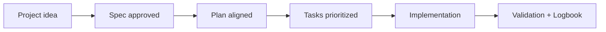

# 🖥️ Guide: desktop tools with local project access

<a href="../README.md"></a>

---

## 🌍 Language pair / Par de idioma

- English: **16-local-desktop-tools-guide.md**
- Español: [../es/16-guia-herramientas-desktop-local.md](../es/16-guia-herramientas-desktop-local.md)


## 🗣️ Friendly prompt (copy/paste)

Use this when you are not technical and want the AI to do setup + guidance end-to-end:

```text
Using https://github.com/juanklagos/spec-driven-development-template, create everything needed to carry out my project end-to-end.
My project is: [describe your project in plain language].

If my project is new, initialize it with this template and GitHub Spec Kit.
If my project already exists, adapt it to idea/specs/bitacora without breaking current behavior.
Guide me step by step for my level (beginner/intermediate/advanced), using simple language.
Do not skip specification, plan, tasks, refinement trace, logbook, and validation.
```


> [!TIP]
> For startup instructions and prompts, use:
> - [`AI_START_HERE.md`](../../AI_START_HERE.md)
> - [Prompt matrix](./19-prompt-matrix-by-goal.md)
> - [Validated prompt bank](./26-validated-prompt-bank.md)


> This guide explains how to use this template with Artificial Intelligence desktop assistants that can read and write local files.

## 🎯 Goal

Enable anyone to work with tools such as:

- Codex desktop
- Claude desktop
- Other desktop tools with local folder access

while preserving structure, traceability, and consistency.

## 📦 What “local access” means

The tool can:

- Read project files.
- Create and edit documents.
- Run terminal commands (if enabled).

## 🧭 Recommended workflow (always)


## ✅ Session startup checklist

- [ ] Opened the correct project root.
- [ ] Confirmed `idea/`, `specs/`, `bitacora/` exist.
- [ ] Read `idea/IDEA_GENERAL.md`.
- [ ] Read `specs/INDEX.md`.
- [ ] Read latest file in `bitacora/handoffs/`.

## 🗣️ Base prompt for desktop assistants

```text
Work in local mode on this folder.
Do not create files outside this standard.
Follow this order:
1) idea/IDEA_GENERAL.md
2) specs/INDEX.md
3) latest handoff in bitacora/handoffs/

Then:
- select one active specification,
- propose a short plan,
- execute only in-scope changes,
- update logbook at session close.

Output format:
1) Goal
2) Modified files
3) Validation
4) Risks
5) Next step
```

## 🛠️ Suggested setup by tool type

## 1) Codex desktop

Recommendation:

- Open project folder as workspace.
- Start with context reading (idea/specs/logbook).
- Request small, controlled execution blocks.

Suggested prompt:

```text
Act as a local implementation assistant.
First summarize project context from idea/specs/logbook.
Then execute one task from the active spec and report exact changed file paths.
```

## 2) Claude desktop

Recommendation:

- Use short iterations.
- Ask for plan summary before execution.
- Require logbook update at the end.

Suggested prompt:

```text
Before writing files, explain your plan in 3 steps.
Then apply minimal changes.
At the end, prepare one global log entry and one daily log entry.
```

## 3) Other desktop tools

Universal rule:

- If the tool can edit locally, it must follow this template structure strictly.
- If it cannot edit, it must return copy-ready content with exact file paths.

Suggested prompt:

```text
Use this repository as source of truth.
Do not change base structure.
If context is missing, ask before editing.
If scope changes, update history.md and logbook.
```

## 4) MCP-compatible desktop tools

If your desktop assistant supports MCP servers, connect the local `sdd-mcp` server instead of relying only on free-form prompts.

Reference:
- [MCP server guide](./33-mcp-server-guide.md)

Why this is better:
- tools are explicit
- policy and templates are exposed as resources
- prompts are reusable and consistent
- the SDD workflow becomes less dependent on model improvisation

## 🔒 Safety and control best practices

- Review file paths before confirming changes.
- Avoid destructive commands in unrelated folders.
- Commit often with clear messages.
- Never push secrets or credentials.

## 🧪 Minimum validation per session

| Validation | Expected result |
|---|---|
| Structure intact | `idea/`, `specs/`, `bitacora/` remain consistent |
| Active spec updated | `history.md` reflects changes |
| Logbook updated | Global + daily + handoff (if needed) |

## 🚨 Warning signals

Stop implementation and align first if:

- Idea and specification conflict.
- Undocumented scope change appears.
- Acceptance criteria are unclear.

## ✅ Session close (mandatory)

- [ ] Update `bitacora/global/PROJECT_LOG.md`
- [ ] Update `bitacora/diaria/YYYY-MM-DD.md`
- [ ] Create handoff if pending work remains
- [ ] Confirm exact next step

## 💡 Quick tips

- Start from a simple one-paragraph project description.
- Ask the AI to confirm the active spec before coding.
- Close every session with validation and a clear next step.

## 📊 Visual flow


