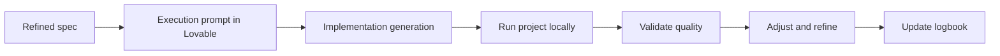

# 💜 How to work with Lovable after specs are ready

<a href="../README.md"></a>

---

> [!TIP]
> **Recommended start (low friction):** you do not need to clone this repository if you are already working inside a project.
>
> **Mandatory rule:** tell the Artificial Intelligence assistant to use this template and its guides as the primary reference.
>
> Options:
> - If this repository is already local, use it directly.
> - If you are in another project, ask the assistant to adapt that project using this guide.
> - If you do not have this repository, cloning is optional:
>
> ```bash
> git clone https://github.com/juanklagos/spec-driven-development-template.git
> cd spec-driven-development-template
> ```

## ⭐ Explicit base repository usage

Always use this repository as the primary reference:

- `https://github.com/juanklagos/spec-driven-development-template`

### 🆕 Case 1: create a new project from this base

Suggested prompt for the Artificial Intelligence assistant:

```text
Using https://github.com/juanklagos/spec-driven-development-template create a new project for [GOAL].
If this repository is not available locally, tell me how to get access to it; then initialize the structure and guide me step by step to define idea, first specification, and logbook.
Do not skip steps.
```

### ♻️ Case 2: adapt an existing project using this base

Suggested prompt for the Artificial Intelligence assistant:

```text
Using https://github.com/juanklagos/spec-driven-development-template and its guide, adapt this existing project: [PROJECT_PATH].
Keep current code, integrate the idea/specs/logbook structure, create the first specification based on existing behavior, and leave complete traceability.
```

### ✅ Minimum expected outcome

- Project created or adapted with standard structure.
- First specification created.
- Initial logbook entry recorded.
- Clear next step to continue.

## 🎯 Goal of this guide

After a refined and approved specification, use Lovable to execute implementation with quality and full traceability.

## ✅ Prerequisites (before using Lovable)

| Requirement | Where to verify |
|---|---|
| Clear idea | `idea/IDEA_GENERAL.md` |
| Complete active spec | `specs/NNN-.../spec.md` |
| Clear technical plan | `specs/NNN-.../plan.md` |
| Executable tasks | `specs/NNN-.../tasks.md` |
| Updated history | `specs/NNN-.../history.md` |

## 🧭 Recommended flow with Lovable



## 🗣️ Base prompt for Lovable (execution)

```text
Act as an implementation assistant following this active specification:
- [SPEC_PATH]
- [PLAN_PATH]
- [TASKS_PATH]

Rules:
1) Execute only in-scope tasks.
2) If you detect contradictions, stop and propose refinement.
3) Produce clean, maintainable code.
4) Run the project locally and report outcomes.
5) At the end, provide:
   - Files changed
   - Validations executed
   - Open risks
   - Next step
```

## ▶️ How to ask Lovable to run the project

Use an explicit prompt like this:

```text
Implement task [ID], then run the project locally.
Run and report these commands:
1) dependency install
2) development run
3) quality checks (lint, tests, build)
If anything fails, fix and re-run until stable.
```

## 🧪 Minimum quality checklist

- [ ] Project starts correctly.
- [ ] No compilation errors.
- [ ] No critical lint errors.
- [ ] Key tests pass (if they exist).
- [ ] Specification acceptance criteria are satisfied.

## 📋 Reporting format to require from Lovable

1. Task goal
2. Files changed
3. Commands executed
4. Validation results
5. Errors found and fixes
6. Open risks
7. Recommended next step

## 🔁 Quality loop for high confidence

1. Execute task.
2. Run project.
3. Validate quality.
4. Adjust.
5. Record in `history.md` and `bitacora/`.

If there is no record, there is no real session closure.
