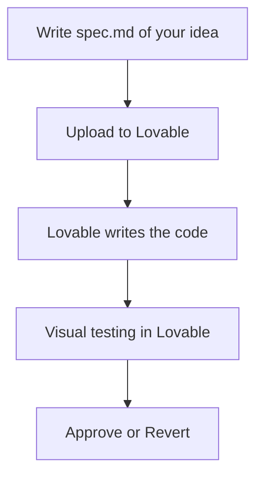
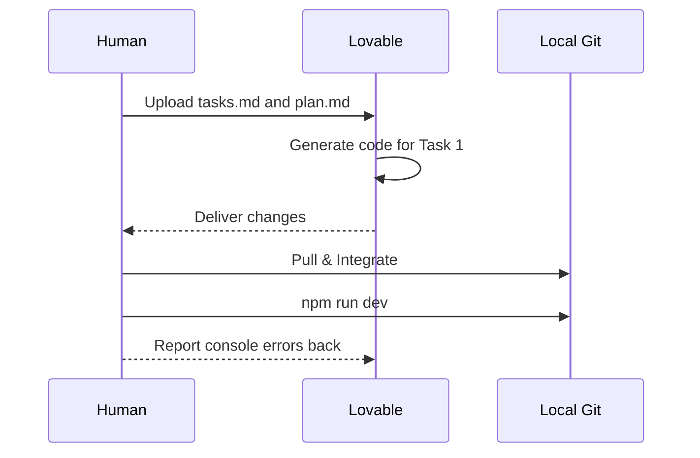
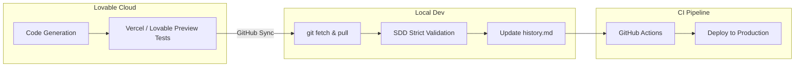

# 💜 How to work with Lovable and Spec-Driven Development

<a href="../README.md"></a>
<a href="../../AI_START_HERE.md"></a>

---

## 🌍 Language pair / Par de idioma

- English: **17-working-with-lovable.md**
- Español: [../es/17-trabajar-con-lovable.md](../es/17-trabajar-con-lovable.md)


## 🗣️ Friendly prompt (copy/paste)

Use this when you are not technical and want the AI to do setup + guidance end-to-end:

```text
Using https://github.com/juanklagos/spec-driven-development-template, create everything needed to carry out my project end-to-end.
My project is: [describe your project in plain language].

If my project is new, initialize it with this template and GitHub Spec Kit.
If my project already exists, adapt it to idea/specs/bitacora without breaking current behavior.
Guide me step by step for my level (beginner/intermediate/advanced), using simple language.
Do not skip specification, plan, tasks, refinement trace, logbook, and validation.
```


> [!TIP]
> **Recommended start (low friction):** you do not need to clone this repository if you are already working inside a project. Give Lovable this structure as context and it follows it well.

## What this guide is for

**Lovable** is very good at turning a description into a working screen, and very bad at remembering what you agreed on two prompts ago. Spec-Driven Development covers exactly that gap: the spec is the memory Lovable does not have. This guide shows how to run the two together.

It will not eliminate hallucinations — nothing does. It will make them obvious, because there is a written contract to compare the output against.

Three levels below, from "I have never written a spec" to "this is wired into CI". Start wherever you are.

---

## 🟢 Level 1: Beginner (the basic loop)

Use this level if you have never touched the specs structure and mostly want Lovable to stop drifting.

### 1. Prepare the ground

Write the requirements before you open the chat. Brainstorming the product inside Lovable is fine as thinking, but if nothing lands in a file, you will be having the same conversation again next week.

| Requirement | Where it lives |
| :--- | :--- |
| **Clear Idea** | `idea/IDEA_GENERAL.md` |
| **Specification**| `specs/001-feature/spec.md` |

### 2. The opening prompt

Paste this into your Lovable chat with your `.md` files attached:

```text
Act as an expert developer. Use the attached documents as your source of truth for this session:
- spec.md (Business requirements)
- plan.md (Technical architecture, if any)

Strict Rules:
1. Do not implement anything not explicitly written in the spec.
2. If a requirement is ambiguous, stop and ask me.
3. Once finished, tell me exactly which files you modified.
```

### 3. What the loop looks like



---

## 🟡 Level 2: Intermediate (quality and control)

Same tool, tighter leash. From here on you review Lovable's output the way you would review a contractor's.

### 1. What you need beyond the spec

A `spec.md` is no longer enough. You (or another AI acting as architect) also draft `plan.md` and `tasks.md`, so the work arrives in reviewable slices.

| Tool | Required Action |
| :--- | :--- |
| **Version Control**| Do not commit directly to `main`. Use branches: <kbd>git checkout -b feature/001</kbd> |
| **Task Management**| Strictly follow the file `specs/001-feature/tasks.md` |

### 2. One task at a time

Asking for "the whole feature" is how you end up reverting an afternoon. Ask for one task:

```text
Today we will strictly implement [TASK 1] as described in tasks.md.
Ensure you test and resolve any lint errors before claiming it is done. Let me know to review only when you are in a stable state.
```

### 3. Run it locally

Lovable runs in the cloud, so pull the code down regularly and check it on your own machine:

1. Install deps: <kbd>npm install</kbd>
2. Dev server: <kbd>npm run dev</kbd>
3. Click through it yourself, with the browser console open.

> [!CAUTION]
> **The web preview is not proof.** It has its own build, its own cache and its own opinions. Verify locally before you call a task done.



---

## 🔴 Level 3: Advanced (automation and GitHub Spec Kit)

Here Lovable becomes one step in a pipeline that also involves the command line, CI and a spec generator.

### 1. Sync with GitHub Spec Kit

At this point you stop hand-writing the whole bundle and let Spec Kit lay out the folder states:

<kbd>specify implement . --ai lovable</kbd>

### 2. The engineering prompt

```text
Assume your role as a Principal Software Engineer.
We operate under the Spec-Driven Development standard. 

Here is our context:
[attach/read specs/002-feature/spec.md]
[attach/read specs/002-feature/contracts/]

Strict Quality Rules:
- Every new component must be strongly typed (TypeScript).
- Test coverage required (Jest/Vitest) for core business logic.
- Breaking the linter means the task is NOT done.

Generate the code, and deliver a "Handoff" report when finished detailing your technical risks.
```

### 3. Handoff and closure

Make Lovable file a report when it finishes, and save it yourself in `bitacora/handoffs/YYYY-MM-DD.md`. Four things, no prose:
1. Total files modified (+ / - lines)
2. New third-party libraries installed (and why)
3. Architecture decisions made
4. Commands to run in local environment (DB migrations, rebuilding dependencies)



---

## Keeping the base repository in the loop

> [!NOTE]
> Point every assistant back at this repository:  
> <kbd>https://github.com/juanklagos/spec-driven-development-template</kbd>

<details>
<summary>🆕 <b>Case: Setting up a project for Lovable from scratch</b></summary>
<br>

Send this to your assistant of choice (local or ChatGPT) *before* you open Lovable:

```text
Using https://github.com/juanklagos/spec-driven-development-template initialize the local structure for a new [REACT/VUE/ETC] project.
Only create the text files and structure; Lovable will handle the actual coding later. Guide me step by step to define the first spec. Do not skip steps.
```

</details>

<details>
<summary>♻️ <b>Case: Lovable broke an existing project</b></summary>
<br>

On large projects Lovable will confidently invent things. This prompt stops the bleeding:

```text
Using https://github.com/juanklagos/spec-driven-development-template and its guide, we are pausing code writing.
Analyze our broken code, integrate the idea/specs/bitacora structure, and help me formulate a spec based on what the code *should* be doing so we can fix it methodically.
```

</details>
