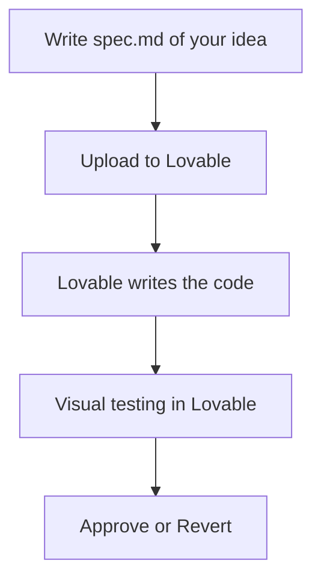
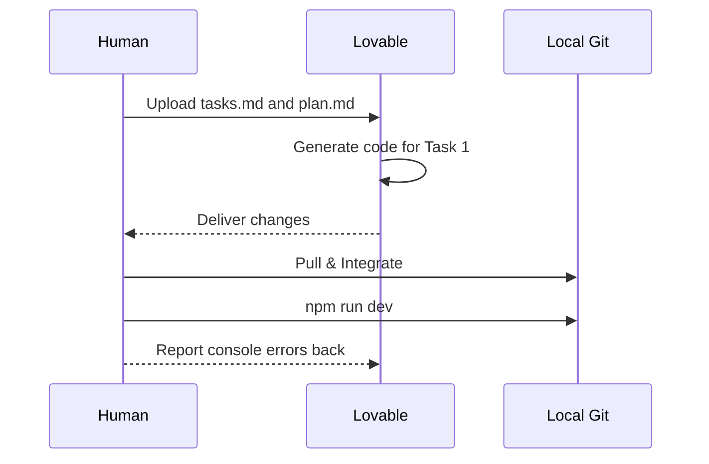
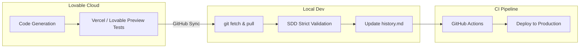

# 💜 How to work with Lovable and Spec-Driven Development

<a href="../README.md"></a>
<a href="../../AI_START_HERE.md"></a>

---

> [!TIP]
> **Recommended start (low friction):** you do not need to clone this repository if you are already working inside a project. Lovable understands this structure perfectly if provided as context.

## 🎯 Goal of this guide

The goal of this guide is to teach you how to use **Lovable** (or similar visual AI assistants) in conjunction with **Spec-Driven Development**. When you combine Lovable's raw code generation power with the rigor of structured specifications, you achieve high-quality applications, zero hallucinations, and genuine long-term maintainability.

We have structured this guide into **3 levels of depth** so you can adapt it at your own pace.

---

## 🟢 Level 1: Beginner (The Basic Flow)

This level is ideal if you have never used the specs structure and want fast, reliable results with Lovable.

### 1. Prepare the Ground

Before giving commands to Lovable, you need clear requirements. Do not use Lovable to "brainstorm" the product from scratch without leaving a paper trail.

| Requirement | Where it lives |
| :--- | :--- |
| **Clear Idea** | `idea/IDEA_GENERAL.md` |
| **Specification**| `specs/001-feature/spec.md` |

### 2. The Magic Initial Prompt

Copy and paste this initial prompt into your Lovable chat, attaching your `.md` files:

```text
Act as an expert developer. Use the attached documents as your source of truth for this session:
- spec.md (Business requirements)
- plan.md (Technical architecture, if any)

Strict Rules:
1. Do not implement anything not explicitly written in the spec.
2. If a requirement is ambiguous, stop and ask me.
3. Once finished, tell me exactly which files you modified.
```

### 3. Beginner Visual Flow



---

## 🟡 Level 2: Intermediate (Quality and Control)

Now we stop acting as basic users and start behaving like software engineers controlling an AI.

### 1. Technical Requirements

In addition to the `spec.md`, you now require technical planning. This level demands that you or your architect (another AI) draft a `plan.md` and `tasks.md`.

| Tool | Required Action |
| :--- | :--- |
| **Version Control**| Do not commit directly to `main`. Use branches: <kbd>git checkout -b feature/001</kbd> |
| **Task Management**| Strictly follow the file `specs/001-feature/tasks.md` |

### 2. Task-Based Execution Flow

Instead of asking Lovable to act on "the entire feature", slice it into actionable tasks:

```text
Today we will strictly implement [TASK 1] as described in tasks.md.
Ensure you test and resolve any lint errors before claiming it is done. Let me know to review only when you are in a stable state.
```

### 3. Run and Validate Locally

Lovable runs in the cloud. You must **pull the code to your local machine** regularly and execute:

1. Install deps: <kbd>npm install</kbd>
2. Dev Server: <kbd>npm run dev</kbd>
3. QA Validation: Click through it yourself, always check browser console logs.

> [!CAUTION]
> **Do not blindly trust Lovable's web preview.** Always verify the code runs stably on your local machine before marking the task as resolved.



---

## 🔴 Level 3: Advanced (Automation and GitHub Spec Kit)

At this level, we integrate Lovable with command-line tools, CI/CD, and strict automation tracking.

### 1. GitHub Spec Kit Synchronization

We don't write specs fully by hand here. We use Spec Kit to automate the folder states:

<kbd>specify implement . --ai lovable</kbd>

### 2. Strategic Engineering Prompt

```text
Assume your role as a Principal Software Engineer.
We operate under the Spec-Driven Development standard. 

Here is our context:
[attach/read specs/002-feature/spec.md]
[attach/read specs/002-feature/contracts/]

Strict Quality Rules:
- Every new component must be strongly typed (TypeScript).
- Test coverage required (Jest/Vitest) for core business logic.
- Breaking the linter means the task is NOT done.

Generate the code, and deliver a "Handoff" report when finished detailing your technical risks.
```

### 3. Handoff Report and Closure

Require Lovable to deliver a formal report at the end of its tasks, which you must save manually in `bitacora/handoffs/YYYY-MM-DD.md`.

**Mandatory Handoff Format:**
1. Total files modified (+ / - lines)
2. New third-party libraries installed (and why)
3. Architecture decisions made
4. Commands to run in local environment (DB migrations, rebuilding dependencies)



---

## ⭐ Explicit Base Repository Usage

> [!NOTE]
> Always keep this repository as your ultimate compass:  
> <kbd>https://github.com/juanklagos/spec-driven-development-template</kbd>

<details>
<summary>🆕 <b>Case: Setting up a project for Lovable from scratch</b></summary>
<br>

Send this prompt to your favorite AI (Local or ChatGPT) *before* diving into Lovable:

```text
Using https://github.com/juanklagos/spec-driven-development-template initialize the local structure for a new [REACT/VUE/ETC] project.
Only create the text files and structure; Lovable will handle the actual coding later. Guide me step by step to define the first spec. Do not skip steps.
```

</details>

<details>
<summary>♻️ <b>Case: Lovable broke an existing project</b></summary>
<br>

Sometimes Lovable "hallucinates" on massive projects. Send this prompt to stop the bleeding:

```text
Using https://github.com/juanklagos/spec-driven-development-template and its guide, we are pausing code writing.
Analyze our broken code, integrate the idea/specs/bitacora structure, and help me formulate a spec based on what the code *should* be doing so we can fix it methodically.
```

</details>
