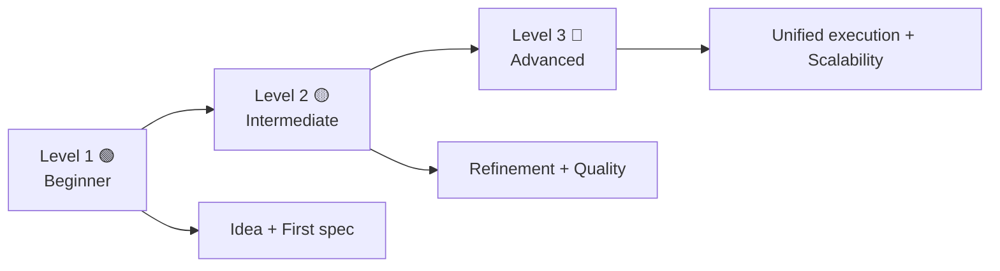

# 🧭 Complete 3-level learning path (full system)

<a href="../README.md"></a>

---

## 🗣️ Friendly prompt (copy/paste)

Use this when you are not technical and want the AI to do setup + guidance end-to-end:

```text
Using https://github.com/juanklagos/spec-driven-development-template, create everything needed to carry out my project end-to-end.
My project is: [describe your project in plain language].

If my project is new, initialize it with this template and GitHub Spec Kit.
If my project already exists, adapt it to idea/specs/bitacora without breaking current behavior.
Guide me step by step for my level (beginner/intermediate/advanced), using simple language.
Do not skip specification, plan, tasks, refinement trace, logbook, and validation.
```


> [!TIP]
> **Recommended start (low friction):** you do not need to clone this repository if you are already working inside a project.
>
> **Mandatory rule:** tell the Artificial Intelligence assistant to work with this template and its guides as the primary reference.
>
> Optional clone:
> ```bash
> git clone https://github.com/juanklagos/spec-driven-development-template.git
> cd spec-driven-development-template
> ```

## 🌈 Global visual map



## 🧱 What each level means

| Level | Profile | Main goal |
| --- | --- | --- |
|  | New to programming | Understand and use workflow without confusion |
|  | Basic project experience | Keep consistency across sessions |
|  | High-discipline technical teams | Unify outputs across tools and scale quality |

## 🗺️ Path by topic (full system)

| Topic |  |  |  |
| --- | --- | --- | --- |
| Base structure | Confirm `idea/specs/bitacora` folders | Validate required templates | Automate structure validation |
| Project idea | Complete `IDEA_GENERAL.md` with AI guidance | Refine scope and risks | Manage vision changes via protocol |
| Specifications | Create `001-...` from template | Keep `history.md` updated | Split specs by domain and dependencies |
| Plan and tasks | Define simple steps | Prioritize and sequence tasks | Track progress/risk metrics per spec |
| Logbook | Record end of each session | Always create handoff when pending | Standardize cross-tool reporting |
| Quality (TDD/BDD) | Understand Given/When/Then | Link scenarios to test tasks | Combined strategy and strict gates |
| AI execution (including Lovable) | Use base prompt | Require structured report | Unified output contract + scope control |
| GitHub publishing | Initial push | Release checklist | Versioning and contributor governance |

## 🟢 Level 1 - Beginner (step by step)

### Goal
Start without confusion and produce first usable specification.

### Sequence
1. Complete `idea/IDEA_GENERAL.md`.
2. Create `specs/001-my-first-spec/`.
3. Copy templates.
4. Ask AI to complete content in simple language.
5. Record session in logbook.

### Recommended prompt

```text
Using https://github.com/juanklagos/spec-driven-development-template,
help me as a beginner create my first project.
Guide me step by step for idea, first spec, and logbook.
Do not move forward until I confirm understanding.
```

## 🟡 Level 2 - Intermediate (consistency)

### Goal
Run iterative work with full traceability.

### Sequence
1. Read idea + index + latest handoff.
2. Select active spec.
3. Update `plan.md` and `tasks.md`.
4. Execute in-scope changes.
5. Update `history.md` and logbook.

### Recommended prompt

```text
Using https://github.com/juanklagos/spec-driven-development-template,
work on the active specification and keep consistency.
Before implementation, summarize scope and risks.
After implementation, update history.md and logbook.
Return output as: goal, changes, validation, risks, next step.
```

## 🔴 Level 3 - Advanced (unified quality)

### Goal
Control quality and consistency across different Artificial Intelligence tools.

### Sequence
1. Apply refinement protocol for every scope change.
2. Execute full Spec Kit flow.
3. Apply TDD + BDD in specs and validations.
4. Run project locally and report outcomes.
5. Consolidate quality metrics per spec.

### Recommended prompt

```text
Using https://github.com/juanklagos/spec-driven-development-template,
apply advanced workflow with strict quality control.
If scope changes, block implementation until spec/history/index are updated.
Run technical and functional validations.
Return unified report: goal, files, commands, validations, risks, next step.
```

## 🎓 Which guide to read by level

- :
  - `docs/en/13-quick-guide-non-programmers.md`
- :
  - `docs/en/14-intermediate-guide.md`
- :
  - `docs/en/15-advanced-guide.md`

## 🔁 Final rule

If there is no documentation traceability, work is not considered complete.
