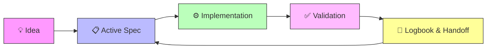

# Team mode and collaboration

---

> SDD works for solo developers and teams alike. This guide explains how to scale from 1 to N contributors.

## 🎭 Recommended roles

| Role | Responsibility | Who typically fills it |
|---|---|---|
| **Spec Owner** | Maintains `spec.md`, `plan.md`, `tasks.md` for their assigned spec | Developer or product lead |
| **Quality Reviewer** | Validates acceptance criteria, reviews tests, checks consistency | Senior dev or QA |
| **Logbook Coordinator** | Ensures handoffs are submitted and `PROJECT_LOG.md` is current | Tech lead or scrum master |
| **AI Pilot** | Manages AI tool context, feeds specs to AI, validates AI output | Whoever is driving the AI session |

> [!TIP]
> On solo projects, one person fills all roles. The discipline remains the same.

## 📐 Team conventions

### Spec ownership
- **One owner per active spec.** Multiple people can contribute, but one person is accountable.
- Ownership is recorded in `specs/INDEX.md` under the "Owner" column.
- Transfer ownership explicitly: update INDEX + create a `bitacora/handoffs/` entry.

### Branch strategy
- Branch naming: `spec/001-feature-name` or `sdd/001-feature-name`
- Each branch maps to exactly one spec. Never mix specs in a branch.
- PR description should reference the spec folder: `Implements specs/001-feature/`

### Session handoffs
- When you stop working, always create a handoff in `bitacora/handoffs/`
- Include: what you did, what's pending, blockers, and who should pick it up
- Even if you'll continue tomorrow — context degrades faster than you think

### Conflict resolution
- If two people modify the same spec, the Spec Owner resolves conflicts
- Spec changes must go through `history.md` — no silent edits
- Architectural decisions that affect multiple specs go in `bitacora/decisiones/`

## 🔄 Visual workflow

## 📋 Team kickoff checklist

When starting a team project with SDD:

1. [ ] Fill `idea/IDEA_GENERAL.md` together (alignment session)
2. [ ] Assign Spec Owners for each initial spec
3. [ ] Set a handoff cadence (end of day, end of sprint, etc.)
4. [ ] Agree on branch naming convention
5. [ ] Run `./scripts/validate-sdd.sh . --strict` and fix any issues
6. [ ] Schedule weekly 15-min SDD sync: review INDEX, check logbook, redistribute specs

## 💬 Communication protocol

| Event | Action | Where to record |
|---|---|---|
| New spec created | Notify team, update INDEX | `specs/INDEX.md` + team channel |
| Scope change | Discuss with Spec Owner first | `history.md` + `bitacora/decisiones/` |
| Blocker found | Raise immediately, document | `bitacora/handoffs/` |
| Spec completed | Review & close, update INDEX | `specs/INDEX.md` status → `Done` |
