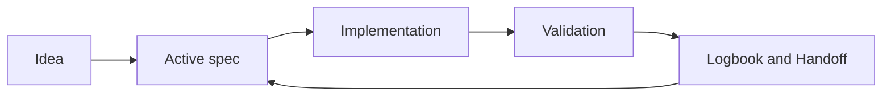

# Team mode and collaboration

## Recommended roles

| Role | Responsibility |
|---|---|
| Spec owner | Maintain `spec.md`, `plan.md`, `tasks.md` |
| Quality reviewer | Validate criteria and tests |
| Logbook coordinator | Ensure handoffs and continuity |

## Visual workflow

## Minimum conventions

- One owner per active spec.
- One handoff per session when pending items exist.
- Quality review before merge.
