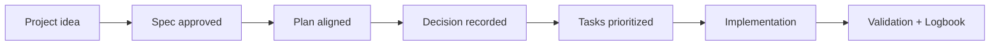

# Architecture decisions

<a href="../README.md"></a>

---

## 🌍 Language pair / Par de idioma

- English: **24-architecture-decisions.md**
- Español: [../es/24-decisiones-de-arquitectura.md](../es/24-decisiones-de-arquitectura.md)


## 🗣️ Friendly prompt (copy/paste)

Use this when you are not technical and want the AI to do setup + guidance end-to-end:

```text
Using https://github.com/juanklagos/spec-driven-development-template, create everything needed to carry out my project end-to-end.
My project is: [describe your project in plain language].

If my project is new, initialize it with this template and GitHub Spec Kit.
If my project already exists, adapt it to idea/specs/bitacora without breaking current behavior.
Guide me step by step for my level (beginner/intermediate/advanced), using simple language.
Do not skip specification, plan, tasks, refinement trace, logbook, and validation.
```

---

> A spec says **what** the system must do. A plan says **how** you will build it. Neither says **why you chose this over the other thing you seriously considered.** That is what a decision record is for.

## 🧭 What an ADR is

An **ADR** (Architecture Decision Record) is a short document capturing one decision at the moment it is made: the context, the choice, the alternatives you rejected, the consequences you accepted, and the signal that should make you revisit it.

It is written **once**, at decision time, and never rewritten as the project evolves. If the decision changes later, you write a new record and link back — you do not edit history. A decision log is a series of snapshots, not a wiki page.

Three properties make it work:

| Property | Why it matters |
|---|---|
| **Immutable** | A record edited to match today's opinion tells you nothing about why the choice was made then. |
| **Sourced** | Every rationale points at a commit, a `file:line`, a spec `history.md`, a `CHANGELOG.md` line, or a document in `idea/`. |
| **Honest** | Where no written rationale exists, the record says so. Invented retrospective justification is worse than a blank. |

That last one is not decoration. A decision log that contains a plausible story nobody actually had is actively harmful: future readers will trust it and reason from a fiction.

## 📐 When to write one — and when not to

Write a record when **any** of these is true:

1. **It chose between real alternatives.** Something else was genuinely on the table and lost.
2. **It will be expensive to reverse.** It touches several specs, a migration, a contract, a license, or a dependency you now depend on.
3. **A future reader would ask "why is it like this?"** and the code alone would not answer.

Do **not** write one otherwise. A padded log is a log nobody reads.

| Record it | Don't bother |
|---|---|
| Choosing a database technology | Naming a variable |
| Deciding on authentication strategy | Picking a CSS color |
| Selecting a deployment platform | A planned task you just finished |
| Defining API versioning | Adding a utility function |
| Changing a license | Fixing a typo |
| Reversing an earlier decision | Changes inside one spec's scope |

**Rule of thumb:** if changing this later would require touching multiple specs or a significant refactor, record it.

## 🗂️ Where records live and how they are named

```
bitacora/decisiones/
├── README.md                                  # browsable index, oldest first
├── 2026-03-12-polyform-noncommercial-source-available.md
├── 2026-03-14-spec-kit-es-el-motor.md
└── 2026-07-21-no-app-escritorio.md
```

- **One decision per file.** If you are writing "and also", split it.
- **`YYYY-MM-DD-<slug>.md`** — the date is the day it was decided, taken from git, never from memory. The date-first name sorts the folder chronologically for free.
- **The slug names the decision, not the feature.** `no-desktop-app`, not `desktop`.
- In a sidecar project the folder is `./spec/bitacora/decisiones/`.

## 📝 The template

Copy `bitacora/templates/DECISION_TEMPLATE.md` (mirrored at `templates/bitacora/decision.template.md`). Every section is bilingual and carries an inline hint:

```markdown
# Key decision - Title / Decisión importante - Título

## Date / Fecha
## Context / Contexto
## Decision / Decisión
## Alternatives considered / Alternativas consideradas
## Consequences / Consecuencias
## When to revisit / Cuándo revisar esta decisión
## Related records / Registros relacionados
```

- **Context** — what problem forced the choice, what was true at that moment, what constrained you.
- **Decision** — one sentence, then the detail. No hedging. Cite the commit or file where it landed.
- **Alternatives considered** — what was really on the table and why each lost. *"No alternatives were considered"* is a valid, honest answer; a straw man is not.
- **Consequences** — what improves, what trade-off you accept, which specs are affected, what this makes harder.
- **Related records** — what this extends, narrows, or supersedes. Superseded records stay on disk forever.

## ⏳ Why "When to revisit" is the section that matters

Most decision logs rot the same way. A choice made under real constraints — a budget, a beta API, a two-person team — is read two years later, out of context, as a permanent law of the system. Nobody remembers the constraint, so nobody notices when it lifts.

**"When to revisit" is the expiry condition you write while you still remember it.** Make it a signal, not a feeling:

- ✅ *"If the 1-hour spike fails and `ui://sdd/board.html` does not render as `.mcpb`."*
- ✅ *"If Flathub reverts its 2026-05-29 policy, or affordable code signing appears without requiring an OSI-approved license."*
- ✅ *"If the project stops being maintained by a single person."*
- ❌ *"If it stops working well."*
- ❌ *"Revisit in the future."*

A record without this section is not a decision. It is dogma with a date on it.

## 🤖 How `/sdd:decision` works

```
/sdd:decision we are not building a desktop app for now
```

The command:

1. **Checks the bar first.** If none of the three criteria hold, it says so and stops rather than padding the log.
2. **Interviews you one question at a time** — what was decided, context, alternatives, consequences, when to revisit — then summarizes back in five bullets and waits for a yes before writing anything.
3. **Demands a source for every claim.** Commit hash and date from `git log`, `file:line`, spec history, `CHANGELOG.md`, a document in `idea/`, or your own words in the session. Where a rationale cannot be sourced, it writes that down instead of inventing one.
4. **Writes** `bitacora/decisiones/YYYY-MM-DD-<slug>.md` from the template, with the real date.
5. **Links it back** from the active spec's `history.md`, `bitacora/global/PROJECT_LOG.md`, and the folder index.

It answers in your language (EN/ES). The Copilot mirror is `.github/prompts/sdd-decision.prompt.md`.

## 🔗 Integration with the SDD workflow

- **During `plan.md`** — the natural moment: you are choosing an approach, so the alternatives are still fresh.
- **At session close** — `/sdd:close` asks whether the session contained a decision worth recording, but only when one of the three criteria plausibly holds. It does not nag on trivial sessions. The close contract carries a **Decision recorded** item; *"none this session"* is a valid answer, silence is not.
- **In strict validation** — `./scripts/validate-sdd.sh . --strict` emits a **warning** (never an error, never a non-zero exit) when a project has approved specs but an empty `bitacora/decisiones/`. It is a nudge, not a gate.
- **Referencing** — from `spec.md` or `plan.md`, link the file: *"see `2026-07-20-logica-en-sdd-core-transportes-finos.md` for why the transports are thin."*
- **Superseding** — never delete. Add a new record, and note the relationship in both.

The canonical rule lives in `template-context/core-instructions/AGENT_OPERATING_SYSTEM.md` (§3 Required Workflow and §4 Output Contract) and in `sdd.policy.yaml` under `decision_log`.

## 📚 A real example: this template's own log

`bitacora/decisiones/` in this repository holds 14 records reconstructed from git history, spec histories, the changelog, and research documents in `idea/`. Read [`bitacora/decisiones/README.md`](../../bitacora/decisiones/README.md) for the full index. Three worth reading as models:

**[`2026-07-21-no-app-escritorio.md`](../../bitacora/decisiones/2026-07-21-no-app-escritorio.md) — a decision that reframed its own question.**
The ask was "build a desktop app, it beats running commands". The record shows the investigation found the real pain elsewhere: the builder was not shipping in the npm package (`"files": ["dist"]`), so users had to clone the repo. It rejects Tauri, Electron, a tray app, a PWA, a VS Code extension and a hosted version — each with the specific reason — and lands on a one-command launcher first. Its "when to revisit" names a one-hour spike whose failure brings Electron back to the table.

**[`2026-03-18-www-recomendado-no-obligatorio.md`](../../bitacora/decisiones/2026-03-18-www-recomendado-no-obligatorio.md) — a record with a declared hole.**
`www/` stopped being a hard constraint. No logbook note, no spec entry, no changelog line explains why. The record says exactly that and reconstructs the change from the doctrine diff. This is what honesty looks like in practice: the gap is documented as a gap.

**[`2026-07-20-mcp-app-postergada-y-luego-con-sdk-oficial.md`](../../bitacora/decisiones/2026-07-20-mcp-app-postergada-y-luego-con-sdk-oficial.md) — a decision reversed 12 hours later.**
The MCP App was postponed because "the standard is still moving". Before writing any code, that premise was checked and turned out to be false. Both the postponement and its reversal are in one record, with the dates. Reversals are not failures of the log — they are the log doing its job.

**The lesson from this repo, stated plainly:** `bitacora/decisiones/` sat empty for the entire build. Eleven specs, four months, a full framework — and the "why" behind every choice lived only in commit messages and one person's memory. It was recoverable here because the git history was detailed. It usually is not.

## 💡 Quick tips

- Write it at decision time. Reconstructing later costs hours and loses the alternatives you rejected in your head.
- If you cannot name a real alternative, ask whether it was actually a decision.
- Prefer one honest sentence over three plausible paragraphs.
- Close every session with validation and a clear next step.

## 📊 Visual flow


