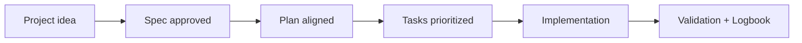

# Project type playbooks

<a href="../README.md"></a>

---

## 🌍 Language pair / Par de idioma

- English: **27-project-type-playbooks.md**
- Español: [../es/27-playbooks-por-tipo-de-proyecto.md](../es/27-playbooks-por-tipo-de-proyecto.md)


## 🗣️ Friendly prompt (copy/paste)

Use this when you are not technical and want the AI to do setup + guidance end-to-end:

```text
Using https://github.com/juanklagos/spec-driven-development-template, create everything needed to carry out my project end-to-end.
My project is: [describe your project in plain language].

If my project is new, initialize it with this template and GitHub Spec Kit.
If my project already exists, adapt it to idea/specs/bitacora without breaking current behavior.
Guide me step by step for my level (beginner/intermediate/advanced), using simple language.
Do not skip specification, plan, tasks, refinement trace, logbook, and validation.
```


> Playbooks are pre-configured SDD starting points for common project types. They give you a head start on idea framing, spec structure, and implementation planning.

## 📦 Available packs

### 🌐 SaaS (`playbooks/saas/`)

**Best for:** Multi-tenant products with user accounts, subscriptions, dashboards, or admin panels.

**Typical spec partition:**
| Spec | Focus area |
|---|---|
| 001-auth | User registration, login, session management |
| 002-tenant | Multi-tenancy isolation, organization management |
| 003-billing | Subscription plans, payment integration |
| 004-dashboard | Core user interface, metrics display |
| 005-admin | Admin panel, user management, system settings |

**Key considerations:** Tenant isolation strategy, subscription lifecycle, role-based access control.

---

### 🛒 E-commerce (`playbooks/ecommerce/`)

**Best for:** Online stores with catalog, cart, checkout, and payment flows.

**Typical spec partition:**
| Spec | Focus area |
|---|---|
| 001-catalog | Product listing, categories, search, filters |
| 002-cart | Shopping cart, quantity management, persistence |
| 003-checkout | Order creation, address, shipping options |
| 004-payment | Payment gateway integration, confirmation |
| 005-orders | Order history, tracking, status updates |

**Key considerations:** Inventory management strategy, payment provider fallbacks, guest vs. authenticated checkout.

---

### 📱 Mobile App (`playbooks/mobile-app/`)

**Best for:** iOS/Android apps with navigation, offline behavior, and data sync.

**Typical spec partition:**
| Spec | Focus area |
|---|---|
| 001-navigation | Screen flow, tab structure, deep linking |
| 002-auth | Login, biometrics, token refresh |
| 003-data-sync | Offline storage, conflict resolution, background sync |
| 004-notifications | Push notifications, in-app alerts |
| 005-core-feature | The main feature of your specific app |

**Key considerations:** Offline-first vs. online-first strategy, platform-specific behaviors, app store requirements.

---

### ⚙️ Backend API (`playbooks/backend-api/`)

**Best for:** REST or GraphQL APIs serving frontends, mobile apps, or third parties.

**Typical spec partition:**
| Spec | Focus area |
|---|---|
| 001-data-model | Database schema, relationships, migrations |
| 002-endpoints | Route design, input validation, response format |
| 003-auth-security | Authentication, authorization, rate limiting |
| 004-integration | Third-party API connections, webhooks |
| 005-observability | Logging, monitoring, error tracking, health checks |

**Key considerations:** API versioning strategy, authentication mechanism (JWT vs. OAuth2 vs. API keys), error response standardization.

---

## 🚀 How to activate a playbook

### With AI assistance:

```text
Using https://github.com/juanklagos/spec-driven-development-template and the [PACK_NAME] playbook,
help me set up a new project for [MY GOAL].
Use the playbook's typical spec partition as a starting point.
Propose initial idea framing and spec structure adapted to my specific needs.
Do not implement code until we agree on the spec partition.
```

### Manually:

1. Copy the playbook's suggested spec structure into your `specs/` folder
2. Fill `idea/IDEA_GENERAL.md` using the playbook's focus areas as a guide
3. Create each spec folder using `./scripts/new-spec.sh "feature-name" "Owner"`
4. Customize requirements and acceptance criteria for your specific case

## 💡 Creating your own playbook

If your project type isn't covered, create a new playbook:

1. Create `playbooks/your-type/README.md`
2. Define: typical spec partition, key considerations, domain-specific prompts
3. Include at least 5 suggested specs with focus areas
4. Add a recommended AI prompt for initialization

## 💡 Quick tips

- Start from a simple one-paragraph project description.
- Ask the AI to confirm the active spec before coding.
- Close every session with validation and a clear next step.

## 📊 Visual flow


