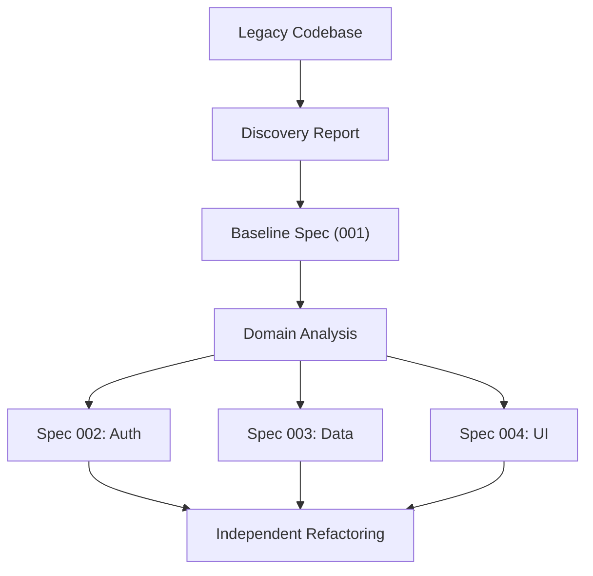

# Advanced legacy migration mode

<a href="../README.md"></a>

---

## 🗣️ Friendly prompt (copy/paste)

Use this when you are not technical and want the AI to do setup + guidance end-to-end:

```text
Using https://github.com/juanklagos/spec-driven-development-template, create everything needed to carry out my project end-to-end.
My project is: [describe your project in plain language].

If my project is new, initialize it with this template and GitHub Spec Kit.
If my project already exists, adapt it to idea/specs/bitacora without breaking current behavior.
Guide me step by step for my level (beginner/intermediate/advanced), using simple language.
Do not skip specification, plan, tasks, refinement trace, logbook, and validation.
```


> Transform an existing codebase into a well-structured SDD project without breaking anything.

## 🎯 When to use this

- You have an existing application with no formal specifications
- You want to add traceability and structure without rewriting
- You need to onboard new team members to a legacy system
- You want AI tools to understand your existing code properly

## 📋 Migration workflow

### Phase 1: Discovery (non-destructive)

```bash
./scripts/legacy-discovery.sh /path/to/legacy-project
```

This script scans your project and generates a report in `analysis/legacy-discovery/` containing:
- File and folder structure analysis
- Technology stack detection
- Entry point identification
- Dependency mapping

> [!IMPORTANT]
> This phase is **read-only**. No files in the legacy project are modified.

### Phase 2: Baseline documentation

1. **Create `idea/IDEA_GENERAL.md`** — Document the system's current purpose
   - Don't describe what it *should* be; describe what it *is*
   - Fill Problem, Goal, and Scope based on current behavior

2. **Create `specs/001-baseline/`** — Reverse-engineer the current state
   - `spec.md`: Current features as requirements (documented as-is)
   - `plan.md`: Existing architecture description
   - `tasks.md`: Areas that need documentation or testing
   - `research.md`: Known technical debt, pain points, undocumented behaviors

3. **Initialize logbook** — Record the discovery session
   - Entry in `bitacora/global/PROJECT_LOG.md`
   - Decision in `bitacora/decisiones/001-migration-approach.md`

### Phase 3: Domain decomposition

Once the baseline is documented:

1. Identify independent functional domains in the existing code
2. Create new numbered specs for each domain (002, 003, ...)
3. Define boundaries: which files/modules belong to which spec
4. Set dependency order: which specs can be refactored independently



### Phase 4: Progressive modernization

For each domain spec:
1. Write acceptance criteria that match **current** behavior first
2. Add tests that verify existing behavior (regression safeguard)
3. Then — and only then — create a new spec for improvements
4. Keep the baseline spec as a reference point

## 🤖 AI-assisted migration prompts

### Initial discovery prompt:

```text
Using https://github.com/juanklagos/spec-driven-development-template as the main guide,
analyze the legacy project at [PROJECT_PATH] without changing any behavior.

1. Map the current architecture: frameworks, patterns, dependencies.
2. Create idea/IDEA_GENERAL.md based on what the system currently does.
3. Create specs/001-baseline/ documenting current behavior as-is.
4. Identify independent domains and suggest spec splits.
5. Create an initial bitacora entry documenting this discovery.
6. Recommend risk areas that need test coverage before any changes.
```

### Ongoing migration prompt:

```text
I'm migrating spec [NUMBER] of my legacy project. The baseline is in specs/001-baseline/.
Current domain: [DOMAIN_NAME]

Help me:
1. Write acceptance criteria that match existing behavior
2. Identify test coverage gaps
3. Propose a safe modernization plan that doesn't break anything
4. Update history.md with the migration progress
```

## ⚠️ Common migration mistakes

| Mistake | Why it's dangerous | Prevention |
|---|---|---|
| Rewriting before understanding | Break existing behavior | Complete Phase 1-2 first |
| Not testing current behavior | Can't verify things still work | Add regression tests before touching code |
| Migrating everything at once | Overwhelm, merge conflicts | One domain spec at a time |
| Skipping the baseline spec | No reference point for "before" | 001-baseline is mandatory |
