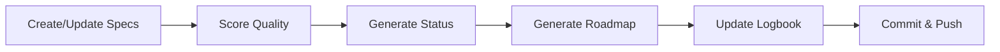
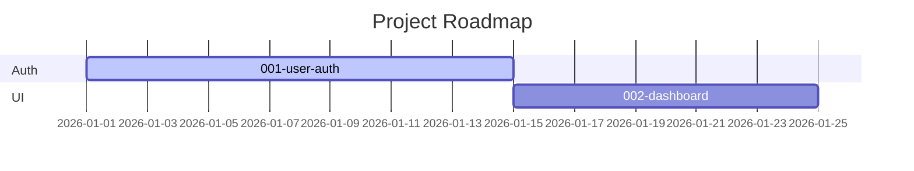

# Status dashboard and auto roadmap

<a href="../README.md"></a>

---

> Automated tools to visualize your project's progress and generate roadmaps from your specs.

## 🛠️ Available scripts

### `./scripts/generate-status.sh`

**What it does:** Scans all specs in `specs/` and generates `STATUS.md` — a dashboard showing:
- Active specs with status, priority, and owner
- Task progress (pending vs. completed across all specs)
- Recent logbook excerpts from `bitacora/global/PROJECT_LOG.md`

**How to use:**
```bash
./scripts/generate-status.sh
```

**Output:** Updates `STATUS.md` in the project root.

**When to run:** After every session where you update specs or complete tasks.

---

### `./scripts/generate-roadmap.sh`

**What it does:** Reads `specs/INDEX.md` and generates a visual Mermaid roadmap.

**How to use:**
```bash
./scripts/generate-roadmap.sh
```

**Output:** Creates two files:
- `docs/roadmap.mmd` — Raw Mermaid diagram source
- `docs/roadmap.md` — Markdown file with embedded Mermaid for GitHub rendering

**When to run:** After creating new specs or changing priorities in INDEX.

---

### `./scripts/score-spec.sh`

**What it does:** Evaluates the quality and completeness of your specifications.

**How to use:**
```bash
# Score all specs
./scripts/score-spec.sh --all

# Score a specific spec
./scripts/score-spec.sh specs/001-my-feature
```

**What it checks:**
| Criterion | What it looks for |
|---|---|
| File completeness | All 5 required files present (spec, plan, tasks, research, history) |
| Content depth | Files have meaningful content, not just templates |
| Acceptance criteria | spec.md has clear, testable criteria |
| Task breakdown | tasks.md has checkboxes with specific actions |
| History tracking | history.md has at least one entry |

---

### `./scripts/new-spec.sh`

**What it does:** Creates a new numbered spec folder with all required template files.

**How to use:**
```bash
./scripts/new-spec.sh "feature-name" "OwnerName"
```

**Output:** Creates `specs/NNN-feature-name/` with pre-filled templates.

---

## 📊 Recommended workflow



### Per-session routine:
1. Work on your specs and implementation
2. Run `./scripts/score-spec.sh --all` to check quality
3. Run `./scripts/generate-status.sh` to update the dashboard
4. Run `./scripts/generate-roadmap.sh` if specs changed
5. Update the logbook and commit

### Sample output: STATUS.md

```markdown
## Active specs
| Number | Name         | Status      | Priority | Owner |
|--------|-------------|-------------|----------|-------|
| 001    | user-auth   | In Progress | High     | Juan  |
| 002    | dashboard   | Draft       | Medium   | Maria |

## Task progress
- Pending: 12
- Completed: 8
```

### Sample output: roadmap.mmd


