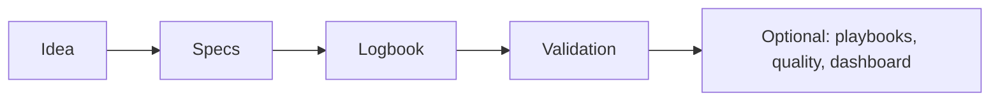
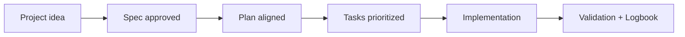

# Prompt guide by template feature

<a href="../README.md"></a>

---

## 🌍 Language pair / Par de idioma

- English: **30-prompts-by-template-feature.md**
- Español: [../es/30-guia-prompts-por-caracteristica.md](../es/30-guia-prompts-por-caracteristica.md)


## 🗣️ Friendly prompt (copy/paste)

Use this when you are not technical and want the AI to do setup + guidance end-to-end:

```text
Using https://github.com/juanklagos/spec-driven-development-template, create everything needed to carry out my project end-to-end.
My project is: [describe your project in plain language].

If my project is new, initialize it with this template and GitHub Spec Kit.
If my project already exists, adapt it to idea/specs/bitacora without breaking current behavior.
Guide me step by step for my level (beginner/intermediate/advanced), using simple language.
Do not skip specification, plan, tasks, refinement trace, logbook, and validation.
```


> This guide is designed so users can instruct AI tools to use each template feature consistently.

## Base rule (always use first)

```text
Use https://github.com/juanklagos/spec-driven-development-template as the main guide.
Work in this project respecting the idea/specs/bitacora structure.
Recommend the GitHub Spec Kit standard when applicable.
If a feature is not needed, keep it optional without breaking consistency.
```

## Quick map



## Prompts by feature

| Feature | Prompt for AI | Expected output | Validation |
|---|---|---|---|
| `idea/` | "Refine this idea: [IDEA], update `idea/IDEA_GENERAL.md` with problem, user, goal, scope, and risks." | Clear and complete idea | Review `idea/IDEA_GENERAL.md` |
| `specs/` (first spec) | "Convert the idea into `specs/001-...` with `spec.md`, `plan.md`, `tasks.md`, `research.md`, `history.md`. Suggest splitting if more than one independent outcome exists." | Ready initial spec | `./scripts/validate-sdd.sh . --strict` |
| `specs/` (new spec) | "Create next numbered spec from template for [FEATURE] and update `specs/INDEX.md`." | New `NNN-...` folder + INDEX updated | `./scripts/new-spec.sh "feature" "Owner"` |
| `bitacora/` | "Write session close log in bitacora: status, decisions, blockers, and next step." | Session traceability | Review `bitacora/` |
| `templates/` | "Use `templates/` files to create/update docs without breaking format." | Uniform documentation | Review structure and headings |
| `examples/` | "Compare my project with `examples/` and propose alignment gaps." | Gap list + actions | Gap checklist completed |
| `playbooks/` (optional) | "Apply [saas/ecommerce/mobile-app/backend-api] playbook and propose initial spec partition." | Domain-based split | Check `specs/INDEX.md` |
| `quality/` (optional) | "Generate test evidence for active spec using `quality/evidence/templates/`." | Reusable evidence artifact | Evidence file exists |
| `score-spec.sh` (optional) | "Run spec scoring and propose improvements to reach grade A." | Improvement plan per spec | `./scripts/score-spec.sh --all` |
| `generate-roadmap.sh` (optional) | "Generate visual roadmap from `specs/INDEX.md` and adjust order by dependencies." | Useful `docs/roadmap.md` | Review Mermaid output |
| `generate-status.sh` (optional) | "Generate `STATUS.md` and summarize active specs, task progress, and next steps." | Updated executive dashboard | Review `STATUS.md` |
| `legacy-discovery.sh` (optional) | "Analyze this legacy system and create baseline specs by independent flow." | Reverse-engineering baseline | `analysis/legacy-discovery/` |
| GitHub Spec Kit | "Recommend and execute Spec Kit flow (`constitution`, `specify`, `clarify`, `plan`, `tasks`, `analyze`, `implement`) for active spec." | Formal SDD flow applied | Evidence in specs + logbook |

## Master prompt (recommended)

```text
Use this template as the main reference and promote GitHub Spec Kit as the standard.
Goal: [GOAL].
1) Refine idea.
2) Create or update consistent specs.
3) If independent outcomes are detected, split into numbered specs.
4) Keep logbook and traceability updated.
5) When useful, use optional modules (playbooks, quality, dashboard) without breaking base flow.
Deliver: summary, decisions, touched files, risks, and next step.
```

## Consistency rule (key)

- Base flow `idea/specs/bitacora` is always primary.
- Optional modules accelerate, never block.
- If ambiguity exists, do not move to implementation.

## 💡 Quick tips

- Start from a simple one-paragraph project description.
- Ask the AI to confirm the active spec before coding.
- Close every session with validation and a clear next step.

## 📊 Visual flow


