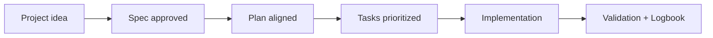

# Documentation audit (2026-03-14)

## 🌍 Language pair / Par de idioma

- English: **32-documentation-audit-2026-03-14.md**
- Español: [../es/32-auditoria-documentacion-2026-03-14.md](../es/32-auditoria-documentacion-2026-03-14.md)


## Scope

Reviewed:
- Starters: `README.md`, `README.es.md`, `QUICKSTART.md`, `AI_START_HERE.md`, `docs/README.md`
- 3-level guides: `docs/en|es/13`, `14`, `15`
- Core consistency references: `02`, `08`, `10`, `11`, `19`, `21`, `26`

## Main issues found

1. Repeated long preambles in many guides.
2. Non-linear starter flow for first-time users.
3. Mixed language links reducing clarity.
4. Some stale references to old AI instruction files.

## Actions applied

1. Rewrote `docs/README.md` into a compact navigation hub.
2. Rewrote `QUICKSTART.md` with a linear Spec Kit-first flow.
3. Rewrote `AI_START_HERE.md` to short mandatory context + hard gate + prompt links.
4. Rewrote level guides in EN/ES (`13`, `14`, `15`) with a consistent educational structure.
5. Aligned AI rules matrix to canonical instruction file.

## Result

- Better readability for beginner/intermediate/advanced users.
- Clearer progression and fewer duplicated instructions.
- Stronger coherence with Spec Kit and SDD gate.

## Next recommended pass

1. Apply the same concise structure to docs `00-12` and `16-31`.
2. Add link-check and style checks in CI for docs.
3. Add timed UX validation (find Quickstart/start path in <10 seconds).

## Pass 2 update (2026-03-14)

- Compacted repeated startup/prompt blocks across core docs `00-12` and `16` in EN/ES.
- Replaced long duplicated sections with short links to `AI_START_HERE.md`, prompt matrix, and validated prompt bank.
- Kept topic-specific content intact while reducing onboarding noise.

## 🗣️ Friendly prompt (copy/paste)

```text
Using https://github.com/juanklagos/spec-driven-development-template, guide me with this template end-to-end for my project.
My project is: [describe your project in plain language].
If it is new, initialize it from this template.
If it already exists, adapt it without breaking current behavior.
Keep me in SDD flow (idea -> spec -> plan -> tasks -> implementation), in simple language.
```

## 💡 Quick tips

- Start from a simple one-paragraph project description.
- Ask the AI to confirm the active spec before coding.
- Close every session with validation and a clear next step.

## 📊 Visual flow


