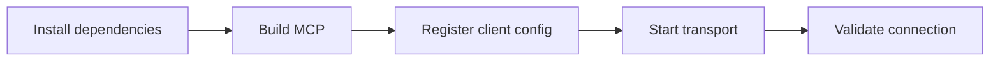

# MCP Server Guide

## Purpose

This guide is only for MCP setup and connectivity.

If you want the full functional reference, start here:
- [Complete MCP Reference](./41-complete-mcp-reference.md)

## Setup flow



Product split:
- repository root: canonical SDD framework
- `packages/sdd-core`: reusable SDD logic
- `packages/sdd-mcp`: MCP tools, resources, prompts, and transports

## What is already implemented

High-level summary only:

Transports:
- `stdio`
- `Streamable HTTP`

Tools:
- `sdd_create_workspace`
- `sdd_create_spec`
- `sdd_validate`
- `sdd_check_gate`
- `sdd_record_user_consent`
- `sdd_list_specs`
- `sdd_generate_status`
- `sdd_generate_roadmap`
- `sdd_append_project_log`
- `sdd_write_daily_log`
- `sdd_write_handoff`
- `sdd_write_decision`

Structured tool output:
- each tool exposes `outputSchema`
- handlers return `structuredContent` plus text output

Static resources:
- `sdd-policy`
- `sdd-ai-start`
- `sdd-quickstart`
- `sdd-spec-template`

Project resource templates:
- `sdd-project-index`
- `sdd-project-log`
- `sdd-project-latest-handoff`
- `sdd-project-idea`
- `sdd-spec-document`

Prompts:
- `start_new_sdd_project`
- `adapt_existing_project_to_sdd`
- `close_sdd_session`

## Local setup

```bash
npm install
npm run typecheck
npm run build
npm run mcp:smoke
npm run mcp:http:smoke
```

Run the servers:

```bash
npm run mcp:start
npm run mcp:http:start
```

Entrypoints:
- stdio: `packages/sdd-mcp/dist/index.js`
- HTTP: `http://127.0.0.1:3334/mcp`

## Operational contract

- open this repository as the workspace root
- prefer `./www/<project-name>/` as the recommended default workspace
- external target paths are also supported for project-root-based tools
- create the SDD base first
- do not implement code before approved spec and consistent plan
- request explicit user consent only when implementation is about to start

Related references:
- [Complete MCP Reference](./41-complete-mcp-reference.md)
- [Command Results Reference](./40-command-results-reference.md)

## Copy-paste config examples

Reference examples:
- `packages/sdd-mcp/examples/.cursor/mcp.json`
- `packages/sdd-mcp/examples/.mcp.json`
- `packages/sdd-mcp/examples/codex.config.toml`

### Cursor

Official config path on macOS/Linux:
- `~/.cursor/mcp.json`

Project-scoped alternative:
- `mcp.json` in the workspace, if you prefer project-local registration

Example:

```json
{
  "mcpServers": {
    "sdd": {
      "type": "stdio",
      "command": "node",
      "args": [
        "/ABSOLUTE/PATH/TO/spec-driven-development-template/packages/sdd-mcp/dist/index.js"
      ]
    }
  }
}
```

### Codex

Official shared config path:
- `~/.codex/config.toml`

Example:

```toml
[mcp_servers.sdd]
command = "node"
args = ["/ABSOLUTE/PATH/TO/spec-driven-development-template/packages/sdd-mcp/dist/index.js"]
```

### Claude Code

Official project-scoped config:
- `.mcp.json` at the repository root

Official user-scoped config:
- `~/.claude.json`

Project-scoped example:

```json
{
  "mcpServers": {
    "sdd": {
      "command": "node",
      "args": [
        "/ABSOLUTE/PATH/TO/spec-driven-development-template/packages/sdd-mcp/dist/index.js"
      ],
      "env": {}
    }
  }
}
```

### HTTP-capable clients

If the client supports remote MCP over Streamable HTTP:

```text
http://127.0.0.1:3334/mcp
```

Use:

```bash
npm run mcp:http:start
```

## Recommended first message to the agent

```text
Use the connected sdd MCP server for this repository.
Create the SDD base first.
If the project is runnable inside this template, keep it inside ./www/<project-name>; external target paths are also supported.
Read the policy and quickstart resources first.
Do not implement code before approved spec and consistent plan.
Ask for explicit user consent only when implementation is about to start.
```

## Verification checklist

- `npm run typecheck`
- `npm run build`
- `npm run mcp:smoke`
- `npm run mcp:http:smoke`
- `./scripts/validate-sdd.sh . --strict`
- `./scripts/check-sdd-policy.sh .`
- `./scripts/check-sdd-gate.sh .`
