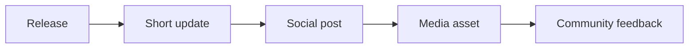

# Launch Kit

## Purpose

This page stores short launch-ready copy for diffusion of the framework.

## Launch flow



## Short update

```text
Spec-Driven Development Template now defaults to a clean `spec/` sidecar architecture for real projects.

New in v1.4.0:
- compact `spec/` sidecar prompts for AI tools
- cleaner project layout for advanced or existing codebases
- MCP contracts aligned with sidecar projects
- link-check and MCP CI fixes for the new architecture

Repository:
https://github.com/juanklagos/spec-driven-development-template
```

## LinkedIn post

```text
I just shipped v1.4.0 of my Spec-Driven Development Template.

This repository is evolving into an operational SDD framework, not just a documentation starter.

What it now includes:
- GitHub Spec Kit as the primary reference flow
- `spec/` sidecar as the professional default for real projects
- multi-agent operating rules
- clean internal container support under ./www/<project-name> when the project lives inside the template
- local MCP server (`sdd-mcp`)
- stdio + Streamable HTTP
- typed SDD core
- MCP integration tests and CI
- copy-paste sidecar prompts so AI tools stop copying the whole repository into advanced projects

Repository:
https://github.com/juanklagos/spec-driven-development-template

The goal is to reduce friction from idea -> spec -> plan -> tasks -> validation, and make different AI assistants behave more consistently across real project work.
```

## Short release note

```text
v1.4.0 makes the framework cleaner to apply in real projects: `spec/` sidecar by default, GitHub Spec Kit as the base workflow reference, MCP behavior aligned with sidecar projects, and exact prompts that stop AI tools from copying the whole repository into advanced codebases.
```
