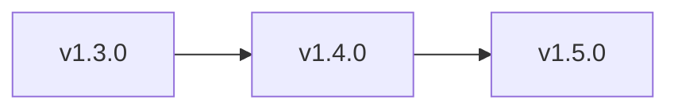

# Public Roadmap

## Purpose

This roadmap makes the next product steps explicit so users know where the framework is going.

## Roadmap timeline

## Current state

Released:
- `v1.3.0`

Now available:
- SDD framework with multi-agent policy
- recommended default workspace in `./www/<project-name>/`, with support for external target paths
- typed `sdd-core`
- local `sdd-mcp`
- `stdio` + `Streamable HTTP`
- MCP tools, resources, prompts, smoke tests, and integration tests
- client setup recipes and package version alignment

## v1.4.0

Focus: hosted onboarding hardening and richer operator experience.

Planned:
- hosted onboarding MCP contract hardening
- richer easy-mode prompts and client shortcuts
- more visual client examples and walkthrough assets
- tested setup guides with screenshots for Cursor, Claude Code, and Codex
- stronger release automation and packaging guidance

## v1.5.0

Focus: framework standardization and publishable MCP packaging.

Planned:
- clearer packaging/version strategy for `@sdd/sdd-core` and `@sdd/sdd-mcp`
- optional publishable MCP package workflow
- governance model for community contributions
- showcase of real projects using the framework

## Notes

- GitHub Spec Kit remains the primary external reference and operating guide.
- New features should continue reducing user friction, not increasing setup complexity.
